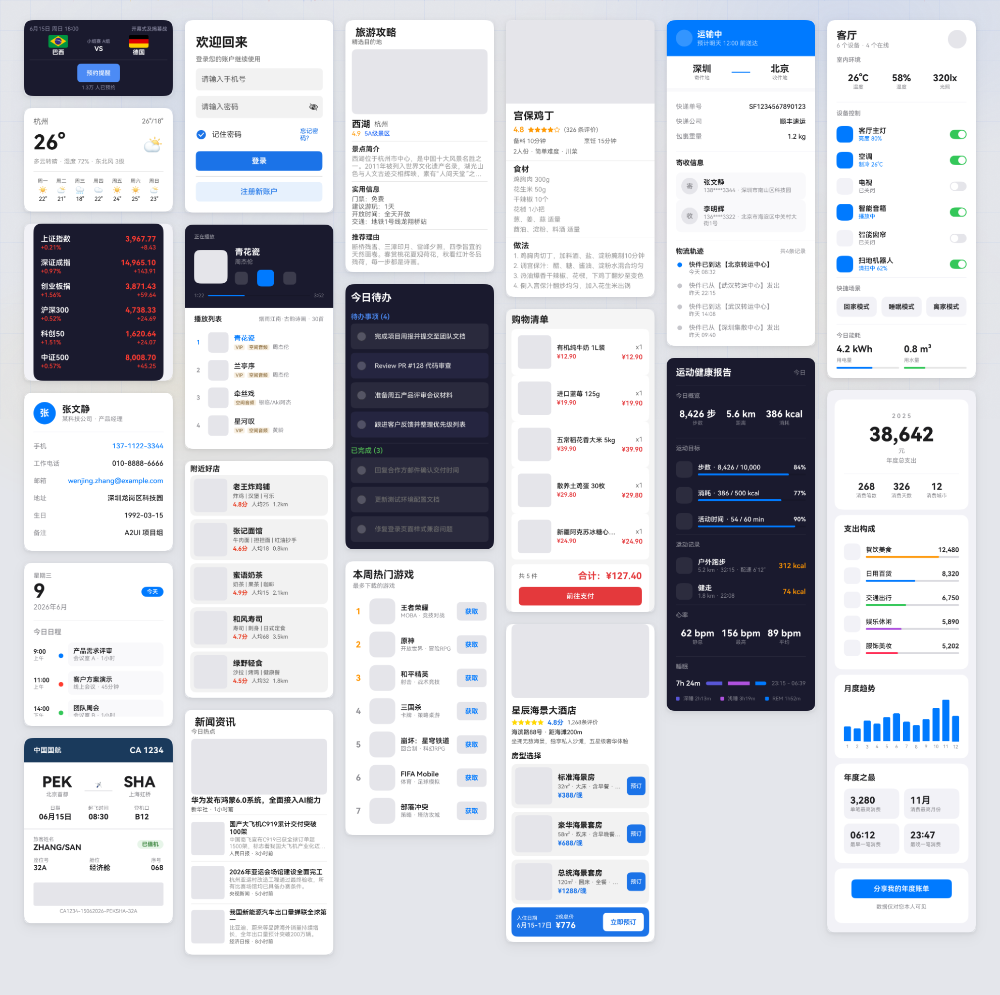
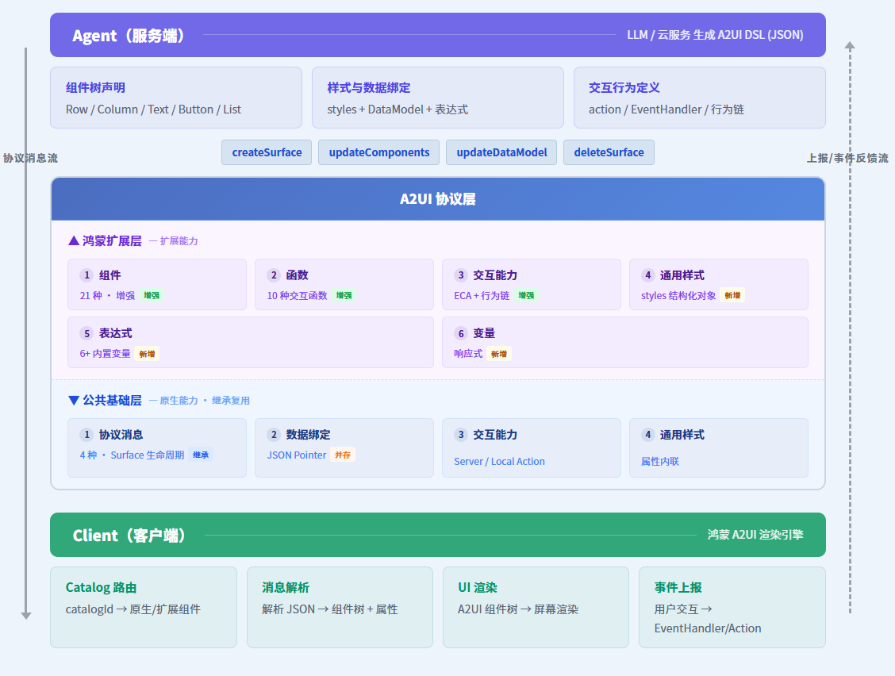

# GenUI 开发者文档

## 项目概览

GenUI 是基于 OpenHarmony ArkUI 的 AI 驱动 UI 渲染框架，遵循 [A2UI](https://github.com/google/A2UI) 开放协议。Agent 通过 JSON 描述界面骨架和内容，GenUI 解析后使用 ArkUI 原生组件渲染。

想了解设计目标、核心理念和适用场景，请阅读 [什么是 GenUI](introduction/what-is-genui.md)。

| 特性 | 说明 |
|------|------|
| **流式渐进渲染** | JSONL 逐行解析，边接收边渲染，首帧延迟低 |
| **高性能** | 对接原生 ArkUI 组件和管线，高性能解析与创建，120FPS 原生体验 |
| **兼容与扩展** | A2UI 标准协议（18 个标准组件 + 14 个内置函数）+ 鸿蒙扩展协议（21 个扩展组件 + 10 个扩展函数） |
| **表达式系统** | {{ }} 语法，支持拼接、运算、条件、变量引用， UI 表达能力增强 |
| **多设备自适应** | vp/fp/% 单位 + 5 级响应式断点 + If 条件组件 |
| **深色模式** | 自动跟随系统，支持自定义品牌色和扩展组件默认深浅色 |
| **可扩展** | [自定义组件（@Builder）](guides/creating-custom-components.md) 和 [自定义函数（FunctionBridge）](guides/creating-custom-functions.md) |
| **多 Surface** | 页面栈导航、返回手势 |

*GenUI 动态生成 UI 效果展示*

---

## 📐 架构

GenUI 采用双层协议架构：

- **A2UI 标准协议层**：4 种消息类型、18 个标准组件、DataModel 数据绑定、14 个内置函数
- **鸿蒙扩展协议层**：21 个扩展组件、{{ }} 表达式系统、5 类变量、styles 样式、10 个扩展函数、EventHandler 事件链、多设备自适应

→ 详见 [架构概览](introduction/architecture.md)

---

## 🧩 组件

### A2UI 标准协议组件（18 个）

| 分类 | 组件 |
|------|------|
| 布局 | Row、Column、List |
| 展示 | Text、Image、Icon、Divider |
| 交互 | Button、TextField、CheckBox、Slider、DateTimeInput、ChoicePicker |
| 容器 | Card、Modal、Tabs |
| 高级 | Video、AudioPlayer |

### 鸿蒙扩展协议组件（21 个）

与标准组件同名的扩展组件（Text、Button、Image、Divider、Row、Column、List、Tabs）在鸿蒙扩展协议下增加了 styles 样式对象和表达式支持。

| 分类 | 组件 |
|------|------|
| 布局 | Row、Column、List、Stack、Grid |
| 展示 | Text、Image、Divider、Progress |
| 交互 | Button、TextInput、Select、Toggle、Radio、Checkbox、CheckboxGroup |
| 容器 | Tabs、TabContent、NavContainer、Web |
| 其他 | If |

→ 详见 [标准组件参考](reference/standard-components/overview.md) 和 [扩展组件参考](reference/extended-components/overview.md)

---

## 🚀 快速开始

**5 分钟体验**：用一段静态 JSON DSL 创建你的第一个 GenUI 界面，无需网络和 API Key。

**接入 LLM**：克隆 ChatDemo，配置 API Key，输入自然语言描述即可看到 LLM 动态生成 UI。

→ [快速上手](introduction/quickstart.md)

---

## 📖 文档导航

完整中文目录见 [全仓文档目录](SUMMARY.md)。

| 分类 | 入口 | 说明 |
|------|------|------|
| 🔰 **入门** | [什么是 GenUI](introduction/what-is-genui.md) ｜ [快速上手](introduction/quickstart.md) | 了解 GenUI 是什么，5 分钟上手 |
| 📖 **概念** | [概念层总览](concepts/overview.md) ｜ [Surface 与消息](concepts/surfaces-and-messages.md) | 深入理解协议核心概念 |	
| 🛠️ **指南** | [快速集成](guides/quick-integration.md) ｜ [构建 UI（标准组件）](guides/building-ui-standard.md) ｜ [LLM 集成](guides/integrating-llm.md) ｜ [多设备自适应最佳实践](guides/multi-device-best-practices.md) | 任务导向实操文档 |
| 🔌 **扩展** | [自定义组件](guides/creating-custom-components.md) ｜ [自定义函数](guides/creating-custom-functions.md) ｜ [定义 Catalog](guides/defining-catalogs.md) | 自定义组件、函数与 Catalog |
| 📋 **参考** | [标准组件参考](reference/standard-components/overview.md) ｜ [扩展组件参考](reference/extended-components/overview.md) ｜ [API 速查](reference/API/README.md) ｜ [PromptBuilder](reference/API/prompt-builder.md) | API 速查，组件和函数完整属性 |
| 📎 **辅助** | [术语表](glossary.md) ｜ [文档维护规范](CONTRIBUTING.md) | 术语表 · 文档维护规范 |

---

## 环境要求

- **DevEco Studio 6.0.0(20)**

---

## 许可证

Apache License 2.0
