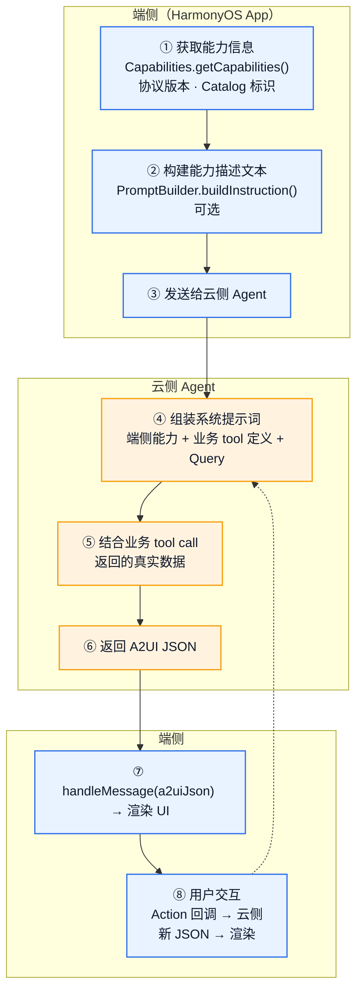
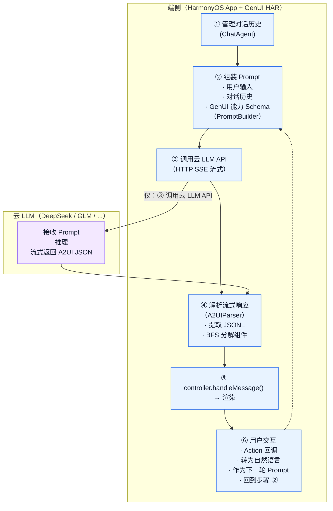

# Agent 部署模式

应用根据自身的业务和实际端云架构，可能会使用两种不同的 A2UI 生成部署方式。选择哪种取决于 Agent 的部署位置和系统架构。

## 模式 A：云侧 Agent

Agent 部署在云端，拥有完整的业务逻辑、tool chain、LLM 调用能力。端侧只需要上报 GenUI 能力信息。



### 云侧 Agent 特点

- **Agent 在云端**：业务逻辑、tool chain、LLM 调用全部在云端
- **端侧轻量**：只需上报能力信息，接收并渲染 DSL
- **架构解耦**：前端和 Agent 独立开发和部署
- **适合已有云 Agent 的系统**：与现有对话系统、RPA 工作流集成

### 端侧关键 API

```ts
import { Capabilities, PromptBuilder, CatalogFactory } from '@arkui-genius/genui'

// 获取 GenUI 能力清单
const manifest = Capabilities.getCapabilities()
// manifest 包含：支持的协议版本、支持的 Catalog 标识

// 构建能力描述文本（可选的，用于给 Agent 看）
const instruction = PromptBuilder.buildInstruction(CatalogFactory.extended())

// 将 manifest + instruction 发送给云侧 Agent
sendToCloudAgent({ manifest, instruction })
```

> **完整示例**：端侧 Agent 的完整实现（对话管理、LLM 调用、流式解析、交互回环）见 [LLM 集成指南 - 模式 B：端侧 Agent 编排](../guides/integrating-llm.md#模式-b端侧-agent-编排)

---

## 模式 B：端侧 Agent 编排

Agent 逻辑部署在端侧（HarmonyOS App 内），云侧只提供 LLM 推理。端侧管理整个对话生命周期。

[ChatDemo](#chatdemo-端侧模块说明) 就是这种模式的完整示例。



### 端侧 Agent 编排特点

- **Agent 在端侧**：对话管理、Prompt 组装、响应流式解析全部在端侧
- **云侧只做推理**：LLM 纯粹是 API 调用
- **端侧自主控制**：不依赖云侧 Agent 服务，灵活性高
- **适合快速原型和轻量化场景**：不需要搭建云侧 Agent 服务

### ChatDemo 端侧模块说明

ChatDemo 示例展示了一个完整的端侧 Agent，其核心模块各司其职：

- **对话管理**：维护多轮对话历史，将用户输入与上下文组装为完整 Prompt
- **LLM 客户端**：通过 HTTP SSE 流式调用远端大模型 API，接收逐 token 返回的 A2UI JSONL
- **Prompt 组装**：根据所选 [Catalog](catalogs.md)（Basic 或 Extended），将组件 Schema 注入系统提示词，引导 LLM 生成符合规范的 DSL
- **流式解析**：从 LLM 响应流中提取 JSONL 行，解析并通过 [controller.handleMessage()](../reference/API/surface-controller.md#handlemessage) 逐条喂入 GenUI
- **会话编排**：协调对话管理、LLM 调用、解析渲染、用户交互的完整生命周期

---

## 如何选择

| 考量 | 模式 A (云侧 Agent) | 模式 B (端侧 Agent) |
|------|---------------------|---------------------|
| Agent 部署位置 | 云端 | 端侧（HarmonyOS App 内） |
| LLM 调用位置 | 云端（由 Agent 调用） | 云端（端侧直连 LLM API） |
| 适用场景 | 已有云 Agent 服务 | 独立功能 / 快速原型 |
| 业务数据位置 | 云端 Agent 管理 | 端侧管理 |
| 端侧复杂度 | 低（只上报 + 渲染） | 中（编排 + 解析 + 渲染） |
| 延迟 | 端 → 云 Agent → LLM → 云 Agent → 端 | 端 → LLM → 端 |
| ChatDemo 示例 | — | ✅ |

---

← 上一节：[Catalog](catalogs.md) | → 下一节：[表达式语言](expression-language.md) | ↑ [概念层总览](overview.md)
