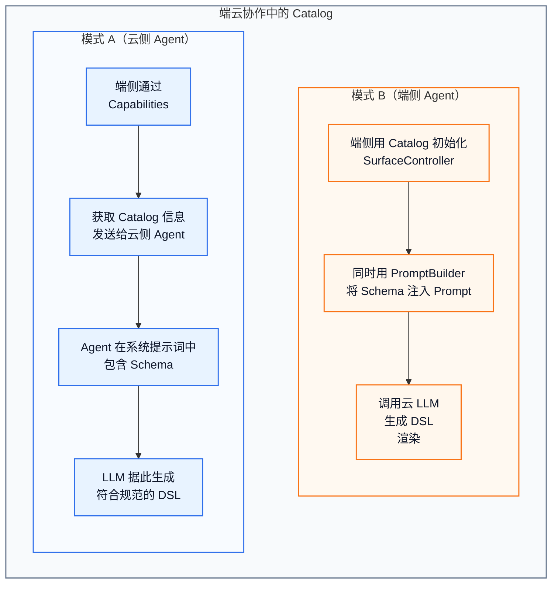

# Catalog

**Catalog** 是 [A2UI 协议](../introduction/a2ui-and-harmonyos.md#a2ui-是什么)的核心概念之一。它定义了 [Agent](agent-deployment-models.md) 可以使用哪些组件和函数——本质上是端侧对 Agent 的**能力契约**。

## Catalog 的本质

Catalog 告诉 Agent：

- 这里有哪些组件可用（[Text](../reference/standard-components/text.md)、[Button](../reference/standard-components/button.md)、[Row](../reference/standard-components/row.md)...）
- 每个组件有哪些属性（[Button](../reference/standard-components/button.md) 有 child 和 action）
- 这里有哪些函数可调用（[required](../reference/functions/validation.md#required)、[formatDate](../reference/functions/format.md#formatdate)...）
- 组件和函数的 [Schema](../glossary.md#schema) 定义

Agent 只能使用 Catalog 中声明的组件和函数。这既是约束（防止生成无效 DSL），也是提示（告诉 LLM 可用的能力范围）。

## Catalog 的两层用途



## 两套 Catalog，二选一

GenUI 当前支持两套 Catalog，每个 [Surface](surfaces-and-messages.md#surface-是什么) 在创建时通过 catalogId 绑定其中一套：

```json
// 使用 Basic Catalog（A2UI 标准协议，18 个标准组件）
{
  "createSurface": {
    "surfaceId": "main",
    "catalogId": "https://a2ui.org/specification/v0_9/catalogs/basic/catalog.json"
  }
}

// 使用鸿蒙扩展协议 Catalog（21 个扩展组件 + 表达式 + 变量）
{
  "createSurface": {
    "surfaceId": "main",
    "catalogId": "ohos.a2ui.extended.catalog"
  }
}
```

## 如何选择

| 场景 | 推荐 Catalog |
|------|-------------|
| 简单信息展示、纯文本表单 | Basic Catalog（A2UI 标准协议） |
| 需要品牌定制样式（颜色、圆角、阴影、渐变） | 鸿蒙扩展协议 Catalog |
| 需要使用 {{ }} 表达式 | 鸿蒙扩展协议 Catalog |
| 需要响应式断点、多设备自适应 | 鸿蒙扩展协议 Catalog |
| 需要[扩展组件默认深浅色](extension-color-mode.md) | 鸿蒙扩展协议 Catalog |
| 需要 [NavContainer](../reference/extended-components/nav-container.md) 导航栈或 [Web](../reference/extended-components/web.md) 组件 | 鸿蒙扩展协议 Catalog |

## GenUI 中的 Catalog 初始化

```ts
import { CatalogFactory, SurfaceControllerFactory } from '@arkui-genius/genui'

// Basic Catalog — A2UI 标准协议，18 个标准组件
const basicCatalog = CatalogFactory.basic()

// 鸿蒙扩展协议 Catalog — 21 个扩展组件 + 表达式 + 变量
const extendedCatalog = CatalogFactory.extended()

// 用选择的 Catalog 创建 SurfaceController
const controller = SurfaceControllerFactory.createSurfaceController({
  uiContext: this.getUIContext(),
  catalog: basicCatalog
})
```

## Catalog 扩展

你可以创建自己的 Catalog，添加自定义组件和函数：

```ts
import { CatalogFactory, CatalogItem, ClientFunction } from '@arkui-genius/genui'
import { wrapBuilder } from '@kit.ArkUI'

const catalog = CatalogFactory.basic()

// 添加自定义组件（CatalogItem）
catalog.addCatalogItem({
  name: 'MyWeatherCard',
  schemaProvider: (version) => JSON.stringify({ /* JSON Schema */ }),
  componentBuilder: wrapBuilder(WeatherCard)
})

// 添加自定义函数（ClientFunction）
catalog.addClientFunction({
  name: 'calculateTax',
  schemaProvider: (version) => JSON.stringify({ /* JSON Schema */ }),
  functionCall: (params, context) => {
    // 函数实现
    return params
  }
})
```

详见 [定义 Catalog 指南](../guides/defining-catalogs.md)。

## Catalog 与 PromptBuilder

[PromptBuilder](../reference/API/prompt-builder.md#promptbuilder) 基于 Catalog 中的 [Schema](../glossary.md#schema) 生成 LLM 系统提示词：

```ts
import { CatalogFactory, PromptBuilder, BASIC_CATALOG_PROTOCOL_VERSION_V09 } from '@arkui-genius/genui'

const catalog = CatalogFactory.basic()
const instruction = PromptBuilder.buildInstruction(catalog, BASIC_CATALOG_PROTOCOL_VERSION_V09)
// instruction 是一个包含完整 Schema 描述的字符串
// 可以直接作为 LLM 系统提示词的一部分
```

---

← 上一节：[交互与函数](actions-and-functions.md) | → 下一节：[Agent 部署模式](agent-deployment-models.md) | ↑ [概念层总览](overview.md)

> **延伸阅读**：[A2UI 官方文档 - Catalogs](https://a2ui.org/concepts/catalogs/)
