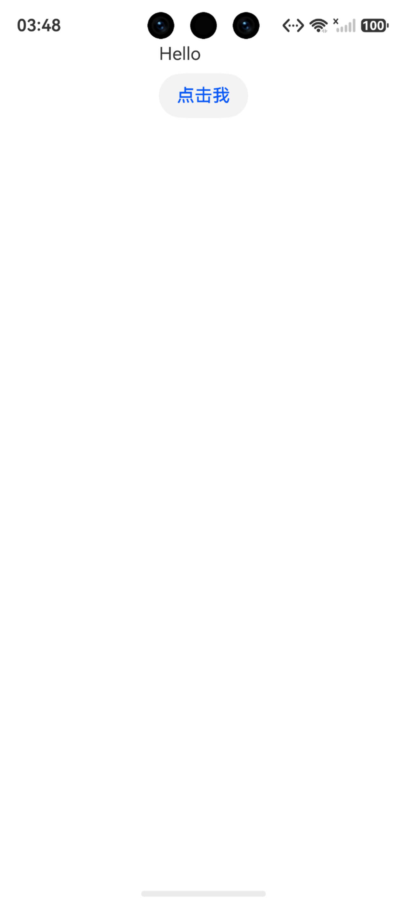

# 组件与布局

A2UI 使用**扁平邻接表**来组织组件。这意味着组件不嵌套——它们在一个扁平的列表中声明，通过 ID 引用建立父子关系。GenUI 在渲染时自动构建树形结构。

## 邻接表模型

A2UI 采用扁平邻接表来组织组件。与嵌套树结构（XML、HTML）不同：

```json
// A2UI 的扁平结构（邻接表）
{
  "components": [
    { "id": "root",   "component": "Column", "children": ["title", "button"] },
    { "id": "title",  "component": "Text",   "text": "Welcome" },
    { "id": "button", "component": "Button", "child": "btn_text" },
    { "id": "btn_text", "component": "Text", "text": "Click Me" }
  ]
}
```

而不是嵌套结构：

```json
// ❌ A2UI 不使用这种嵌套写法
{
  "component": "Column",
  "children": [
    { "component": "Text", "text": "Welcome" },
    { "component": "Button", ... }
  ]
}
```

### 为什么用邻接表

| 优势 | 说明 |
|------|------|
| **LLM 友好** | 扁平结构更容易被 LLM 理解和生成，不需要处理深层嵌套 |
| **增量更新** | 可以只发送变化的组件，不需要重发整个树 |
| **乱序可渲染** | 组件到达顺序无关紧要——GenUI 会缓存并等待引用就绪 |
| **去重简单** | 相同 id 的组件天然去重，后到的覆盖先到的 |

## 组件通用属性

所有组件都共享以下属性：

| 属性 | 类型 | 必填 | 说明 |
|------|------|------|------|
| id | string | 是 | 组件唯一标识，用于父子引用。不支持匿名。 |
| component | string | 是 | 组件类型，如 "Text"、"Button"、"Column" |
| weight | number | 否 | 布局权重，仅在 Row/Column 的直接子组件中生效。<br> 默认值：""。 |
| accessibility | object | 否 | 无障碍属性，含 label 和 description。<br> 默认值：{}。 |

## 组件类型体系

A2UI 定义了 5 种组件角色：

| 角色 | 组件 | 特点 |
|------|------|------|
| **布局容器** | [Row](../reference/standard-components/row.md)、[Column](../reference/standard-components/column.md)、[List](../reference/standard-components/list.md) | 包含 children 数组，管理子组件排列 |
| **展示组件** | [Text](../reference/standard-components/text.md)、[Image](../reference/standard-components/image.md)、[Icon](../reference/standard-components/icon.md)、[Divider](../reference/standard-components/divider.md) | 展示内容，不含子组件 |
| **交互组件** | [Button](../reference/standard-components/button.md)、[TextField](../reference/standard-components/textfield.md)、[CheckBox](../reference/standard-components/checkbox.md)、[Slider](../reference/standard-components/slider.md)、[DateTimeInput](../reference/standard-components/dateTimeInput.md)、[ChoicePicker](../reference/standard-components/choicePicker.md) | 接收用户输入或触发 Action |
| **容器组件** | [Card](../reference/standard-components/card.md)、[Modal](../reference/standard-components/modal.md)、[Tabs](../reference/standard-components/tabs.md) | 用 child（单个）而非 children（多个）引用子组件 |
| **高级组件** | [Video](../reference/standard-components/video.md)、[AudioPlayer](../reference/standard-components/audioPlayer.md) | 多媒体 |

## 静态列表 vs 动态模板

children 支持两种模式：

### 静态列表（明确列出子组件 ID）

```json
{ "id": "col", "component": "Column", "children": ["title", "content", "footer"] }
```

### 动态模板（从数据模型数组批量生成）

```json
{ "id": "list", "component": "List",
  "children": { "componentId": "itemTemplate", "path": "/products" } }
```

从 /products 数组中读取数据，为每个元素渲染一个 itemTemplate 组件。

模板描述符不要求与容器在同一批次中到达。如果模板描述符在后续 updateComponents 中才到达，渲染器会先标记容器为 pending 状态，等描述符到达后自动展开渲染。**此渐进式渲染行为为扩展组件专属**，标准组件的模板不支持 pending 延迟展开和自动重建。详见 [数据流 - 渐进式模板渲染](data-flow.md#渐进式模板渲染)。

## 标准组件 vs 扩展组件

GenUI 支持两套组件体系，通过 catalogId 在创建 [Surface](surfaces-and-messages.md#createsurface) 时选择：

| | Basic Catalog | 鸿蒙扩展协议 Catalog |
|---|---|---|
| **组件数** | 18 | 21 |
| **文本属性** | "text" | "content" |
| **样式** | 不支持 | "styles": {...} 支持 15 种样式 |
| **表达式** | 不支持 | {{ }} 完整表达式 |
| **新增组件** | — | NavContainer、Web、Stack、Grid、Progress、If |

同一个 Surface 不能混用两套组件。

此外，你还可以通过 [自定义组件](../guides/creating-custom-components.md) 扩展 GenUI 的组件体系。

## GenUI 视角的组件渲染

在 GenUI 中，你不需要手动处理邻接表，只需要确保提交给 [SurfaceController](../reference/API/surface-controller.md#surfacecontroller) 合法可被解析的 JSON 格式 A2UI 协议消息，剩下的与该 SurfaceController 绑定的 UIRendererComponent 会自动完成：

```ts
import {
  CatalogFactory,
  SurfaceController,
  SurfaceControllerFactory,
  UIRendererComponent
} from '@arkui-genius/genui'

// ① 创建 Controller，绑定 Catalog（决定用哪套组件）
const controller = SurfaceControllerFactory.createSurfaceController({
  uiContext: this.getUIContext(),
  catalog: CatalogFactory.basic() // 或 CatalogFactory.extended() 使用扩展组件
})

// ② 喂入 DSL，GenUI 自动解析邻接表、构建组件树
controller.handleMessage(
  '{"version":"v0.9",' +
  '"updateComponents":{' +
  '"surfaceId":"main",' +
  '"components":[' +
  '{"id":"root","component":"Column","children":["title","btn"]},' +
  '{"id":"title","component":"Text","text":"Hello"},' +
  '{"id":"btn","component":"Button","child":"btn_text",' +
  '"action":{"event":{"name":"sayHello"}}},' +
  '{"id":"btn_text","component":"Text","text":"点击我"}' +
  ']}}'
)

// ③ UIRendererComponent 自动渲染
build() {
  UIRendererComponent({ surfaceController: this.controller })
}
```

---

## 效果图



---

← 上一节：[Surface 与消息](surfaces-and-messages.md) | → 下一节：[数据模型与绑定](data-model-and-binding.md) | ↑ [概念层总览](overview.md)
