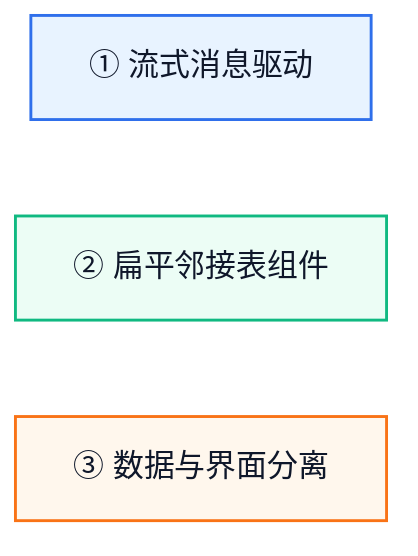

# 概念层总览

> 如果还不了解 GenUI 是什么，请先阅读 [什么是 GenUI](../introduction/what-is-genui.md) 和 [架构概览](../introduction/architecture.md)。

GenUI 建立在 A2UI 协议的基础上。要深入理解 GenUI 的工作原理，你需要理解以下核心概念。

## 三大核心思想

### ① 流式消息驱动

UI 不是一次生成、一次渲染的，而是通过 JSONL 逐行传输的**消息流**逐帧构建的。Agent 边生成、GenUI 边渲染——首屏可见延迟极低。

### ② 扁平邻接表组件

组件不嵌套，而是以扁平的 ID 列表存在。父子关系通过 ID 引用建立。这使 LLM 更容易生成，GenUI 更容易处理增量更新。

### ③ 数据与界面分离

组件定义界面骨架（长什么样），DataModel 填充内容（显示什么）。数据更新自动触发 UI 刷新，不需要重发组件结构。

## 阅读顺序

概念文档按以下线性顺序组织，建议按顺序阅读：

| 序号 | 文档 | 核心内容 |
|------|------|----------|
| 1 | [Surface 与消息](surfaces-and-messages.md) | Surface 生命周期、4 种消息、handleMessage |
| 2 | [组件与布局](components-and-layout.md) | 邻接表模型、标准 vs 扩展组件 |
| 3 | [数据模型与绑定](data-model-and-binding.md) | DataModel、DynamicValue、JSON Pointer |
| 4 | [数据流](data-flow.md) | JSONL 流式、渐进式渲染、消息顺序 |
| 5 | [交互与函数](actions-and-functions.md) | event vs functionCall、Action 回调 |
| 6 | [Catalog](catalogs.md) | Catalog 机制、能力契约、两套组件的选择 |
| 7 | [Agent 部署模式](agent-deployment-models.md) | 云侧 vs 端侧、架构对比、选择指南 |
| 8 | [表达式语言](expression-language.md) | {{ }} 语法、运算符、类型转换（鸿蒙特有） |
| 9 | [变量系统](variable-system.md) | 5 类变量、作用域规则（鸿蒙特有） |
| 10 | [主题与色彩模式](theme-and-color-mode.md) | 品牌色、深色/浅色模式（鸿蒙特有） |
| 11 | [扩展组件默认深浅色](extension-color-mode.md) | 扩展组件颜色默认值、深浅色切换规则（鸿蒙特有） |
| 12 | [扩展组件一多部署](extension-multi-deployment.md) | 扩展组件一多部署内置适配（鸿蒙特有） |
| 13 | [多设备自适应](multi-device-adaptation.md) | 响应式断点、If 条件组件（鸿蒙特有） |

前 7 篇是 A2UI 协议的通用概念（以 GenUI 实现视角讲解），后 6 篇是鸿蒙扩展特有的高级能力。

## 进阶：自定义扩展

学完以上概念后，你可以进一步扩展 GenUI 的能力：

| 文档 | 说明 |
|------|------|
| [自定义组件](../guides/creating-custom-components.md) | 用 @Builder 创建业务专属组件（天气卡片、股票行情等） |
| [自定义函数](../guides/creating-custom-functions.md) | 用 [ClientFunction](../reference/API/client-function.md#clientfunction) 注册本地函数（计算、查询、设备操作） |
| [定义 Catalog](../guides/defining-catalogs.md) | 管理自定义组件和函数的能力清单，控制 LLM 可用能力范围 |

---

→ 下一篇：[Surface 与消息](surfaces-and-messages.md)
