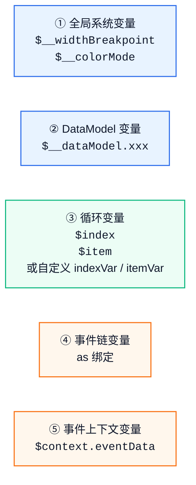

# 变量系统

> **起始版本：** API Version 20
>
> 变量系统是**鸿蒙扩展协议**新增能力，仅在 ohos.a2ui.extended.catalog [Catalog](catalogs.md) 下可用。

## 概述

鸿蒙扩展协议在 A2UI 标准协议之上，引入了 **5 类变量**，构成了完整的数据引用体系。变量可以在表达式（{{ }}）中使用，也可以在组件属性中直接引用。

## 五类变量



## ① 全局系统变量

系统内置的全局变量，自动注入，无需定义：

| 变量 | 类型 | 值 | 说明 |
|------|------|------|------|
| $__widthBreakpoint | string | xs / sm / md / lg / xl | 当前[窗口宽度断点](multi-device-adaptation.md#响应式断点) |
| $__colorMode | string | light / dark | 当前系统色彩模式 |

```json
{ "content": "{{ '当前断点：' + $__widthBreakpoint }}" }
{ "styles": { "backgroundColor": "{{ $__colorMode == 'dark' ? '#333' : '#FFF' }}" } }
```

## ② DataModel 变量

通过 [updateDataModel](surfaces-and-messages.md#updatedatamodel) 消息填充的数据模型。支持绝对路径和相对路径。

### 绝对路径

```
$__dataModel.user.name
$__dataModel.products[0].price
```

### JSON Pointer 语法

```
${/user/name}                    标准 JSON Pointer（以 `/` 开头）
${/products/0/price}             数组索引访问
```

```json
{ "content": "{{ $__dataModel.user.name }}" }
{ "content": "{{ '价格：' + $__dataModel.product.price }}" }
```

## ③ 循环变量

当容器组件使用动态模板（[children.template](../reference/types.md#childlist)）遍历数据数组时，GenUI 自动为每个迭代创建循环变量：

| 变量 | 类型 | 含义 | 可通过以下属性自定义 |
|------|------|------|---------------------|
| $index | number | 当前循环索引（从 0 开始） | indexVar |
| $item | any | 当前循环项的数据 | itemVar |

indexVar 和 itemVar 的值是变量声明名，不带 $；表达式中通过 $声明名 引用。未声明时分别使用 $index 和 $item。同一层配置合法自定义变量后，该层只绑定自定义变量，不再额外绑定该层的默认 $index 或 $item。

### 局部变量命名规则

indexVar、itemVar 和事件链里的 as 使用同一套命名规则：

- 变量名必须以字母或下划线开头
- 后面只能使用字母、数字、下划线
- 声明时不写 $，在表达式里引用时再写 $变量名

像 idx、entry、entry_1、selected 这样的名称可以使用；像 1entry、entry-name、$entry、entry name 这样的名称不能使用。

循环变量只在当前模板实例及其子组件中生效。模板外、兄弟模板、父组件自身，以及同一事件链之外的组件都不能读取该模板实例的局部变量。

### 默认循环变量

```json
{ "id": "itemList", "component": "List",
  "children": { "componentId": "itemNameText", "path": "/items" } }

{ "id": "itemNameText", "component": "Text",
  "content": "{{ $index + 1 + '. ' + $item.name }}" }
```

未配置 indexVar / itemVar 时，模板内使用默认 $index 和 $item。

### 自定义循环变量

```json
{ "id": "itemList", "component": "List",
  "children": {
    "componentId": "listItem",
    "path": "/items",
    "indexVar": "idx",
    "itemVar": "entry"
  }
}

{ "id": "listItem", "component": "Column", "children": ["customVarText", "defaultVarText"] }
{ "id": "customVarText", "component": "Text",
  "content": "{{ $idx + 1 + '. ' + $entry.name }}" }
{ "id": "defaultVarText", "component": "Text",
  "content": "{{ $index + 1 + '. ' + $item.name }}" }
```

这一层自定义为 $idx 和 $entry 后，本层不再绑定默认 $index 和 $item。因此 customVarText 可以读取当前项，defaultVarText 中的 $index 和 $item 不会再表示当前项。

### 嵌套模板：内层遮蔽外层

循环支持嵌套，变量查找按就近优先。查找某个 $变量名 时，先看当前模板层；本层找不到时继续向外层模板查找，直到最外层模板。内层和外层同名时，内层变量遮蔽外层变量；退出内层后，外层变量恢复可见。

```json
{ "id": "categoryList", "component": "List",
  "children": { "componentId": "categoryItem", "path": "/categories" } }
{ "id": "categoryItem", "component": "Column", "children": ["categoryNameText", "entryList"] }
{ "id": "categoryNameText", "component": "Text",
  "content": "{{ $item.name }}" }

{ "id": "entryList", "component": "List",
  "children": { "componentId": "entryNameText", "path": "entries" } }
{ "id": "entryNameText", "component": "Text",
  "content": "{{ $item.name }}" }
```

categoryNameText 中的 $item 是外层分类；entryNameText 中的 $item 是内层条目，内层默认 $item 遮蔽了外层默认 $item。如果需要同时读取外层分类和内层条目，给外层和内层配置不同变量名，例如 itemVar: "category" 和 itemVar: "entry"。

### 嵌套模板：默认变量向上查找

```json
{ "id": "categoryList", "component": "List",
  "children": { "componentId": "categoryItem", "path": "/categories" } }
{ "id": "categoryItem", "component": "Column", "children": ["entryList"] }

{ "id": "entryList", "component": "List",
  "children": {
    "componentId": "entryNameText",
    "path": "entries",
    "itemVar": "entry"
  }
}
{ "id": "entryNameText", "component": "Text",
  "content": "{{ $item.name + ' / ' + $entry.name }}" }
```

内层只自定义了 $entry，本层没有绑定默认 $item；因此 $item 会向外查找，解析到外层分类。

### 超出作用域

局部变量超出作用域后不生效，不能把模板内变量拿到模板外继续使用：

```json
{ "id": "itemList", "component": "List",
  "children": { "componentId": "itemNameText", "path": "/items", "itemVar": "entry" } }
{ "id": "itemNameText", "component": "Text",
  "content": "{{ $entry.name }}" }

// summaryText 不在 itemNameText 模板实例及其子组件内，$entry 在这里不可用
{ "id": "summaryText", "component": "Text",
  "content": "{{ $entry.name }}" }
```

summaryText 不在 itemNameText 模板实例及其子组件内，不能使用 $entry。

### 非法循环变量名

非法 indexVar 或 itemVar 不会中断模板渲染。GenUI 会记录 warning，并按以下规则降级：

| 场景 | 处理规则 |
|------|----------|
| 单个 indexVar 非法 | 该索引变量回退为 $index，itemVar 仍按自身配置处理 |
| 单个 itemVar 非法 | 该项变量回退为 $item，indexVar 仍按自身配置处理 |
| 同一层 indexVar == itemVar | 两个自定义绑定都失败，该层回退为 $index 和 $item |
| 内层冲突名与外层合法变量同名 | 内层不绑定冲突名，查找会继续访问外层变量 |

非法或冲突只影响对应局部变量绑定，不影响组件树继续渲染。

```json
{ "id": "itemList", "component": "List",
  "children": {
    "componentId": "itemNameText",
    "path": "/items",
    "itemVar": "entry-name"
  }
}

{ "id": "itemNameText", "component": "Text",
  "content": "{{ $item.name }}" }
```

entry-name 不是合法变量名，itemVar 绑定失败并回退为默认 $item；模板继续渲染。

## ④ 事件链变量

通过 [EventHandler](../reference/extended-components/overview.md#eventhandler-结构) 链中的 [as](../reference/extended-components/overview.md#eventhandler-结构) 关键字，将函数返回值绑定到临时变量，在后续链节点中引用：

as 的值是变量声明名，不带 $；表达式中通过 $声明名 引用。命名规则见[局部变量命名规则](#局部变量命名规则)。该变量只在当前事件链后续 handler 中可见，可用于 condition 和 args。call 和 as 字段本身为静态字段，不按表达式求值。

as 变量可以用于后续 handler 的 args：

```json
{
  "onClick": [
    { "call": "getSelectValue", "args": { "componentId": "mySelect" }, "as": "selected" },
    { "call": "navigate", "args": { "url": "{{ '/detail?id=' + $selected }}" } }
  ]
}
```

as 变量也可以用于后续 handler 的 condition：

```json
{
  "onChange": [
    { "call": "getSelectValue", "args": { "componentId": "optionSelect" }, "as": "selected" },
    { "call": "openUrl",
      "condition": "{{ $selected != '' }}",
      "args": { "url": "https://example.com" } }
  ]
}
```

as 绑定遵循以下生命周期：

- 只有函数返回有效值且 as 名称合法时才创建变量。
- as 变量只对同一事件链中后续 handler 可见，绑定前不可见。
- 事件链结束后，as 变量释放，下一次事件触发不会复用上一次的值。
- 非法 as 名称只记录 warning；handler 仍执行，但不创建变量，事件链继续。
- 函数无返回值或返回无效值时，不创建 as 变量，事件链继续。

## ⑤ 事件上下文变量

事件触发时，GenUI 将事件相关的运行时数据注入 $context。$context 包含触发事件的组件信息和事件数据：

| 字段 | 类型 | 说明 |
|------|------|------|
| $context.componentId | string | 当前触发事件的组件 ID |
| $context.eventData | object | 当前事件的运行时数据，不同事件类型字段不同 |

eventData 按协议中的事件数据类型区分。无事件数据时，$context.eventData 可视为空对象或 null，不应读取业务字段。

| EventData 类型 | 触发来源 | 可用字段 | 说明 |
|----------------|----------|----------|------|
| 无事件数据 | onAppear、onReachStart、onReachEnd | 无 | $context.eventData 为空对象、null 或无可用业务字段 |
| ClickEventData | onClick | $context.eventData.x: number<br>$context.eventData.y: number | 点击位置坐标 |
| TextInputChangeEventData | TextInput onChange | $context.eventData.value: string | 当前输入文本 |
| RadioChangeEventData | Radio onChange | $context.eventData.isChecked: boolean | 当前 radio 是否选中 |
| CheckboxChangeEventData | Checkbox onChange | $context.eventData.value: boolean | 当前 checkbox 是否选中 |
| CheckboxGroupChangeEventData | CheckboxGroup onChange | $context.eventData.value: string[]<br>$context.eventData.status: All / Part / None | 当前选中的 checkbox 名称列表和全选状态 |
| TabsChangeEventData | Tabs onChange | $context.eventData.index: number | 当前激活 tab 的索引，从 0 开始 |
| ToggleChangeEventData | Toggle onChange | $context.eventData.isOn: boolean | 当前开关状态 |
| SelectEventData | Select onSelect | $context.eventData.index: number<br>$context.eventData.value: string | 当前选中项索引和文本 |

TextInput 变更可以直接读取当前输入文本：

```json
{
  "id": "nameInput",
  "component": "TextInput",
  "onChange": [
    { "call": "setDataModel",
      "args": { "path": "/form/name", "value": "{{ $context.eventData.value }}" } }
  ]
}
```

点击事件可以直接读取坐标：

```json
{
  "onClick": [
    { "call": "setDataModel", "args": {
      "path": "/lastClick",
      "value": { "x": "{{ $context.eventData.x }}", "y": "{{ $context.eventData.y }}" }
    } }
  ]
}
```

如果事件链中使用 as: "context"，后续表达式里的 $context 会按普通变量优先级解析为该 as 返回值，而不再是事件上下文。需要继续访问事件上下文时，应避免将 context 用作 as 或循环变量名。

## 模板事件复合场景

模板实例中的组件触发事件时，事件表达式上下文可以同时读取模板循环变量和事件局部变量：

```json
{ "id": "itemList", "component": "List",
  "children": { "componentId": "itemRow", "path": "/items" } }

{ "id": "itemRow", "component": "Row",
  "onClick": [
    { "call": "getSelectValue", "args": { "componentId": "optionSelect" }, "as": "selectedOption" },
    { "call": "setDataModel", "args": {
      "path": "{{ '/selection/' + $item.id }}",
      "value": { "name": "{{ $item.name }}", "option": "{{ $selectedOption }}" }
    } }
  ]
}
```

- 循环变量和 as 变量不同名时，后续 handler 可同时访问两者。
- 循环变量和 as 变量同名时，as 绑定前读取循环变量；绑定成功后，同一事件链后续 handler 读取 as 值。
- 事件链结束后，as 变量释放，模板循环变量仍按模板作用域规则存在。

## 作用域优先级

当普通变量名同时存在于多个作用域时，优先级为（从高到低）：

```
① 事件链变量 (as 绑定)
② 循环变量 ($index / $item 或自定义变量)
③ 事件上下文变量 ($context)
④ 全局变量
```

内层模板按就近优先查找，事件链 as 只影响绑定后的后续 handler。

```json
{ "id": "itemList", "component": "List",
  "children": { "componentId": "itemRow", "path": "/items" } }

{ "id": "itemRow", "component": "Row",
  "onClick": [
    { "call": "getSelectValue", "args": { "componentId": "optionSelect" }, "as": "item" },
    { "call": "setDataModel", "args": {
      "path": "/debug/priority",
      "value": "{{ $item }}"
    } }
  ]
}
```

as: "item" 绑定前的 $item 是循环项；绑定成功后，后续 handler 中 $item 按优先级解析为事件链变量，遮蔽外层循环项。若仍需读取循环项，避免把 as 命名为 item、index 或已有自定义循环变量名。

$__ 双下划线前缀属于全局变量命名空间，例如 $__dataModel、$__widthBreakpoint 和 $__colorMode。这些 $__* 变量不会被模板变量或 as 变量遮蔽；即使局部变量声明名与其同名或同后缀，$__* 仍按全局变量解析。该规则只是命名空间边界，不新增 $__* 求值语义。

## 协议边界

局部变量只在扩展组件的表达式中生效。标准组件属性中的 {{ $item.name }}、{{ $context.eventData.value }} 等文本保持普通字符串语义，不触发局部变量解析。

## 响应式更新

GenUI 自动追踪组件所依赖的变量。当变量的值发生变化时（通过 updateDataModel 或用户输入），依赖该变量的所有组件自动刷新。

---

← 上一节：[表达式语言](expression-language.md) | → 下一节：[主题与色彩模式](theme-and-color-mode.md) | ↑ [概念层总览](overview.md)
