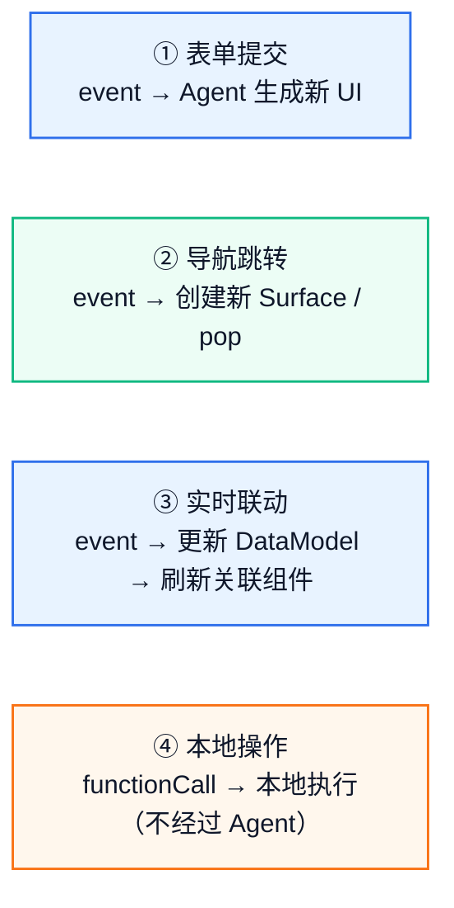

# 用户交互处理

[A2UI](../concepts/overview.md) 中用户的交互行为通过 [Action](../reference/types.md#action) 机制传递。不同的交互场景需要用不同的 Action 类型和回调策略。

---

## 四种交互模式



---

## 模式一：表单提交

最常见的模式——用户填写表单 → 点击提交 → Agent 处理 → 显示结果。

### 表单提交 DSL

```json
{ "id": "submitBtn", "component": "Button",
  "child": "submitText",
  "action": { "event": {
    "name": "submitOrder",
    "context": {
      "email": { "path": "/order/email" },
      "product": { "path": "/product/name" }
    }
  }},
  "variant": "primary"
}
```

### 表单提交 ArkUI 代码

```ts
controller.registerActionReceiver(async (actionJson: string) => {
  const action = JSON.parse(actionJson)

  // action.action.context 中的 path 已自动解析为实际值
  // {
  //   "name": "submitOrder",
  //   "surfaceId": "order-form",
  //   "sourceComponentId": "submitBtn",
  //   "context": { "email": "user@example.com", "product": "蓝牙耳机" }
  // }

  // 发送给 Agent/LLM，获取响应 DSL
  const messages = [
    { role: 'user', content: `用户提交了订单。操作：${action.action.name}，数据：${JSON.stringify(action.action.context)}` }
  ]
  const newDsl = await callLLM(messages)

  // 用新 DSL 更新 UI（如显示"订单已提交"确认页）
  controller.handleMessage(newDsl)
})
```

**为什么用 event 而不是 functionCall？** event 会将 Action 和数据回传给 Agent，Agent 可以根据上下文决定下一轮响应（展示确认页、显示错误、发起新流程等）。functionCall 只能本地执行。

---

## 模式二：导航跳转

列表页 → 点击某项 → 详情页。用 [MultiSurfaceController](../reference/API/multi-surface-controller.md#multisurfacecontroller) 实现页面栈。

### 导航跳转 DSL

```json
{ "id": "itemRow", "component": "Row",
  "children": ["itemName", "itemArrow"],
  "action": { "event": {
    "name": "openDetail",
    "context": { "itemId": { "path": "/products/0/id" } }
  }}
}
```

### 导航跳转 ArkUI 代码

```ts
controller.registerActionReceiver((actionJson: string) => {
  const action = JSON.parse(actionJson)

  if (action.action.name === 'openDetail') {
    const itemId = action.action.context.itemId
    // 创建新 Surface 压入栈
    controller.handleMessage(detailPageDSL(itemId))
  }

  if (action.action.name === 'goBack') {
    controller.pop()  // 返回上一层
  }
})
```

---

## 模式三：实时联动

一个组件的交互影响另一个组件。如 Select 选城市 → 天气组件更新。

### 实时联动 DSL

```json
{ "id": "citySelect", "component": "Select",
  "options": [{ "value": "beijing", "label": "北京" }, { "value": "shanghai", "label": "上海" }],
  "value": { "path": "/form/city" },
  "onSelect": [
    { "call": "setDataModel", "args": { "path": "/form/weatherUpdated", "value": true } }
  ]
}

{ "id": "weatherText", "component": "Text",
  "content": "{{ $__dataModel.form.city == 'beijing' ? '北京：晴 25°C' : '上海：多云 28°C' }}",
  "styles": { "visibility": "{{ $__dataModel.form.weatherUpdated ? 'visible' : 'hidden' }}" }
}
```

这里通过 [setDataModel](../reference/functions/extension-functions.md) 函数在用户选择城市后更新一个标记位，weatherText 自动响应。

### 实时联动 ArkUI 代码

需要查询扩展组件当前值（[getSelectValue](../reference/functions/component-value.md#getselectvalue) 等）时：

```ts
controller.registerActionReceiver((actionJson: string) => {
  const action = JSON.parse(actionJson)

  if (action.action.name === 'searchWeather') {
    // context 中包含通过 getSelectValue 获取的当前值
    const city = action.action.context.city
    // 调用 LLM 生成该城市的天气 UI
  }
})
```

---

## 模式四：本地操作

当组件的 action 使用 functionCall 模式时，交互不会上报给 Agent，而是由 Genui 在本地直接解析参数并调用。它适合打开链接、修改 DataModel、调用已注册的本地函数等**无需服务端参与**的同步操作。

```json
{ "id": "openSite", "component": "Button",
  "child": "linkText",
  "action": { "functionCall": { "call": "openUrl", "args": { "url": "https://example.com" } } }
}

{ "id": "resetForm", "component": "Button",
  "label": "重置",
  "action": { "functionCall": {
    "call": "setDataModel",
    "args": { "path": "/", "value": {} }
  }}
}
```

> **注意**：Local Action（functionCall）**不会触发** registerActionReceiver 回调。它在 GenUI 内部直接执行。如果函数执行过程中抛出异常，会通过 [registerErrorCallback](../reference/API/surface-controller.md#registererrorcallback) 以 LOCAL_FUNCTION 错误码上报。

---

## 扩展组件事件响应（EventHandler 链）

扩展组件支持通过 onClick、onAppear、onChange、onSelect、onReachStart、onReachEnd 事件属性定义 EventHandler 数组。事件触发时，数组中的 handler 按顺序执行，支持条件跳过、链中断和局部变量绑定。

与 action 不同，EventHandler 链可以将多个函数调用组合为一个事件响应流程，适合需要**多步操作、条件分支或中间变量传递**的场景。

### 多步操作

```json
{
  "id": "refreshBtn",
  "component": "Button",
  "label": "刷新",
  "onClick": [
    { "call": "setDataModel", "args": { "path": "/ui/isLoading", "value": true } },
    { "call": "setAttributes", "args": { "componentId": "refreshBtn", "value": { "label": "加载中..." } } }
  ]
}
```

### 条件执行与链中断

使用 condition 控制是否执行某个 handler，使用 call: "break" 中断整个链：

```json
{
  "id": "submitBtn",
  "component": "Button",
  "label": "提交",
  "onClick": [
    { "call": "getRadioValue", "args": { "group": "plan_type" }, "as": "selected" },
    { "call": "break", "condition": "{{ $selected == '' }}" },
    { "call": "setDataModel", "args": { "path": "/form/submitted", "value": true } }
  ]
}
```

### 局部变量传递

通过 as 字段将函数返回值绑定为局部变量，后续 handler 可通过 $变量名 引用：

```json
{
  "id": "genderBtn",
  "component": "Button",
  "label": "确认",
  "onClick": [
    { "call": "getRadioValue", "args": { "group": "gender" }, "as": "selected" },
    { "call": "setDataModel", "args": { "path": "/form/gender", "value": "{{ $selected }}" } }
  ]
}
```

as 的值是声明名，不带 $；表达式中引用时再加 $。命名规则见[局部变量命名规则](../concepts/variable-system.md#局部变量命名规则)。该变量只对同一事件链中后续 handler 可见。

事件触发时还会注入 $context，常用于把当前事件数据写入 DataModel。完整的 eventData 类型见 [事件上下文变量](../concepts/variable-system.md#⑤-事件上下文变量)，作用域规则见 [作用域优先级](../concepts/variable-system.md#作用域优先级)。

```json
{
  "id": "optionSelect",
  "component": "Select",
  "onSelect": [
    { "call": "setDataModel", "args": {
      "path": "/form/selectedOption",
      "value": "{{ $context.eventData.value }}"
    } }
  ]
}
```

点击坐标可直接写入 DataModel：

```json
{
  "id": "mapArea",
  "component": "Stack",
  "onClick": [
    { "call": "setDataModel", "args": {
      "path": "/lastClick",
      "value": { "x": "{{ $context.eventData.x }}", "y": "{{ $context.eventData.y }}" }
    } }
  ]
}
```

### 模板事件中的局部变量

模板组件触发事件时，事件表达式可以同时读取模板循环变量和事件链局部变量：

```json
{ "id": "itemList", "component": "List",
  "children": { "componentId": "itemRow", "path": "/items" } }

{ "id": "itemRow", "component": "Row",
  "onClick": [
    { "call": "getSelectValue", "args": { "componentId": "optionSelect" }, "as": "selectedOption" },
    { "call": "setDataModel", "args": {
      "path": "{{ '/selection/' + $item.id }}",
      "value": { "name": "{{ $item.name }}", "option": "{{ $selectedOption }}" }
    } }
  ]
}
```

$item 来自当前模板实例，$selectedOption 来自当前事件链。变量遮蔽见 [模板事件复合场景](../concepts/variable-system.md#模板事件复合场景)，优先级规则见 [作用域优先级](../concepts/variable-system.md#作用域优先级)。

### 任意组件的点击响应

扩展组件中，任何组件都支持 onClick 事件（不仅仅是 Button）。例如在 Stack 上添加点击：

```json
{
  "id": "pay_btn_stack",
  "component": "Stack",
  "styles": { "width": "matchParent", "height": 40 },
  "onClick": [{"call": "openUrl", "args": {"url": "https://example.com"}}],
  "children": ["btn_bg", "btn_label"]
}
```

### Button 的 action vs onClick

Button 同时支持 action 属性和 onClick 事件。**action 优先级更高**：有 action 时 onClick 不注册。

| 场景 | 使用 | 原因 |
|------|------|------|
| 表单提交、上报给 Agent | action.event | Agent 参与决策 |
| 本地单次函数调用 | action.functionCall | 简洁，单步操作 |
| 多步操作、条件分支、变量传递 | onClick EventHandler 链 | 需要组合多个函数调用 |

---

## 何时用 event vs functionCall

| 场景 | 使用 | 原因 |
|------|------|------|
| 需要 Agent 生成新 UI | event | Agent 才能根据上下文生成新的 DSL |
| 打开链接 | functionCall → [openUrl](../reference/functions/system.md#openurl) | 纯本地操作，不需要 Agent |
| 清空表单 | functionCall → setDataModel | 本地数据操作 |
| 城市选择联动天气 | event + [expression](../concepts/expression-language.md) | 复杂逻辑需要 Agent 生成新 DSL |
| 计算价格 | functionCall → [自定义函数](creating-custom-functions.md) | 计算逻辑在本地执行即可 |

---

## 校验交互

checks 是组件级的**客户端校验**能力，用于在当前 Surface 内直接校验输入状态或控制按钮可用性，不需要 Agent 参与，也不会触发 registerActionReceiver。它只对**组件本身支持 checks 属性**且 DSL 中**显式声明了 checks** 的场景生效；未声明或传空数组时，不执行任何校验。

| 关注点 | 说明 |
|------|------|
| 运行条件 | 组件需要支持 checks 属性（如 TextField、Button 等），并在 DSL 中配置 [CheckRule](../reference/types.md#checkrule) 数组。 |
| 触发时机 | 组件会基于当前 DataModel 对 checks 求值；condition 中依赖的数据路径发生变化后，会自动重新校验。 |
| 校验方式 | Genui 按数组顺序依次计算每个 condition，结果必须为布尔值。任一条件不满足，即视为当前组件校验失败。 |
| 校验作用 | 输入类组件显示错误态和 message；Button 存在未通过项时不可点击。 |
| 适用边界 | 适合必填、格式、长度、范围等本地同步校验；如果要依赖服务端结果、远程接口或复杂业务逻辑，应改用 event 交给业务层处理。 |

### 输入即时校验

```json
{ "id": "email", "component": "TextField",
  "value": { "path": "/form/email" },
  "checks": [
    { "condition": { "call": "required", "args": { "value": { "path": "/form/email" } } },
      "message": "请输入邮箱" },
    { "condition": { "call": "email", "args": { "value": { "path": "/form/email" } } },
      "message": "邮箱格式不正确" }
  ]
}
```

校验失败时，组件进入错误态并显示对应 message。当 /form/email 的值被用户输入或被 setDataModel 等函数更新后，Genui 会自动重新求值并刷新校验结果。

### Button 条件启用

```json
{ "id": "submit", "component": "Button",
  "action": { "event": { "name": "submit" } },
  "checks": [
    { "condition": {
      "call": "and", "args": { "values": [
        { "call": "required", "args": { "value": { "path": "/form/email" } } },
        { "call": "required", "args": { "value": { "path": "/form/name" } } }
      ]}
    }, "message": "请完成必填项" }
  ]
}
```

上述示例中，当 [checks](../reference/types.md#checkrule) 条件满足时（condition 校验结果为 true 时），按钮才可点击；任一条件失败时，按钮会保持不可点击状态，并提示对应的 message。

---

## 常见问题

| 问题 | 原因 | 解决 |
|------|------|------|
| Action 回调没触发 | 使用了 functionCall 而非 event | functionCall 不会回调 registerActionReceiver |
| context 中 path 是字符串不是实际值 | path 格式错误 | 确保 path 以 / 开头，路径在 DataModel 中存在 |
| 点击按钮后 UI 没更新 | 没有正确处理 action 并 feed 新 DSL | 确认在回调中调用了 controller.handleMessage(newDsl) |
| functionCall 没执行 | 函数名拼写错误、参数类型不匹配 | 检查函数注册名称和 DSL 中 call 字段一致 |

---

相关指南：
→ [LLM 集成](integrating-llm.md) | → [构建 UI（标准组件）](building-ui-standard.md) | → [函数参考](../reference/functions/overview.md)
