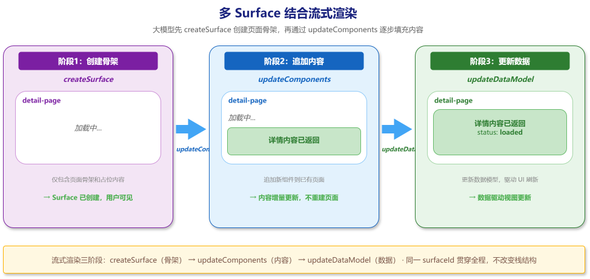
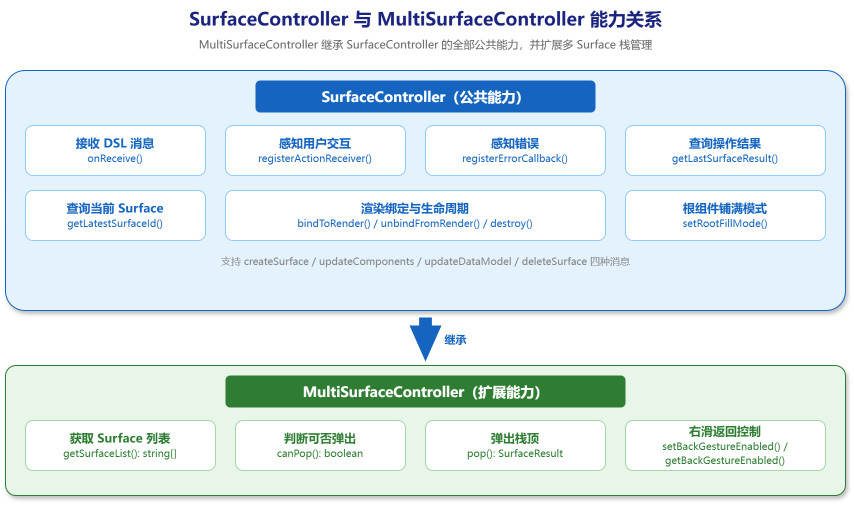
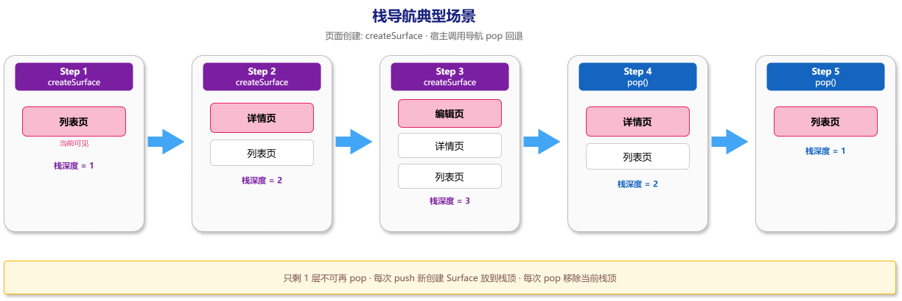
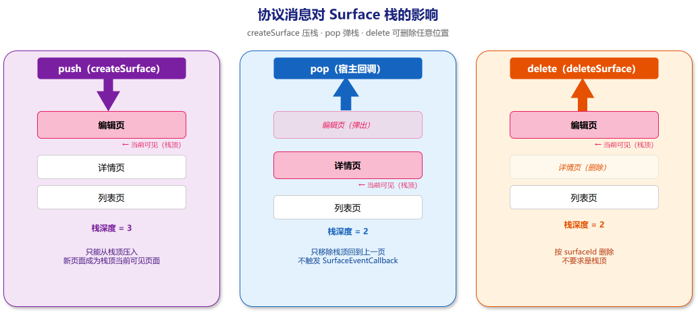
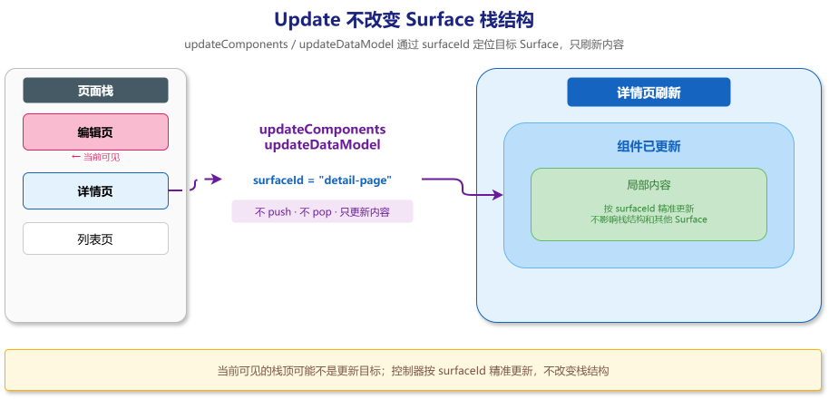
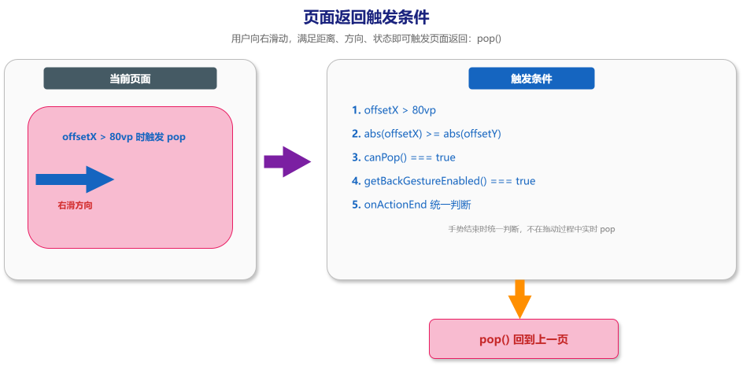
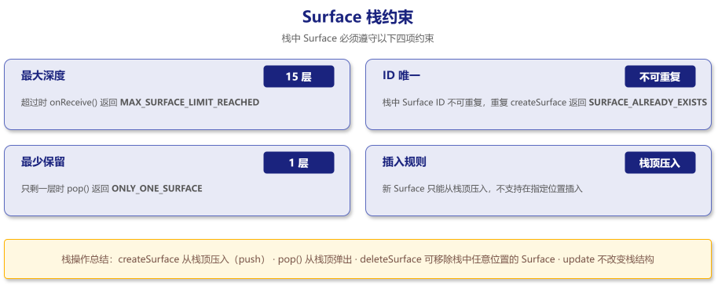

# 多 Surface 管理

[MultiSurfaceController](../reference/API/multi-surface-controller.md) 继承 [SurfaceController](../reference/API/surface-controller.md) 的全部公共能力，在此基础上增加了 **Surface 栈管理**——以压栈 / 出栈方式管理最多 15 层 Surface，并提供右滑返回手势。

当应用需要**页面导航**（例如列表 → 详情 → 编辑）时，每个页面即一个独立 Surface，MultiSurfaceController 自动维护栈顺序：createSurface 将新 Surface 压入栈顶，pop() 弹出栈顶回到上一层，deleteSurface 可移除栈中任意位置。

**核心能力：**

| 能力 | 说明 |
|------|------|
| 栈式导航 | createSurface 自动 push，pop() 弹出栈顶，最多 15 层 |
| 右滑返回 | 内置手势识别，距离阈值 80vp，可按需开关 |
| 灵活删除 | deleteSurface 可移除栈中任意位置的 Surface，不限于栈顶 |
| 独立生命周期 | 栈中每个 Surface 拥有独立的组件树和 DataModel |

如果你的应用是单页表单、单页展示或简单对话式 UI，使用 [SurfaceController](../reference/API/surface-controller.md) 即可——更轻量。详见下方 [选择哪种 Controller](#选择哪种-controller)。



---

## 选择哪种 Controller



```
你的应用需要导航（列表→详情→编辑）吗？
    │
    ├── 是 → 用 MultiSurfaceController
    │         · 页面栈管理（push/pop/delete）
    │         · 返回手势
    │         · 最多 15 层
    │
    └── 否 → 用 SurfaceController
              · 单页渲染
              · 更简单
```

| 使用 [MultiSurfaceController](../reference/API/multi-surface-controller.md) | 使用 [SurfaceController](../reference/API/surface-controller.md) |
|------------------------------|--------------------------|
| 列表 → 详情 → 编辑的逐级导航 | 单页表单、单页展示 |
| Tab 页面各自管理导航 | 不入栈的固定 UI 区域 |
| 需要右滑返回手势 | 简单对话式 UI |

多个完全独立的 UI 区域可以用多个 [SurfaceController](../reference/API/surface-controller.md)，各自管理互不干扰。

---

## 初始化

```ts
import { CatalogFactory, SurfaceControllerFactory } from '@arkui-genius/genui'

const controller = SurfaceControllerFactory.createMultiSurfaceController({
  uiContext,
  catalog: CatalogFactory.extended(),
  eventCallback
})
```

---

## 场景：商品浏览 → 详情 → 编辑



```
          列表页 (product-list)
              │  点击"查看详情" → openDetail
              ▼
          详情页 (product-detail-{id})
              │  点击"编辑" → editProduct
              ▼
          编辑页 (product-edit)
              │  保存 or 右滑返回
              ▼
         pop → 回到详情页
```

### 创建列表页

```ts
// ① createSurface：创建列表页 Surface → 自动成为栈底
controller.handleMessage(
  '{"version":"v0.9",' +
  '"createSurface":{' +
  '"surfaceId":"product-list",' +
  '"catalogId":"ohos.a2ui.extended.catalog"' +
  '}}'
)

// ② updateComponents：提交列表页组件
//    标题 + 动态商品列表（从 /products 数组批量生成列表项）
controller.handleMessage(
  '{"version":"v0.9",' +
  '"updateComponents":{' +
  '"surfaceId":"product-list",' +
  '"components":[' +
  '{"id":"root","component":"Column","children":["title","productList"]},' +
  '{"id":"title","component":"Text","text":"商品列表"},' +
  '{"id":"productList","component":"List",' +
  '"children":{"componentId":"productItem","path":"/products"}},' +
  '{"id":"productItem","component":"Row","children":["itemName","itemBtn"]},' +
  '{"id":"itemName","component":"Text","text":{"path":"/name"}},' +
  '{"id":"itemBtn","component":"Button","child":"itemBtnText",' +
  '"action":{"event":{"name":"openDetail","context":{"productId":{"path":"/id"}}}}},' +
  '{"id":"itemBtnText","component":"Text","text":"查看详情"}' +
  ']}}'
)

// ③ updateDataModel：填充商品数据 → 列表自动渲染
controller.handleMessage(
  '{"version":"v0.9",' +
  '"updateDataModel":{' +
  '"surfaceId":"product-list",' +
  '"path":"/",' +
  '"value":{"products":[' +
  '{"id":"p1","name":"蓝牙耳机","price":299},' +
  '{"id":"p2","name":"机械键盘","price":499},' +
  '{"id":"p3","name":"便携显示器","price":1299}' +
  ']}}' +
  '}'
)
```

> **栈状态：** [product-list] — 1 层，用户看到商品列表

### 用户点击商品或编辑 → 创建新页面

```ts
controller.registerActionReceiver((actionJson: string) => {
  const payload = JSON.parse(actionJson) as Record<string, Object>
  const action = payload.action as Record<string, Object>
  const context = action.context as Record<string, Object>
  const actionName = action.name as string

  if (actionName === 'openDetail') {
    const productId = String(context.productId ?? 'default')
    const detailSurfaceId = `product-detail-${productId}`

    controller.handleMessage(JSON.stringify({
      version: 'v0.9',
      createSurface: {
        surfaceId: detailSurfaceId,
        catalogId: 'ohos.a2ui.extended.catalog'
      }
    }))

    controller.handleMessage(JSON.stringify({
      version: 'v0.9',
      updateComponents: {
        surfaceId: detailSurfaceId,
        components: [
          { id: 'root', component: 'Column', children: ['nameText', 'priceText', 'descText', 'editBtn'] },
          { id: 'nameText', component: 'Text', text: { path: '/product/name' } },
          {
            id: 'priceText',
            component: 'Text',
            text: {
              call: 'formatCurrency',
              args: { value: { path: '/product/price' }, currency: 'CNY' },
              returnType: 'string'
            }
          },
          { id: 'descText', component: 'Text', text: { path: '/product/description' } },
          {
            id: 'editBtn',
            component: 'Button',
            child: 'editBtnText',
            action: {
              event: {
                name: 'editProduct',
                context: { productId: { path: '/product/id' } }
              }
            }
          },
          { id: 'editBtnText', component: 'Text', text: '编辑' }
        ]
      }
    }))

    controller.handleMessage(JSON.stringify({
      version: 'v0.9',
      updateDataModel: {
        surfaceId: detailSurfaceId,
        path: '/',
        value: {
          product: {
            id: productId,
            name: '蓝牙耳机',
            price: 299,
            description: '高品质降噪蓝牙耳机，续航 30 小时'
          }
        }
      }
    }))
  }

  if (actionName === 'editProduct') {
    const productId = String(context.productId ?? 'default')

    controller.handleMessage(JSON.stringify({
      version: 'v0.9',
      createSurface: {
        surfaceId: 'product-edit',
        catalogId: 'ohos.a2ui.extended.catalog'
      }
    }))

    controller.handleMessage(JSON.stringify({
      version: 'v0.9',
      updateComponents: {
        surfaceId: 'product-edit',
        components: [
          { id: 'root', component: 'Column', children: ['titleLabel', 'nameField', 'priceLabel', 'priceField', 'saveBtn'] },
          { id: 'titleLabel', component: 'Text', text: '编辑商品' },
          { id: 'nameField', component: 'TextField', label: '商品名称', value: { path: '/form/name' } },
          { id: 'priceLabel', component: 'Text', text: '价格' },
          { id: 'priceField', component: 'TextField', label: '价格', value: { path: '/form/price' } },
          {
            id: 'saveBtn',
            component: 'Button',
            child: 'saveBtnText',
            action: {
              event: {
                name: 'saveProduct',
                context: {
                  productId: productId,
                  name: { path: '/form/name' },
                  price: { path: '/form/price' }
                }
              }
            }
          },
          { id: 'saveBtnText', component: 'Text', text: '保存' }
        ]
      }
    }))

    controller.handleMessage(JSON.stringify({
      version: 'v0.9',
      updateDataModel: {
        surfaceId: 'product-edit',
        path: '/',
        value: { form: { name: '蓝牙耳机', price: '299' } }
      }
    }))
  }
})
```

> **栈状态：** [product-list, product-detail-p1, product-edit] — 3 层，用户看到编辑表单

### 返回：右滑 or pop()

```ts
// ⑪ 代码弹出栈顶 → edit 被移除，回到 detail
const code = controller.pop()
// code === SurfaceErrorCode.NO_ERROR 表示回退成功

// 或让用户右滑返回（默认关闭，需主动开启）
controller.setBackGestureEnabled(true)
```

> **栈状态回到：** [product-list, product-detail-p1] — 2 层

---

## 栈操作详解





| 操作 | 方法/消息 | 效果 | 触发事件回调 |
|------|----------|------|:---:|
| 推入（新页面） | [createSurface](../concepts/surfaces-and-messages.md#createsurface) 消息 | 新 Surface 压入栈顶 | SURFACE_CREATED |
| 弹出（返回） | controller.pop() | 移除栈顶，回到上一层 | 否 |
| 更新（改内容） | [updateComponents](../concepts/surfaces-and-messages.md#updatecomponents) / [updateDataModel](../concepts/surfaces-and-messages.md#updatedatamodel) | 只更新指定 Surface，不改变栈 | 是 |
| 删除（任意位置） | [deleteSurface](../concepts/surfaces-and-messages.md#deletesurface) 消息 | 移除任意位置的 Surface | SURFACE_DELETED |

关键区别：
- **push（createSurface）**：只能从栈顶压入
- **pop（pop()）**：只能弹出栈顶
- **delete（deleteSurface）**：可移除栈中任意位置

---

## 返回手势



```ts
controller.setBackGestureEnabled(true)   // 开启
controller.getBackGestureEnabled()        // 查询状态
```

### 使用建议

当 UIRendererComponent 不在左右可滑动的宿主组件中时，可以开启返回手势。开启后，用户完成一次符合阈值的返回滑动，UIRendererComponent 会调用 [pop()](../reference/API/multi-surface-controller.md#pop) 销毁栈顶 Surface，并显示上一个 Surface。

如果 UIRendererComponent 被放在横向 Scroll、Swiper、Tabs、PanGesture 等左右可滑动的宿主组件中，不建议开启返回手势。开启后 UIRendererComponent 内部的水平 PanGesture 可能优先消费手势，导致外层左右滑动无法响应。此类场景建议关闭返回手势，改由宿主在合适的按钮、导航栏或系统返回处理中调用 [canPop()](../reference/API/multi-surface-controller.md#canpop) / [pop()](../reference/API/multi-surface-controller.md#pop) 主动返回。

> 当前 SDK 在 LTR 环境下以右滑触发返回，在 RTL 镜像语言环境下方向相反。

### 手势规格

适用于通过 UIRendererComponent 托管渲染的场景。

| 规格项 | 取值 | 说明 |
|--------|------|------|
| 触发时机 | onActionEnd | 手势结束时统一判断，不在拖动过程中实时 pop |
| 返回距离阈值 | offsetX > 80 | 向右滑动距离严格大于 80vp 时触发 |
| 斜滑判定 | abs(offsetX) >= abs(offsetY) | 水平方向为主，超过 45° 偏竖向的斜滑不触发 |
| 栈状态要求 | canPop() === true | 深度 > 1 |
| 开关状态要求 | getBackGestureEnabled() === true | 已开启 |

### 手势冲突

遵循 ArkUI 手势响应机制：

- **UIRendererComponent 内部优先**：若渲染内容中有可滑动组件（横向 Scroll、横向 List 等），该组件优先响应手势，在横向滚动区域右滑时内部组件消费手势，右滑返回不触发。离开横向滚动区域后按阈值规则正常工作。
- **宿主横向滑动可能被劫持**：若宿主在 UIRendererComponent 外层存在横向 Scroll、Swiper、Tabs、PanGesture 等左右可滑动组件，开启返回手势后，UIRendererComponent 内的水平 PanGesture 可能优先响应，外层滑动不触发。

| 场景 | 响应方 | 说明 |
|------|--------|------|
| 渲染内容内部有横向 Scroll/List → 用户在该区域右滑 | 内部可滑动组件优先 | 内部组件滚动消费手势，不触发返回 |
| 宿主外层有横向 Scroll/Swiper/Tabs/PanGesture | 可能由 UIRendererComponent 优先响应 | 外层左右滑动可能无法触发，建议关闭返回手势并改用 canPop()/pop() |
| 普通区域（Text、Button 等） | 右滑返回 | 无手势竞争，按阈值规则触发 |

---

## 栈约束



| 约束 | 说明 | 错误表现 |
|------|------|----------|
| 最大 15 层 | 超过时消息处理结果为 [MULTI_SURFACE_MAX_SURFACE_LIMIT_REACHED](../reference/errors.md) | 新 Surface 创建被拒绝，栈不变 |
| ID 唯一 | 栈内不可重复 surfaceId | 返回 [MULTI_SURFACE_ALREADY_EXISTS](../reference/errors.md) |
| 至少 1 层 | 仅剩 1 层时 pop() 无效 | 返回 [MULTI_SURFACE_ONLY_ONE_SURFACE](../reference/errors.md) |

---

## Tab + 独立 MultiSurfaceController

当应用使用 Tab 布局时，每个 Tab 可以持有独立的 MultiSurfaceController，各自的页面栈互不干扰：

```ts
import {
  CatalogFactory,
  MultiSurfaceController,
  SurfaceControllerFactory,
  UIRendererComponent
} from '@arkui-genius/genui'

@Entry
@Component
struct TabPage {
  // 每个 Tab 独立管理自己的页面栈
  // 首页栈：[首页] → [首页, 搜索结果] → ...
  @State homeController: MultiSurfaceController | null = null
  // 我的栈：[个人中心] → [个人中心, 设置] → ...
  @State profileController: MultiSurfaceController | null = null

  aboutToAppear(): void {
    const catalog = CatalogFactory.extended()
    this.homeController = SurfaceControllerFactory.createMultiSurfaceController({
      uiContext: this.getUIContext(),
      catalog,
      eventCallback: () => {}
    })
    this.profileController = SurfaceControllerFactory.createMultiSurfaceController({
      uiContext: this.getUIContext(),
      catalog,
      eventCallback: () => {}
    })
  }

  build() {
    Tabs() {
      TabContent() {
        if (this.homeController) {
          UIRendererComponent({ surfaceController: this.homeController })
        }
      }.tabBar('首页')

      TabContent() {
        if (this.profileController) {
          UIRendererComponent({ surfaceController: this.profileController })
        }
      }.tabBar('我的')
    }
  }
}
```

两个 Tab 的页面栈完全独立——在首页进入的子页面不会影响"我的"Tab 的栈状态，切换 Tab 时各自的导航位置被保留。

---

## 与流式渲染结合

创建 Surface 骨架后，逐步填充：

```ts
// 阶段 1：骨架
controller.handleMessage(createSurfaceDSL)
controller.handleMessage(skeletonDSL)     // 只有 root + 标题

// 阶段 2：填充
controller.handleMessage(moreComponents)  // 追加详情内容

// 阶段 3：数据
controller.handleMessage(dataDSL)         // 填充 DataModel
```

---

## 完整 API 速查

完整 API 文档见 [MultiSurfaceController API](../reference/API/multi-surface-controller.md) 和 [SurfaceController API](../reference/API/surface-controller.md)。

```ts
controller.handleMessage(dsl)              // 处理 A2UI DSL 消息
controller.getSurfaceList()               // 栈中所有 Surface ID 列表
controller.getLatestSurfaceId()           // 当前栈顶 Surface ID
controller.canPop()                       // 深度 > 1 返回 true
controller.pop()                          // 弹出栈顶，返回 SurfaceErrorCode
controller.setBackGestureEnabled(true)    // 开关右滑返回
controller.getBackGestureEnabled()        // 当前手势状态
```

---

相关指南：
→ [创建 Surface](creating-surfaces.md) | → [Surface 概念](../concepts/surfaces-and-messages.md) | → [MultiSurfaceController API](../reference/API/multi-surface-controller.md)
