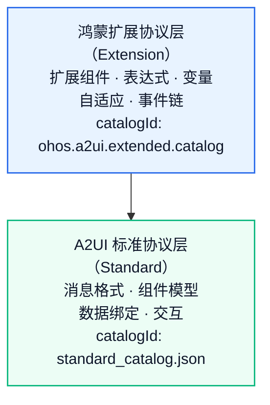

# A2UI 与鸿蒙扩展

GenUI 建立在 A2UI 标准协议之上，同时通过鸿蒙扩展协议为开发者提供了更丰富的 UI 能力。理解两者的关系，是掌握 GenUI 的第一步。

## A2UI 是什么

A2UI（Agent-to-UI）是由 Google 发起的一个开放 UI 描述协议。它的核心思想是：

> AI Agent 通过标准化的 JSON 消息流，描述和更新用户界面。

A2UI 协议定义了：

| 层面 | 内容 |
|------|------|
| **消息格式** | createSurface、updateComponents、updateDataModel、deleteSurface 四种消息类型 |
| **组件模型** | 扁平邻接表结构，通过 ID 引用构建 UI 树 |
| **数据绑定** | 基于 JSON Pointer 的 DataModel，支持 static binding 和 template binding |
| **交互模型** | Action 机制（event 发送到服务端 / functionCall 本地执行） |
| **标准组件** | 18 个标准组件（Text、Button、Row、Column、List、TextField 等） |
| **内置函数** | 14 个内置函数（required、regex、formatDate、openUrl 等） |

A2UI 是一个**平台无关**的开放协议，不同平台只需要实现自己的 Renderer 即可。

## 鸿蒙扩展在 A2UI 之上增加了什么

A2UI 标准协议提供的是 UI 描述的"最小公约数"——足够简单、足够通用，但也因此缺少一些高级能力。

鸿蒙扩展协议在 A2UI 标准协议之上，通过 **Catalog 扩展机制** 增加了以下能力：

| 能力 | A2UI 标准协议 | 鸿蒙扩展协议 |
|------|----------|----------|
| **组件** | 18 个标准组件 | 21 个扩展组件（命名相同，但增加了 styles 对象支持） |
| **样式** | 不支持 | 15 种通用样式（width/height、margin/padding、backgroundColor、shadow、linearGradient 等） |
| **表达式** | 不支持 | {{ }} 模板表达式（算术运算、字符串拼接、三元条件、大小比较） |
| **变量** | 仅 DataModel | 5 类变量（DataModel、全局系统变量、循环变量、事件链变量、事件上下文） |
| **事件** | 通过 action 表达交互，且仅部分标准组件支持 | 新增 onClick、onChange 等事件，并提供完整 EventHandler 链（call/args/as/condition） |
| **自适应** | 不支持 | vp/fp/% 单位 + 响应式断点（xs/sm/md/lg/xl）+ If 条件组件 |
| **深浅色默认值** | 不支持 | 扩展组件未显式设置颜色属性时，按当前深浅色使用默认色 |
| **新增组件** | — | Navigation、Web、Stack、Grid、Progress、If 等 |
| **扩展函数** | 14 内置函数 | +10 个交互函数（getRadioValue、sendToAssistant、navigate 等） |

## 双层架构

鸿蒙扩展协议不是"替代"A2UI 标准协议，而是**扩展**它。两者是分层关系：



## 关键规则：

- **消息格式完全兼容**：鸿蒙扩展协议层不引入新消息类型，完全继承 A2UI 标准协议的 4 种消息
- **Catalog 决定组件集**：每个 Surface 在创建时通过 catalogId 绑定一个 Catalog，这决定了可用哪套组件
- **不可混用**：同一个 Surface 上不能混用标准组件和扩展组件——这是二选一的决策

## 混用 A2UI 标准协议与鸿蒙扩展协议会怎样

端侧 Catalog 和 DSL catalogId 必须**配对使用**。如果不配对，会出现以下情况：

### 端侧标准 + DSL 扩展（catalogId 不匹配）

```ts
import { CatalogFactory, SurfaceControllerFactory } from '@arkui-genius/genui'

// 端侧：使用 A2UI 标准协议
const controller = SurfaceControllerFactory.createSurfaceController({
  uiContext: this.getUIContext(),
  catalog: CatalogFactory.basic()
})
```

```json
// DSL：却填了鸿蒙扩展协议的 catalogId
{
  "version": "v0.9",
  "createSurface": {
    "surfaceId": "main",
    "catalogId": "ohos.a2ui.extended.catalog"
  }
}
```

**结果：** createSurface 会因 catalogId 不匹配而失败，Surface 无法创建。[registerErrorCallback()](../reference/API/surface-controller.md#registererrorcallback) 会收到错误通知。

### 端侧扩展 + DSL 标准（catalogId 不匹配）

```ts
// 端侧：使用鸿蒙扩展协议
const controller = SurfaceControllerFactory.createSurfaceController({
  uiContext: this.getUIContext(),
  catalog: CatalogFactory.extended()
})
```

```json
// DSL：却填了 A2UI 标准协议的 catalogId
{
  "version": "v0.9",
  "createSurface": {
    "surfaceId": "main",
    "catalogId": "https://a2ui.org/specification/v0_9/catalogs/basic/catalog.json"
  }
}
```

**结果：** 与上一种情况相同，createSurface 因 catalogId 不匹配而失败，Surface 无法创建。

### 同一 Surface 内混用组件

端侧与 DSL 配对正确（都使用 A2UI 标准协议）时，如果在 updateComponents 中使用了扩展组件或扩展属性：

```json
{
  "version": "v0.9",
  "updateComponents": {
    "surfaceId": "main",
    "components": [
      {
        "id": "root",
        "component": "Column",
        "children": ["btn"]
      },
      {
        "id": "btn",
        "component": "Button",
        "styles": { "backgroundColor": "#FF0000" }
      }
    ]
  }
}
```

**结果：**

- A2UI 标准协议 Catalog 不包含 styles 解析能力，styles 属性会被忽略，组件回退到默认样式继续渲染。
- 如果使用了鸿蒙扩展协议独有的组件（如 NavContainer、Web、Stack），引擎会因组件未注册而无法创建。

### 跨 Surface 混用

在同一个 [MultiSurfaceController](../reference/API/multi-surface-controller.md#multisurfacecontroller) 中，不同的 Surface **可以**分别使用不同协议：

```json
// Surface A：A2UI 标准协议
{
  "version": "v0.9",
  "createSurface": {
    "surfaceId": "list-page",
    "catalogId": "https://a2ui.org/specification/v0_9/catalogs/basic/catalog.json"
  }
}

// Surface B：鸿蒙扩展协议（同一控制器，不同 Surface）
{
  "version": "v0.9",
  "createSurface": {
    "surfaceId": "detail-page",
    "catalogId": "ohos.a2ui.extended.catalog"
  }
}
```

**结果：** 这是合法的。端侧使用 CatalogFactory.extended() 创建控制器后，既支持鸿蒙扩展协议也兼容 A2UI 标准协议的组件集，不同 Surface 可以各自绑定不同的 catalogId。但每个 Surface 内部仍然不可混用两套组件。

---

## 什么时候用哪套

| 场景 | 推荐 |
|------|------|
| 简单信息展示、纯文本表单 | Basic Catalog（A2UI 标准协议，18 个标准组件） |
| 品牌定制样式、深色模式 | 鸿蒙扩展协议 Catalog |
| 需要 {{ }} 表达式进行动态数据绑定 | 鸿蒙扩展协议 Catalog |
| 需要响应式断点、多设备自适应 | 鸿蒙扩展协议 Catalog |
| 需要组件默认深浅色或一多部署能力说明 | 鸿蒙扩展协议 Catalog |
| 需要 NavContainer 导航栈 | 鸿蒙扩展协议 Catalog |

## 怎么创建 A2UI 标准协议和鸿蒙扩展协议的 Surface

选哪套协议，**关键看 createSurface 的 catalogId 填什么**。

### 端侧写法

```ts
import { CatalogFactory, SurfaceControllerFactory } from '@arkui-genius/genui'

// A2UI 标准协议
const standardCtrl = SurfaceControllerFactory.createSurfaceController({
  uiContext: this.getUIContext(),
  catalog: CatalogFactory.basic()
})

// 鸿蒙扩展协议
const extendedCtrl = SurfaceControllerFactory.createSurfaceController({
  uiContext: this.getUIContext(),
  catalog: CatalogFactory.extended()
})
```

| 协议 | 端侧写法 |
|------|----------|
| **A2UI 标准协议** | CatalogFactory.basic() |
| **鸿蒙扩展协议** | CatalogFactory.extended() |

### DSL 写法

```json
// A2UI 标准协议
{
  "version": "v0.9",
  "createSurface": {
    "surfaceId": "main",
    "catalogId": "https://a2ui.org/specification/v0_9/catalogs/basic/catalog.json"
  }
}

// 鸿蒙扩展协议
{
  "version": "v0.9",
  "createSurface": {
    "surfaceId": "main",
    "catalogId": "ohos.a2ui.extended.catalog"
  }
}
```

| 协议 | DSL 里的 catalogId |
|------|-------------------|
| **A2UI 标准协议** | "https://a2ui.org/specification/v0_9/catalogs/basic/catalog.json" |
| **鸿蒙扩展协议** | "ohos.a2ui.extended.catalog" |

> 💡 catalogId 决定了"这套组件按什么规则解析"。端侧和 DSL 两边要配对使用——端侧用 CatalogFactory.extended() 启用扩展渲染能力，DSL 里填 ohos.a2ui.extended.catalog 声明扩展组件集。

详细的组件属性对比、样式速查和完整代码示例，见[使用扩展组件](../guides/using-extended-components.md)。扩展组件颜色属性的深浅色默认值见[扩展组件默认深浅色](../concepts/extension-color-mode.md)。

---

## 下一步

- [架构概览](architecture.md) — 了解端到端数据流
- [快速上手](quickstart.md) — 5 分钟体验 GenUI
- [A2UI 官方文档](https://a2ui.org/introduction/what-is-a2ui/) — 了解 A2UI 协议的更多细节
