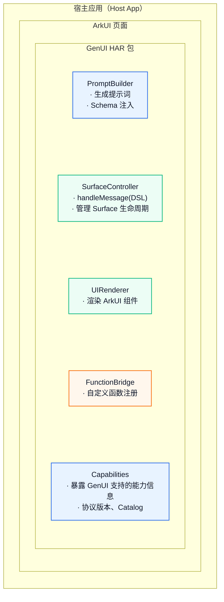
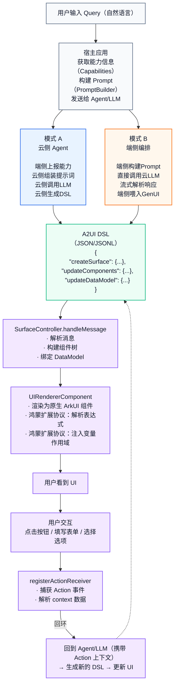

# 架构概览

## 双层协议架构

GenUI 采用双层协议架构：A2UI 标准协议层提供基础通信能力，鸿蒙扩展协议层在此基础上通过 Catalog 机制增加高级 UI 能力。

## 端到端数据流

## 核心模块

| 模块 | 职责 |
|------|------|
| **Catalog** | 声明 GenUI 支持哪些组件和函数。每个 Surface 通过 catalogId 绑定一个 Catalog，决定可用哪套组件体系 |
| **SurfaceController** | 管理单个 Surface 的生命周期。接收 DSL、触发渲染、分发事件、查询状态 |
| **MultiSurfaceController** | 管理多个 Surface 的栈结构。支持推入、弹出、返回手势 |
| **UIRendererComponent** | ArkUI [@Component](../glossary.md#uirenderercomponent)，将 Surface 的组件树渲染为原生 ArkUI 控件 |
| **PromptBuilder** | 基于 Catalog 中的 Schema 信息生成 LLM 系统提示词，告诉 LLM 可用的组件和函数 |
| **Capabilities** | 暴露 GenUI 支持的能力信息（协议版本、Catalog 标识） |
| **FunctionBridge** | 允许应用注册自定义函数，函数可在 DSL 中被引用（action、动态值、校验规则） |

## 下一步

- [快速上手](quickstart.md) — 5 分钟体验 GenUI
- [A2UI 与鸿蒙扩展](a2ui-and-harmonyos.md) — 理解两套协议的差异
- [Surface 与消息](../concepts/surfaces-and-messages.md) — 深入理解协议消息
