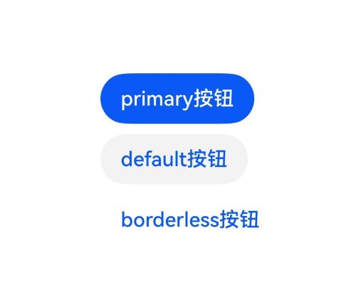

# Button 组件

按钮组件，可快速创建不同样式的可交互按钮。

**起始版本：**  API Version 20

## 特有属性

除支持[通用属性](overview.md)，还支持以下特有属性：

| 特有属性 | 说明 |
|------|------|
| [checks](#checks) | 客户端验证规则数组 |
| [child](#child) | 子组件的id |
| [variant](#variant) | 按钮样式 |
| [action](#action) | 按钮点击响应事件 |

### checks

客户端验证规则数组，数组中任一校验项不通过时按钮无法点击。

**起始版本：**  API Version 20

| 属性 | 类型 | 必填 |  说明 |
|------|------| ------| ------|
| checks | [CheckRule[]](../types.md#checkrule) | 否 | 设置客户端验证规则数组。 <br/> 取值范围：支持["required"](../functions/validation.md###required)、["regex"](../functions/validation.md###regex)、["length"](../functions/validation.md###length)、["numeric"](../functions/validation.md###numeric)、["email"](../functions/validation.md###email) 验证规则，其他验证规则不生效。<br> 默认值：[]。  |

可选验证规则类型具体说明如下：

| 名称 | 值 | 说明 |
|----|---------|------|
| "required" | - | 校验输入值是否为空。 |
| "regex" | - | 对输入值进行正则匹配校验。 |
| "length" | - | 对输入值进行长度检验。 |
| "numeric" | - | 对输入值进行数字类型检验。 |
| "email" | - | 对输入值进行邮箱地址格式检验。 |

**示例DSL：**

检验Button组件的文本内容是否为空。检验失败按钮不可点击。

```json
{
  "version":"v0.9",
  "updateComponents":{
    "surfaceId":"button_surface",
    "components":[
      {
        "component": "Button",
        "id": "buttonNode",
        "child": "childText",
        "checks":[{
          "condition":{
            "call":"required",
            "args":{
              "value": {"path": "/form/code"}
            },
            "returnType":"boolean"
          },
          "message":"检验失败"
        }]
      },
      {
        "component": "Text",
        "id": "childText",
        "text": {"path": "/form/code"}
      }
    ]
  }
}
```

---

### child

子组件的id。

**起始版本：**  API Version 20

| 属性 | 类型 | 必填 |  说明 |
|------|------| ------| ------|
| child | string | 是 | Button组件内需要展示的子组件的id。 <br/> 取值范围：支持设置["Text"](./text.md)、["Icon"](./icon.md)类型组件的id，设置其他类型组件id时不显示子组件。<br> 默认值：""。未设置child属性时取默认值。  |

**示例DSL：**

```json
{
  "version":"v0.9",
  "updateComponents":{
    "surfaceId":"button_surface",
    "components":[
      {
        "component": "Button",
        "id": "buttonNode",
        "child": "childText"
      },
      {
        "component": "Text",
        "id": "childText",
        "text": "按钮文本"
      }
    ]
  }
}
```

---

### variant

按钮样式。

**起始版本：**  API Version 20

| 属性 | 类型 | 必填 |  说明 |
|------|------| ------| ------|
| variant | string | 否 | 按钮样式。 <br/> 取值范围：支持"default"、"primary"、"borderless"，非法字符串按默认值处理。<br> 默认值："default"。  |

可选字符串枚举值的具体说明如下：

| 名称 | 值 | 说明 |
|----|---------|------|
| "default" | - | 默认按钮样式。 |
| "primary" | - | 行动号召按钮样式。 |
| "borderless" | - | 无边框和背景按钮样式。 |

**示例DSL：**

```json
{
  "version":"v0.9",
  "updateComponents":{
    "surfaceId":"button_surface",
    "components":[
      {
        "component": "Column",
        "id": "root",
        "children": ["primaryButton", "defaultButton", "borderlessButton"]
      },
      {
        "component": "Button",
        "id": "primaryButton",
        "child": "primaryText",
        "variant": "primary"
      },
      {
        "component": "Text",
        "id": "primaryText",
        "text": "primary按钮"
      },
      {
        "component": "Button",
        "id": "defaultButton",
        "child": "defaultText",
        "variant": "primary"
      },
      {
        "component": "Text",
        "id": "defaultText",
        "text": "default按钮"
      },
      {
        "component": "Button",
        "id": "borderlessButton",
        "child": "borderlessText",
        "variant": "primary"
      },
      {
        "component": "Text",
        "id": "borderlessText",
        "text": "borderless按钮"
      }
    ]
  }
}
```



---

### action

按钮点击响应事件，支持服务器事件和客户端函数两种形式。

**起始版本：**  API Version 20

| 属性 | 类型 | 必填 |  说明 |
|------|------| ------| ------|
| action | [Action](../types.md#action) | 是 | 按钮点击响应事件。 <br/> 取值范围：支持"event"、"functionCall"事件形式，其他事件形式不生效。<br> 默认值：{}。未设置action属性时取默认值。  |

可选事件形式具体说明如下：

| 名称 | 值 | 说明 |
|----|---------|------|
| "event" | - | 上报定义的服务器事件。 |
| "functionCall" | - | 执行本地的客户端函数。 |

**示例DSL：**

点击按钮，执行本地的[openUrl](../functions/system.md#系统函数1-个)客户端函数，打开url对应的网页。

```json
{
  "version":"v0.9",
  "updateComponents":{
    "surfaceId":"button_surface",
    "components":[
      {
        "component": "Button",
        "id": "buttonNode",
        "child": "childText",
        "action": {
          "functionCall": {
            "call": "openUrl",
            "args": {
              "url": "https://www.huawei.com/cn/"
            },
            "returnType":"void"
          }
        }
      },
      {
        "component": "Text",
        "id": "childText",
        "text": "按钮文本"
      }
    ]
  }
}
```

点击按钮，上报name为button.event的服务器事件。

```json
{
  "version":"v0.9",
  "updateComponents":{
    "surfaceId":"button_surface",
    "components":[
      {
        "component": "Button",
        "id": "buttonNode",
        "child": "childText",
        "action": {
          "event": {
            "name": "button.event",
            "context": {
              "data": "user data"
            }
          }
        }
      },
      {
        "component": "Text",
        "id": "childText",
        "text": "按钮文本"
      }
    ]
  }
}
```

---

## 组件Schema

```json
{
  "type": "object",
  "allOf": [
    {
      "$ref": "../common_types.json#/$defs/ComponentCommon"
    },
    {
      "$ref": "../common_types.json#/$defs/CatalogComponentCommon"
    },
    {
      "$ref": "../common_types.json#/$defs/Checkable"
    },
    {
      "type": "object",
      "properties": {
        "component": {
          "const": "Button"
        },
        "child": {
          "$ref": "../common_types.json#/$defs/ComponentId",
          "description": "Child component id. Button content should be rendered by a Text child."
        },
        "variant": {
          "type": "string",
          "default": "default",
          "enum": [
            "default",
            "primary",
            "borderless"
          ],
          "description": "Button visual variant. Invalid values fallback to default behavior."
        },
        "action": {
          "$ref": "../common_types.json#/$defs/Action"
        }
      },
      "required": [
        "component",
        "child",
        "action"
      ]
    }
  ],
  "additionalProperties": true
}

```

↑ [返回 Reference 总览](../../README.md#reference-api-速查)
