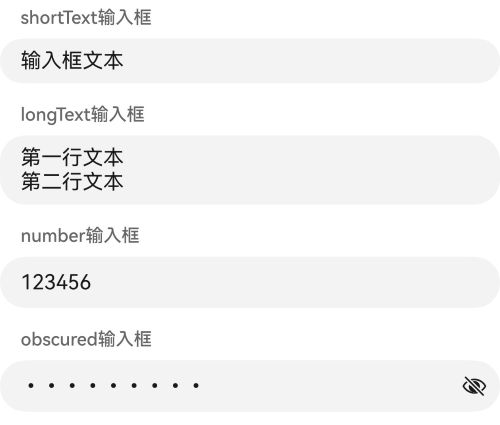

# TextField 组件

文本输入框组件。

**起始版本：**  API Version 20

## 特有属性

除支持[通用属性](overview.md)，还支持以下特有属性：

| 特有属性 | 说明 |
|------|------|
| [checks](#checks) | 客户端验证规则数组 |
| [label](#label) | 输入框标签文本 |
| [value](#value) | 输入框内容文本 |
| [variant](#variant) | 输入框样式 |
| [validationRegexp](#validationregexp) | 输入框内容正则校验表达式 |

### checks

客户端验证规则数组，数组中任一校验项不通过时输入框下方显示用户定义的错误信息。

**起始版本：**  API Version 20

| 属性 | 类型 | 必填 |  说明 |
|------|------| ------| ------|
| checks | [CheckRule[]](../types.md#checkrule) | 否 | 设置客户端验证规则数组。 <br/> 取值范围：支持["required"](../functions/validation.md###required)、["regex"](../functions/validation.md###regex)、["length"](../functions/validation.md###length)、["numeric"](../functions/validation.md###numeric)、["email"](../functions/validation.md###email) 验证规则，其他验证规则不生效。<br> 默认值：[]。  |

可选验证规则类型具体说明如下：

| 名称 | 值 | 说明 |
|----|---------|------|
| "required" | - | 校验输入值是否为空。 |
| "regex" | - | 对输入值进行正则匹配校验。 |
| "length" | - | 对输入值进行长度检验。 |
| "numeric" | - | 对输入值进行数字类型检验。 |
| "email" | - | 对输入值进行邮箱地址格式检验。 |

**示例DSL：**

检验TextField组件的输入框内容是否为空。检验失败输入框下方显示"检验失败"的错误信息。

```json
{
  "version":"v0.9",
  "updateComponents":{
    "surfaceId":"text_field_surface",
    "components":[
      {
        "component": "TextField",
        "id": "textFieldNode",
        "label": "输入框标签",
        "value": {"path": "/form/code"},
        "checks":[{
          "condition":{
            "call":"required",
            "args":{
              "value": {"path": "/form/code"}
            },
            "returnType":"boolean"
          },
          "message":"检验失败"
        }]
      }
    ]
  }
}
```

---

### label

输入框标签文本。

**起始版本：**  API Version 20

| 属性 | 类型 | 必填 |  说明 |
|------|------| ------| ------|
| label | [DynamicString](../types.md#dynamicstring) | 是 | 输入框标签文本。</br> 取值范围：支持任意字符串，设置不支持数据类型按默认值处理。 <br> 默认值：""。未设置label属性时取默认值。 |

**示例DSL：**

```json
{
  "version":"v0.9",
  "updateComponents":{
    "surfaceId":"text_field_surface",
    "components":[
      {
        "component": "TextField",
        "id": "textFieldNode",
        "label": "输入框标签",
        "value": "输入框文本"
      }
    ]
  }
}
```

---

### value

输入框内容文本。

**起始版本：**  API Version 20

| 属性 | 类型 | 必填 |  说明 |
|------|------| ------| ------|
| value | [DynamicString](../types.md#dynamicstring) | 是 | 输入框内容文本。</br> 取值范围：支持任意字符串，设置不支持数据类型按默认值处理。 <br> 默认值：""。未设置value属性时取默认值。 |

**示例DSL：**

```json
{
  "version":"v0.9",
  "updateComponents":{
    "surfaceId":"text_field_surface",
    "components":[
      {
        "component": "TextField",
        "id": "textFieldNode",
        "label": "输入框标签",
        "value": "输入框文本"
      }
    ]
  }
}
```

---

### variant

输入框样式。

**起始版本：**  API Version 20

| 属性 | 类型 | 必填 |  说明 |
|------|------| ------| ------|
| variant | string | 否 | 输入框样式。 <br/> 取值范围：支持"shortText"、"longText"、"number"、"obscured"，非法字符串按默认值处理。<br> 默认值："shortText"。  |

可选字符串枚举值的具体说明如下：

| 名称 | 值 | 说明 |
|----|---------|------|
| "shortText" | - | 单行文本输入框。 |
| "longText" | - | 多行文本输入框。 |
| "number" | - | 数字输入框。 |
| "obscured" | - | 密码输入框。 |

**示例DSL：**

```json
{
  "version":"v0.9",
  "updateComponents":{
    "surfaceId":"text_field_surface",
    "components":[
      {
        "component": "Column",
        "id": "root",
        "children": ["shortTextTextField", "longTextTextField", "numberTextField", "obscuredTextField"]
      },
      {
        "component": "TextField",
        "id": "shortTextTextField",
        "label": "shortText输入框",
        "value": "输入框文本",
        "variant": "shortText"
      },
      {
        "component": "TextField",
        "id": "longTextTextField",
        "label": "longText输入框",
        "value": "第一行文本\n第二行文本",
        "variant": "longText"
      },
      {
        "component": "TextField",
        "id": "numberTextField",
        "label": "number输入框",
        "value": "123456",
        "variant": "number"
      },
      {
        "component": "TextField",
        "id": "obscuredTextField",
        "label": "obscured输入框",
        "value": "123456abc",
        "variant": "obscured"
      }
    ]
  }
}
```



---

### validationRegexp

输入框内容正则校验表达式。

**起始版本：**  API Version 20

| 属性 | 类型 | 必填 |  说明 |
|------|------| ------| ------|
| validationRegexp | string | 否 | 输入框内容正则校验表达式。</br> 取值范围：支持合法正则表达式字符串。设置不合法表达式字符串默认校验失败。 <br> 默认值：""，空字符串默认校验通过。 |

**示例DSL：**

校验TextField组件的输入框内容是否为6位纯数字。

```json
{
  "version":"v0.9",
  "updateComponents":{
    "surfaceId":"text_field_surface",
    "components":[
      {
        "component": "TextField",
        "id": "textFieldNode",
        "label": "输入框标签",
        "value": "输入框文本",
        "validationRegexp":"^[0-9]{6}$"
      }
    ]
  }
}
```

---

## DFX 说明

TextField组件的异常通过[registerErrorCallback](../API/surface-controller.md#registererrorcallback)注册的 onError 回调。

| 错误类型 | code 值 | error message | 说明 |
|------|---------|---------------|------|
| ERROR_SCHEMA_WARNING | 2001 | Property validationRegexp is invalid regex '<validationRegexp>': <errorReason> | validationRegexp设置的正则表达式不合法。 |

错误码和错误回调的完整说明见 [onError](../errors.md) 。

## 组件Schema

```json
{
  "type": "object",
  "allOf": [
    {
      "$ref": "../common_types.json#/$defs/ComponentCommon"
    },
    {
      "$ref": "../common_types.json#/$defs/CatalogComponentCommon"
    },
    {
      "$ref": "../common_types.json#/$defs/Checkable"
    },
    {
      "type": "object",
      "properties": {
        "component": {
          "const": "TextField"
        },
        "label": {
          "$ref": "../common_types.json#/$defs/DynamicString",
          "description": "The text label for the input field."
        },
        "value": {
          "$ref": "../common_types.json#/$defs/DynamicString",
          "description": "The value of the text field."
        },
        "variant": {
          "type": "string",
          "enum": [
            "longText",
            "number",
            "shortText",
            "obscured"
          ],
          "default": "shortText",
          "description": "Input variant mapped to ArkUI text input type. Invalid values fallback to shortText behavior."
        },
        "validationRegexp": {
          "type": "string",
          "description": "Regex used to intercept invalid value input/update for this text field. Malformed regex is ignored."
        }
      },
      "required": [
        "component",
        "label"
      ]
    }
  ],
  "additionalProperties": true
}
```

↑ [返回 Reference 总览](../../README.md#reference-api-速查)
