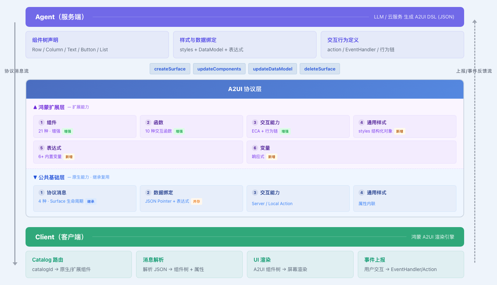

# 鸿蒙A2UI协议设计

## 修改记录

> ⚠ 修改记录已迁移到独立文件，**请勿在此章节编辑**。
> 回写位置：[modification-history.md](modification-history.md)（全量）/ [modification-history-form.md](modification-history-form.md)（form）

完整修改记录详见 [modification-history.md](modification-history.md)。

## 1 协议说明

### 1.1 协议概述

鸿蒙 A2UI 协议（以下简称本协议）是面向智能体（Agent）与客户端（Client）之间 UI 描述与渲染的标准化通信协议。本协议以 A2UI v0.9 原生协议为基线进行扩展设计，在完全兼容 A2UI 消息格式与数据结构的前提下，通过组件扩展机制为鸿蒙生态提供更丰富的 UI 描述能力。

本协议旨在为智能体驱动的 UI 生成场景定义一套标准化的 UI 描述与交互规范：智能体负责描述界面结构、样式、交互行为及数据绑定关系，客户端据此完成渲染与事件处理。

### 1.2 设计目标

本协议在设计时遵循以下目标：

1. **兼容性优先**：消息格式、数据结构、组件模型沿袭 A2UI 原生设计，确保原生协议的客户端实现无需修改即可运行。
2. **声明式 UI 描述**：以 JSON 为载体，通过组件树声明界面结构，通过数据模型（DataModel）驱动内容更新，实现 UI 与数据的分离。
3. **增量式扩展**：扩展能力以原生协议为基座，通过 catalog 机制增量叠加。扩展的样式、交互（ECA）、表达式等能力仅作用于扩展组件，原生组件的行为和后续演进完全不受影响。
4. **多端自适应**：提供响应式断点系统、弹性布局单位和条件渲染组件，支持一次描述适配多种设备形态。
5. **模型亲和性**：协议结构与语义设计充分考虑大语言模型（LLM）的生成能力，力求 DSL 结构简洁、语义明确、易于模型学习与生成。

### 1.3 协议架构

本协议采用两层架构模型：

**A2UI 原生层**（[A2UI原生协议](#2-a2ui原生协议)）：定义服务端与客户端之间的消息协议，包括 Surface 生命周期管理、组件更新、数据模型操作、能力协商等核心机制，以及内置组件体系和交互模型。

**鸿蒙扩展层**（[A2UI扩展设计](#3-a2ui扩展设计)）：在原生层基础上，通过 catalog 扩展机制新增组件、样式属性、交互函数、事件监听、表达式系统和多端自适应能力。扩展层的实现机制如下：

- 通过 `createSurface` 消息中的 `catalogId` 字段选定扩展 catalog，该 surface 内的组件按扩展 catalog 定义的属性集解析，底层消息机制沿用原生协议。
- 扩展组件与原生组件采用统一命名（如 `Text`、`Button`），同一组件名称在不同 catalog 下各自独立定义属性集与能力，不存在覆盖关系。
- 扩展组件的消息格式（`updateComponents`、`updateDataModel` 等）与原生组件完全一致，不引入新的消息类型。

**两层协作关系**：



各维度详细职责见下表：

| 维度 | 原生层职责 | 扩展层职责 | 关系 |
|------|-----------|-----------|------|
| 消息机制 | 定义 createSurface / updateComponents / updateDataModel / deleteSurface 的消息格式与交互流程 | 完整继承，不引入新的消息类型 | **继承** |
| 组件体系 | 定义内置组件（Row、Column、Text、Button 等 18 种）及其属性 | 通过 catalog 新增扩展组件，同名组件可具备更丰富的属性集 | **增强** |
| 数据驱动 | 定义 DataModel 的读写机制（JSON Pointer 路径绑定） | 继承 JSON Pointer 绑定，并扩展为表达式响应式绑定（`{{ $__dataModel.xxx }}`） | **并行** |
| 交互能力 | 定义 Server Action / Local Action / 内置函数 | 新增事件监听（EventHandler）、交互函数、行为链 | **增强** |
| 样式系统 | 无独立样式机制（属性内联） | 新增 `styles` 结构化样式对象 | **增强** |
| 多端自适应 | 无 | 新增响应式变量、断点系统、条件渲染组件（If） | **新增** |

### 1.4 协议版本

本协议涉及两个独立的版本号：

| 版本 | 版本号格式 | 当前版本 | 说明 |
|------|-----------|---------|------|
| A2UI 原生协议 | v{major}.{minor} | v0.9 | 消息格式、核心组件、数据模型的基础协议 |
| 鸿蒙扩展协议 | {major}.{minor}.{patch} | 1.0.0 | 基于 A2UI 原生协议的扩展能力（组件、样式、表达式等） |

**版本演进规则**：

1. **原生协议升级**：A2UI 原生协议版本升级时，本协议评估兼容性影响并决定是否同步升级。原生协议的 minor 版本升级（如 v0.9 → v1.0）可能引入新的消息类型或组件定义，本协议需评估是否需要配套更新扩展层。
2. **扩展协议独立演进**：鸿蒙扩展协议的版本号独立于 A2UI 原生协议。在不改变原生协议基线的前提下，扩展协议可独立发布 minor 或 patch 版本（如新增扩展组件、样式属性、交互函数等）。
3. **版本兼容性**：每个扩展协议版本声明其所依赖的 A2UI 原生协议最低版本。扩展协议应保持对同一原生协议 major 版本内的向后兼容。

**版本编号规则**：

扩展协议版本号遵循 [语义化版本 2.0.0](https://semver.org/)（Semantic Versioning）规范，格式为：

```
MAJOR.MINOR.PATCH[-PRERELEASE]
```

**各段含义**：

| 段 | 递增时机 | 示例 |
|----|---------|------|
| MAJOR | 大的特性演进、可能的不兼容变更（如删除组件、修改消息格式） | 1.x.x → 2.0.0 |
| MINOR | 向后兼容的功能新增（如新增组件、属性、函数） | 1.0.x → 1.1.0 |
| PATCH | 向后兼容的问题修复（如修正默认值、文档勘误） | 1.0.0 → 1.0.1 |

**预发布阶段**：

当 MAJOR 或 MINOR 版本处于开发阶段时，通过预发布标识标注成熟度：

| 标识 | 含义 | 说明 |
|------|------|------|
| `-alpha.N` | 内部验证版 | 协议设计初稿，结构可能频繁变更 |
| `-beta.N` | 公开测试版 | 功能基本稳定，接受外部反馈，可能有不兼容调整 |
| `-rc.N` | 发布候选版 | 功能冻结，仅修复缺陷，预期与正式版一致 |
| （无后缀） | 正式发布版 | 生产可用，保证向后兼容 |

版本排序遵循 SemVer 规范：`1.0.0-alpha.1 < 1.0.0-alpha.2 < 1.0.0-beta.1 < 1.0.0-rc.1 < 1.0.0`

**示例演进路径**：

```
1.0.0-alpha.1 → 1.0.0-alpha.2 → 1.0.0-beta.1 → 1.0.0-rc.1 → 1.0.0 → 1.1.0 → 1.1.1 → 2.0.0-alpha.1
```

### 1.5 文档组织

本协议文档按以下结构组织：

| 章节 | 内容 | 导读 |
|------|------|------|
| §2 A2UI 原生协议 | 消息流、消息格式、组件体系、交互模型、能力协商 | 理解协议通信基础，阅读 §3 前的前置知识 |
| §3 扩展设计 | 扩展原则、组件、样式、函数、事件监听、表达式与变量系统、子组件模板生成、多端自适应、动态数据绑定 | 本协议的核心规范，扩展组件开发的必读章节 |
| §4 附件 | 组件规格详表、通用属性/样式/事件、表达式语法与变量系统、JSON Schema | 按需查阅的参考手册，配合 §3 使用 |

### 1.6 约定

1. **版本标注**：本协议基于 A2UI v0.9 设计（鸿蒙扩展协议版本 1.0.0），所有消息示例中的 `version` 字段均为 `"v0.9"`。
2. **必选与可选**：组件属性表中标注为"必选"的字段在消息中不可省略，标注为"可选"的字段省略时采用默认值。
3. **JSON 示例**：文档中的 JSON 示例用于说明结构，部分示例包含注释（`//`）以辅助理解，实际消息中不允许注释。
4. **颜色值**：除特殊说明外，颜色值均采用 `#AARRGGBB` 十六进制格式。
5. **长度单位**：除特殊说明外，数值型尺寸属性默认单位为 vp（虚拟像素），支持 fp、% 等单位显式标注。
6. **枚举值**：属性取值为有限集合时，以字符串枚举形式列出所有合法值及默认值。

## 2 A2UI原生协议

本章节简要介绍 A2UI 协议关键能力，详细请参考官方说明[[a2ui_protocol](https://github.com/google/A2UI/blob/v0.9/specification/v0_9/docs/a2ui_protocol.md)]

### 2.1 协议消息

#### 2.1.1 协议数据流

1. Create Surface: 服务端发送 createSurface 消息以初始化界面。

2. Update Components：一旦界面创建好了，服务端通过发送一个或多个包含UI组件定义的updateComponents消息来定义界面。

3. Update Data Model: 界面创建好之后，服务端可以在任意时刻发送updateDataModel消息来定义或者修改UI组件的数据。

4. Render：客户端根据updateComponents消息和updateDataModel消息渲染UI界面。

5. Dynamic updates：当用户与应用交互或者有新的信息时，服务端可以发送新增的updateComponents消息和updateDataModel消息来动态调整UI。

6. Delete Surface：当UI界面已经不需要了，服务端可以发送deleteSurface消息移除该界面。

   > 参考官网流程图了解详细数据流[[Data Flow](https://a2ui.org/concepts/data-flow/)]


#### 2.1.2 消息顺序

1. updateComponents必须在createSurface之后发出。
2. updateComponents和updateDataModel先后顺序没有约束。
3. 不同的surface之间的消息应该独立。
4. 多个updateComponents和updateDataModel消息可增量修改同一个surface。

#### 2.1.3 createSurface消息

**消息格式**

```json
{
  version: "v0.9";
  createSurface: {
    surfaceId: string;      // Required: Unique surface identifier
    catalogId: string;      // Required: URL of component catalog
    theme?: object;         // Optional: Theme configuration
    sendDataModel?: boolean; // Optional: Request client to send data model updates
  }
}
```

**消息示例**

```json
{
  "version": "v0.9",
  "createSurface": {
    "surfaceId": "main",
    "catalogId": "https://a2ui.org/specification/v0_9/basic_catalog.json",
    "theme": {
        "primaryColor": "#00BFFF",
        "iconUrl": "https://www.example.com/a.ico",
        "agentDisplayName": "A2UI Agent"
    }
  }
}
```

#### 2.1.4 updateComponents消息

**消息格式**

```json
{
  version: "v0.9";
  updateComponents: {
    surfaceId: string;        // Required: Target surface
    components: Array<{       // Required: List of components
      id: string;             // Required: Component ID
      component: string;      // Required: Component type name
      ...properties           // Component-specific properties (flat)
    }>
  }
}
```

**单组件示例**

```json
{
  "version": "v0.9",
  "updateComponents": {
    "surfaceId": "main",
    "components": [
      {
        "id": "greeting",
        "component": "Text",
        "text": "Hello, World!",
        "variant": "h1"
      }
    ]
  }
}
```

**多组件示例**

```json
{
  "version": "v0.9",
  "updateComponents": {
    "surfaceId": "main",
    "components": [
      {
        "id": "root",
        "component": "Column",
        "children": ["header", "body"]
      },
      {
        "id": "header",
        "component": "Text",
        "text": "Welcome"
      },
      {
        "id": "body",
        "component": "Card",
        "child": "content"
      },
      {
        "id": "content",
        "component": "Text",
        "text": {"path": "/message"}
      }
    ]
  }
}
```

**更新已有组件示例**

```json
{
  "version": "v0.9",
  "updateComponents": {
    "surfaceId": "main",
    "components": [
      {
        "id": "greeting",
        "component": "Text",
        "text": "Hello, Alice!",
        "variant": "h1"
      }
    ]
  }
}
```

#### 2.1.5 updateDataModel消息

**消息格式**

```json
{
  version: "v0.9";
  updateDataModel: {
    surfaceId: string;      // Required: Target surface
    path?: string;          // Optional: JSON Pointer path (defaults to "/")
    value?: any;            // Optional: Value to set (omit to delete)
  }
}
```

**初始化整个数据示例**

```json
{
  "version": "v0.9",
  "updateDataModel": {
    "surfaceId": "main",
    "path": "/",
    "value": {
      "user": {
        "name": "Alice",
        "email": "alice@example.com"
      },
      "items": []
    }
  }
}
```

**更新数据示例**

```json
{
  "version": "v0.9",
  "updateDataModel": {
    "surfaceId": "main",
    "path": "/user/email",
    "value": "alice@newdomain.com"
  }
}
```

#### 2.1.6 deleteSurface 消息

**消息格式**

```json
{
  version: "v0.9";
  deleteSurface: {
    surfaceId: string;        // Required: Surface to delete
  }
}
```

**消息示例**

```json
{
  "version": "v0.9",
  "deleteSurface": {
    "surfaceId": "modal"
  }
}
```

#### 2.1.7 能力协商机制

由于客户端和服务端智能体可以支持多个catalog，所以他们需要通过catalog协商握手机制来决定使用哪个catalog，具体机制如下：

1. **智能体公布其支持的catalog（可选）**：智能体可以公布其支持哪些catalog（比如通过A2A的Agent Card形式）。这个可以帮助客户端知道是否智能体支持客户端特定的能力，但是这个信息仅供客户端参考，客户端不一定要使用，该过程也是可选的。

```json
{
  "name": "Ecommerce Dashboard Agent",
  "description": "This agent visualizes ecommerce data...",
  "capabilities": {
    "extensions": [
      {
        "uri": "https://a2ui.org/a2a-extension/a2ui/v0.8",
        "description": "Provides agent driven UI using the A2UI JSON format.",
        "params": {
          "supportedCatalogIds": [
            "https://a2ui.org/specification/v0_9/basic_catalog.json",
            "https://github.com/.../rizzcharts_catalog_definition.json"
          ]
        }
      }
    ]
  }
}
```

2. **客户端公布其支持的（必选）Catalog**：客户端可以在每条消息的metadata部分发送其支持的catalog列表给智能体，catalog可以通过偏好来排序。通过这个来精确告知智能体客户端具体的渲染能力。以下是以A2A消息为例：

```json
{
  "parts": [
    {
      "text": "What is the current status of my flight?"
    }
  ],
  "metadata": {
    "a2uiClientCapabilities": {
      "supportedCatalogIds": [
        "https://a2ui.org/specification/v0_9/basic_catalog.json",
        "https://github.com/.../rizzcharts_catalog_definition.json"
      ]
    }
  }
}
```

3. **智能体选用catalog**：当智能体创建新的界面时，需要从客户端发送的支持的catalog列表中选择一个最匹配的来使用。在一个界面的生成过程中（即一次createSurface生命周期过程）仅能按照这一个选定的catalog来生成界面，同一个会话中的多个界面生成可以选用不同的catalog。如果没有匹配的catalog，智能体可以不发送界面。

```json
{
  "createSurface": {
    "surfaceId": "salesDashboard",
    "catalogId": "https://a2ui.org/specification/v0_9/basic_catalog.json"
  }
}
```

### 2.2 A2UI组件

#### 2.2.1 内置组件

A2UI原生支持的组件包括布局组件、展示组件、交互组件、容器组件、高级组件5大类，详细原生组件类型、功能说明及属性见[A2UI原生组件](#41-a2ui-原生组件)。

| 名称 | 类型 |
|------|------|
| Row | 布局组件 |
| Column | 布局组件 |
| List | 布局组件 |
| Text | 展示组件 |
| Image | 展示组件 |
| Icon | 展示组件 |
| Divider | 展示组件 |
| Button | 交互组件 |
| TextField | 交互组件 |
| CheckBox | 交互组件 |
| Slider | 交互组件 |
| DateTimeInput | 交互组件 |
| ChoicePicker | 交互组件 |
| Card | 容器组件 |
| Modal | 容器组件 |
| Tabs | 容器组件 |
| Video | 高级组件 |
| AudioPlayer | 高级组件 |

#### 2.2.2 自定义组件

A2UI原生支持新增自定义组件，可以在catalog新增组件定义，形式如下：

```json
"Image": {
      "type": "object",
      "allOf": [
        {
          "$ref": "common_types.json#/$defs/ComponentCommon"
        },
        {
          "$ref": "#/$defs/CatalogComponentCommon"
        },
        {
          "type": "object",
          "properties": {
            "component": {
              "const": "Image"
            },
            "url": {
              "$ref": "common_types.json#/$defs/DynamicString",
              "description": "The URL of the image to display."
            },
            "fit": {
              "type": "string",
              "description": "Specifies how the image should be resized to fit its container. This corresponds to the CSS 'object-fit' property.",
              "enum": ["contain", "cover", "fill", "none", "scaleDown"],
              "default": "fill"
            },
            "variant": {
              "type": "string",
              "description": "A hint for the image size and style.",
              "enum": [
                "icon",
                "avatar",
                "smallFeature",
                "mediumFeature",
                "largeFeature",
                "header"
              ],
              "default": "mediumFeature"
            }
          },
          "required": ["component", "url"]
        }
      ],
      "unevaluatedProperties": false
    }
```

### 2.3 A2UI交互

#### 2.3.1 交互类型

现有A2UI中定义了两种行为服务端行为和本地行为。

**服务端行为（Server Action）**

通过在交互组件（如Button）中的action属性中设置event字段值定义具体交互，并可以携带可选的context字段上传数据。

```json
{
  "id": "submit-btn",
  "component": "Button",
  "child": "submit-text",
  "variant": "primary",
  "action": {
    "event": {
      "name": "submit_form",
      "context": {
        "itemId": "123",
        "email": { "path": "/formData/email" }
      }
    }
  }
}
```

客户端向服务端发送的消息内容如下所示：

```json
{
  "name": "submit_form",
  "surfaceId": "id",
  "sourceComponentId": "submit-btn",
  "timestamp": "2026-03-12T06:12:16.444Z",
  "context":{
    "itemId": "123",
    "email": "abc@abc.com"
  }
}
```

**本地行为（Local Action）**

通过在交互组件（如Button）中的action属性中设置functionCall字段值定义具体交互，并可以携带args字段上传指定参数。

```json
{
  "id": "submit-btn",
  "component": "Button",
  "child": "submit-text",
  "variant": "primary",
  "action": {
    "functionCall": {
      "call": "openUrl",
      "args": {
        "url": "${/url}"
      }
    }
  }
}
```

#### 2.3.2 内置函数

| 名称 | 说明 |
|------|------|
| required | 必填验证 |
| regex | 正则验证 |
| length | 长度验证 |
| numeric | 数值验证 |
| email | 邮箱验证 |
| formatString | 字符串格式化 |
| formatNumber | 数字格式化 |
| formatCurrency | 货币格式化 |
| formatDate | 日期格式化 |
| pluralize | 复数化 |
| openUrl | 打开链接 |
| and | 逻辑与 |
| or | 逻辑或 |
| not | 逻辑非 |

## 3 A2UI扩展设计

### 3.1 扩展说明

1. 扩展组件类型、样式属性、交互以及表达式能力，这些能力均只在扩展组件上生效，A2UI原生组件上不支持这些扩展能力。
3. 扩展组件与原生组件采用统一命名（如 `Button`、`Text`），通过 `catalogId` 字段区分组件来源。`catalogId: "ohos.a2ui.extended.catalog"` 标识鸿蒙扩展组件，原生组件的 `catalogId` 为 `"https://a2ui.org/specification/v0_9/basic_catalog.json"`（参见 [§2.1.3 createSurface 消息](#213-createsurface消息)）。

### 3.2 扩展组件

在A2UI原生组件的基础上，扩展更丰富的组件，支撑多样化UI能力。扩展组件与原生组件采用统一命名（如 `Text`、`Button`），通过 `createSurface` 消息中的 `catalogId` 字段区分来源。新增组件在updateComponents消息中的描述沿袭A2UI数据结构组织方式，详细扩展组件及属性参见[扩展组件](#32-扩展组件)。

```json
// createSurface 时指定扩展 catalog
{
  "version": "v0.9",
  "createSurface": {
    "surfaceId": "main",
    "catalogId": "ohos.a2ui.extended.catalog"
  }
}

// updateComponents 中直接使用统一组件名，无需再指定 catalogId，通过 surfaceId 关联到创建的 surface
{
  "version": "v0.9",
  "updateComponents": {
    "surfaceId": "main",  // 使用 createSurface 创建的 surfaceId
    "components": [
      {
        "id": "submit-btn", // 必选，组件ID
        "component": "Button", // 必选，组件类型
        "text": "按钮", // 组件必选属性
        "styles": {  // 可选样式属性
          "fontColor":"#33182431",
          "fontSize":12,
          "other prop":"value"
        }
        // 其他组件相关必选和可选属性
      }
    ]
  }
}
```

### 3.3 扩展组件样式

在扩展组件中统一添加styles字段，其值为一个对象，内容为需要设置的属性名及值，若没有明确配置，则使用匹配组件的默认值。具体属性名称和值类型参见[通用样式](#4212-通用样式)章节。

```json
{
  "id": "submit-btn",
  "component": "Button",
  "label": "submit-text",
  "styles": {
    "fontColor":"#33182431",
    "fontSize":12,
    "other prop":"value"
  }
}
```

### 3.4 扩展函数

A2UI 协议定义了一部分内置函数（参见[内置函数](#232-内置函数)），并支持自由扩展新的函数，函数一般使用在一次性求值的地方，如组件属性计算或校验，action event context 求值等。

鸿蒙扩展协议在此基础上新增了部分与 UI 交互和操作相关的函数，这些函数也叫做交互函数，其参数可以使用表达式，因其与 UI 的关联性，可能会产生副作用，因此仅能用于交互上下文中。

#### 3.4.1 函数总表

| 函数名 | 说明 | 返回值 | 参数 | 参数类型说明 | 仅用于交互 |
|--------|------|--------|----------|--------------|------------|
| getRadioValue | 获取指定群组中被选中 Radio 组件的 value 文本值。找不到群组或无选中时返回 `""` | string | group | string<br>Radio 组件的所属群组名称 | 是 |
| getCheckboxGroupValues | 获取指定群组中所有被选中 Checkbox 组件的 value 属性值数组。找不到群组或无选中时返回 `[]` | string[] | group | string<br>CheckboxGroup 组件的群组名称 | 是 |
| getToggleValue | 获取指定 Toggle 组件的开关状态和标签文本 | { isOn: boolean, label: string } | componentId | string<br>目标 Toggle 组件的 ID | 是 |
| getSelectValue | 获取指定 Select 组件当前选中项的文本值。找不到或未选中时返回 `""` | string | componentId | string<br>目标 Select 组件的 ID | 是 |
| break | 跳出当前事件的行为链 | void | - | - | 是 |
| setDataModel | 设置数据模型值 | void | path<br>value | string<br>要设置的变量路径<br>any<br>要设置给目标变量的值 | 是 |
| setAttributes | 批量修改目标节点的属性值 | void | componentId<br>value | string<br>目标节点的ID<br>object，key为属性名，value为属性值。目标组件不支持的属性或样式，或值类型不正确的，会被直接忽略。 | 是 |
| navigate | NavContainer子页面跳转 | void | componentId<br>targetComponentId | string<br>要操作的目标NavContainer组件<br>string<br>要跳转的目标子页面的component id | 是 |

#### 3.4.2 使用示例

这些函数在 `action.event.context` 中作为字段值调用，返回值自动作为对应字段的值随事件发送给 Agent：

```json
{
  "id": "submit-btn",
  "component": "Button",
  "label": "提交",
  "action": {
    "event": {
      "name": "submitSurvey",
      "context": {
        "plan": { "call": "getRadioValue", "args": { "group": "plan_type" } },
        "hobbies": { "call": "getCheckboxGroupValues", "args": { "group": "hobbies" } },
        "agree": { "call": "getToggleValue", "args": { "componentId": "agree_toggle" } },
        "city": { "call": "getSelectValue", "args": { "componentId": "city_select" } }
      }
    }
  }
}
```

各函数单独使用示例：

* **getRadioValue**：获取指定群组中被选中 Radio 的 value。

  ```json
  {
    "id": "plan-btn",
    "component": "Button",
    "label": "确认选择",
    "action": {
      "event": {
        "name": "confirmPlan",
        "context": {
          "selectedPlan": { "call": "getRadioValue", "args": { "group": "plan_type" } }
        }
      }
    }
  }
  ```

* **getCheckboxGroupValues**：获取指定群组中所有被选中 Checkbox 的 value 属性值数组。

  ```json
  {
    "id": "hobby-btn",
    "component": "Button",
    "label": "提交爱好",
    "action": {
      "event": {
        "name": "submitHobbies",
        "context": {
          "selectedHobbies": { "call": "getCheckboxGroupValues", "args": { "group": "hobbies" } }
        }
      }
    }
  }
  ```

* **getToggleValue**：获取指定 Toggle 的开关状态和标签。

  ```json
  {
    "id": "wifi-btn",
    "component": "Button",
    "label": "应用设置",
    "action": {
      "event": {
        "name": "applyWifiSetting",
        "context": {
          "wifiState": { "call": "getToggleValue", "args": { "componentId": "wifi_toggle" } }
        }
      }
    }
  }
  ```

* **getSelectValue**：获取指定 Select 当前选中项的文本。

  ```json
  {
    "id": "city-btn",
    "component": "Button",
    "label": "确认城市",
    "action": {
      "event": {
        "name": "confirmCity",
        "context": {
          "selectedCity": { "call": "getSelectValue", "args": { "componentId": "city_select" } }
        }
      }
    }
  }
  ```

* **break**：跳出当前事件的行为链。

  示例：
  ```json
  {
    "id": "submit-btn",
    "component": "Button",
    "label": "提交",
    "onClick": [
      {
        "call": "validateForm",
        "args": {
          "data": "{{ $__dataModel.form }}"
        },
        "as": "validResult"
      },
      {
        "call": "break",
        "condition": "{{ $validResult == 0 }}"
      },
      {
        "call": "setDataModel",
        "args": {
          "path": "/form/validated",
          "value": true
        }
      }
    ]
  }
  ```

* **setDataModel**：设置数据模型中的值。

  示例：
  ```json
  {
    "id": "refresh-btn",
    "component": "Button",
    "label": "刷新",
    "onClick": [
      {
        "call": "setDataModel",
        "args": {
          "path": "/ui/isLoading",
          "value": true
        }
      },
      {
        "call": "setAttributes",
        "args": {
          "componentId": "refresh-btn",
          "value": {
            "label": "加载中..."
          }
        }
      }
    ]
  }
  ```

* **setAttributes**：批量修改目标节点的属性值。

  示例：
  ```json
  {
    "id": "avatar-refresh-btn",
    "component": "Button",
    "label": "更新头像",
    "onClick": [
      {
        "call": "setAttributes",
        "args": {
          "componentId": "user_avatar",
          "value": {
            "src": "{{ $__dataModel.user.avatarUrl }}",
            "alt": "用户头像"
          }
        }
      }
    ]
  }
  ```

* **navigate**：NavContainer 子页面跳转。

  示例：
  ```json
  {
    "id": "settings-btn",
    "component": "Button",
    "label": "设置",
    "onClick": [
      {
        "call": "navigate",
        "args": {
          "componentId": "main_nav_container",
          "targetComponentId": "settings_page"
        }
      }
    ]
  }
  ```

#### 3.4.3 自定义扩展函数

除预定义函数外，协议支持在扩展 catalog 中声明自定义扩展函数。自定义函数声明负责定义函数名、参数类型、返回值类型和使用范围；EventHandler 仅通过 `call` 引用已声明的函数，不重复声明返回类型。

函数定义包含以下字段：

| 字段 | 必选 | 说明 |
|------|------|------|
| `description` | 否 | 函数说明 |
| `args` | 否 | 函数参数的 JSON Schema 定义 |
| `returnType` | 否 | 函数返回值类型。无返回值函数可声明为 `void` 或省略 |
| `interactionOnly` | 否 | 是否仅允许在交互上下文中使用。具有 UI 操作、副作用或依赖事件上下文的函数应设为 `true` |

示例 — 在扩展 catalog 的 `functions` 中定义名为 `validateForm` 的交互函数：

```json
{
  "functions": {
    "validateForm": {
      "description": "Validate form data before submission",
      "interactionOnly": true,
      "args": {
        "type": "object",
        "properties": {
          "data": {
            "type": "object",
            "format": "Expression",
            "description": "The form data to validate"
          }
        },
        "required": ["data"],
        "additionalProperties": false
      },
      "returnType": {
        "const": "boolean"
      }
    }
  }
}
```

定义后，`action.event.context` 的字段值或 EventHandler 的 `call` 字段即可引用该函数名：

```json
{
  "call": "validateForm",
  "args": {
    "data": "{{ $__dataModel.form }}"
  },
  "as": "validResult"
}
```

### 3.5 事件监听与交互

扩展组件支持通过注册监听事件来定义交互响应行为，使用结构示意如下：

```
{
  "component": "组件类型名",
  ... ...           // 组件属性
  "styles": {...}   // 组件样式
  "事件类型 1": [
    EventHandler,   // 函数调用包装 1
    EventHandler    // 函数调用包装 2
  ],
  "事件类型 2": [
    EventHandler,   // 函数调用包装 1
    EventHandler    // 函数调用包装 2
  ]
}
```

事件类型名即为组件的属性名，值为 EventHandler 数组，每个 EventHandler 都是一个函数的封装(以下简称 handler)。

系统在检测到该组件上对应的事件类型触发时，会依次尝试执行数组中的 handler，根据每个 handler 内的 condition 字段结果(如果没有提供该字段，则按照 condition 结果为 true 处理)来决定是否执行该 handler，如果 condition 结果为 false，则跳过该 handler，继续尝试执行下一个，直到数组遍历完成。

每个组件上可注册不同类型的事件监听，但仅能注册该组件类型支持的事件类型，所有事件类型及其适用的组件类型请参考[事件监听](#4213-通用事件)表格。

每个事件监听绑定的 EventHandler 数组内的所有 handler 都可以访问该事件的上下文数据，上下文数据即为事件发生时的系统回调数据，如 `onClick` 事件发生时，系统会自动注入携带用户点击坐标的数据对象，handler 内就可通过 $context.eventData.x/y 来访问坐标信息。具体可参考[事件上下文](#352-事件上下文)章节。

EventHandler 是函数调用的一层封装，可以通过 as 关键字将函数的返回值声明为当前事件监听作用域内可用的局部变量，其可在当前事件范围内后续执行的 handler 内被使用，具体可参考[变量系统](#42224-局部变量)。

**详细规格与约束**：

1. 一个组件可支持多种不同类型的事件监听注册；
2. 同一个组件上注册多个同一种类型的事件监听，仅会生效最后一个；
3. 组件只能使用适用于自身组件类型的事件监听，注册不适用的类型时不生效；
4. 注册的事件监听必须包含有效的 EventHandler 数组，当数组为空，或数组内部所有 handler 均无效时，则不注册该事件；
5. 当对应事件发生时，数组内的 EventHandler 会被依次尝试执行，并根据其内的 condition 字段求值结果是否为 true，决定是否跳过；
6. 当 EventHandler 未提供 condition 字段时，则按照 condition 为 true 处理，执行该 handler；
7. 当 EventHandler 包装的函数没有返回值时，通过 as 声明变量会失效；
8. EventHandler 不与具体的事件类型绑定；
9. EventHandler 不支持用于事件监听之外的地方；
10. 当`onClick`事件监听与 A2UI 原生 action 同时使用时，以 A2UI 原生 action 注册为准；
11. EventHandler 不可用于组件属性和样式求值；


#### 3.5.1 EventHandler 数据结构

每个EventHandler是一个对象，包含以下字段：

| 字段 | 必选 | 说明 |
|------|------|------|
| `call` | 是 | 调用函数名，预定义函数及扩展函数均可，具体可参考[扩展函数](#341-函数总表)。 |
| `args` | 否 | 执行函数时的参数，参数类型遵循 call 所指定的函数定义，其中可以使用表达式。见下方 args 值类型说明 |
| `as` | 否 | 将返回值绑定为局部变量名，后续 EventHandler  可通过 `$变量名` 引用。作用域覆盖当前事件的 EventHandler 链，事件完成后自动释放。 |
| `condition` | 否 | 执行条件（表达式字符串）。求值为 `true` 时执行；求值为 `false` 或 `undefined` 时跳过，继续执行下一个；无 `condition` 字段时默认执行 |

**args 值类型说明**

`args` 的参数值可以是：

1. 静态值（字面量）
2. 表达式字符串（`{{ ... }}`）
3. 嵌套对象（对象字段值可以是静态值或表达式字符串）

```json
{
  "args": {
    "url": "{{ '/api/users/' + $__dataModel.user.id }}",
    "method": "POST",
    "body": {
      "name": "{{ $__dataModel.formData.name }}",
      "email": "{{ $__dataModel.formData.email }}",
      "timestamp": "{{ $__dataModel.timestamp }}"
    }
  }
}
```

#### 3.5.2 事件上下文

每个事件触发时，框架自动注入该事件的上下文信息，可在 EventHandler 的表达式（如 `condition`、`args`）中通过 `$context` 引用：

| 属性                   | 类型   | 说明                                       |
| ---------------------- | ------ | ------------------------------------------ |
| `$context.componentId` | string | 当前事件的组件 ID                          |
| `$context.eventData`   | any    | 事件相关数据，具体结构因事件类型和组件而异 |

各事件的具体 eventData 类型参见[通用事件](#4213-通用事件)。

示例 — TextInput 的 onChange 事件中，可通过 `$context.eventData` 获取编辑框最新文本值：

```json
{
  "id": "search-input",
  "component": "TextInput",
  "onChange": [
    {
      "call": "setDataModel",
      "args": {
        "path": "/ui/keyword",
        "value": "{{ $context.eventData }}"
      }
    },
    {
      "call": "setAttributes",
      "condition": "{{ $context.eventData != '' }}",
      "args": {
        "componentId": "search-btn",
        "value": {
          "label": "{{ '搜索: ' + $context.eventData }}"
        }
      }
    }
  ]
}
```

变量查找优先级等详细规则参见[变量作用域](#42226-作用域与冲突解决)。

#### 3.5.3 Button 组件的 action 属性

Button 组件除支持通用事件监听（`onClick` 等）外，还支持 `action` 属性用于表单提交场景。两者职责划分：

- `action`：表单提交、函数调用（Button 特有）
- 事件监听（`onClick` 等）：UI 反馈、导航、数据操作等通用交互

`action` 优先级高于事件监听。两者可以同时存在于同一个 Button 上，但触发规则为：**有 `action` 时只触发 `action`，没有 `action` 时触发事件监听**。仅 Button 组件支持此属性。

```json
// 表单提交 — 使用 action
{
  "id": "submitBtn",
  "component": "Button",
  "label": "提交",
  "action": {
    "event": {
      "name": "submitForm",
      "context": {
        "email": "{{ $__dataModel.form.email }}"
      }
    }
  }
}

// 通用交互 — 使用事件监听
{
  "id": "toastBtn",
  "component": "Button",
  "label": "提示",
  "onClick": [
    {"call": "validate", "args": {"data": "{{ $__dataModel.form }}"}, "as": "validResult"},
    {"call": "showToast", "condition": "{{ $validResult == 0 }}", "args": {"message": "验证通过"}}
  ]
}
```

### 3.6 表达式与变量系统

本协议通过表达式系统为扩展组件提供动态数据计算能力。表达式以 `"{{...}}"` 形式嵌入属性值中，通过引用变量实现数据绑定、条件判断和响应式更新。变量系统按作用域提供全局系统变量、DataModel 变量及局部变量三类，配合表达式的响应式机制，当变量值变化时自动驱动 UI 更新。详细语法规范见 [§4.2.2 公共能力](#422-公共能力)附录。

#### 3.6.1 表达式

表达式仅在扩展组件中生效，且须遵循以下约束：

1. 表达式仅适用于扩展组件。
2. 表达式仅在 updateComponents 消息中生效，其他消息类型不支持。
3. A2UI 原生数据绑定的 path 属性（如 `{"content": {"path": "/user/name"}}`）为字面量 JSON Pointer 路径，不支持表达式。
4. 交互函数参数中的 path（如 `setDataModel` 的 `args.path`）属于函数调用参数，可使用表达式。此 path 与规则 3 的数据绑定 path 为不同属性，前者指定运行时动态路径，后者指定静态 JSON Pointer 绑定。
5. 组件的 component 和 id 属性不支持表达式。
6. EventHandler 中的 call 和 as 字段为标识符引用（函数名与变量绑定名），不支持表达式。
7. 表达式仅可用于 JSON 值（value）位置，不可用于键（key）位置。
8. 组件的各属性/样式是否支持动态数据绑定，以其所属 catalog 中的 JSON Schema 定义为准；支持绑定的属性在 Schema 中以 `ExtendedDynamic*` 类型声明（含 Expression / PathBinding / FunctionCall 三种动态数据源）。绑定能力总述与适用规则见 [§3.9 动态数据绑定能力](#39-动态数据绑定能力)。
9. 表达式字符串总长度不超过 2048 字符，括号嵌套深度不超过 20 层（参见 [§4.2.2.1.1](#42211-基本语法) 安全约束）。

当表达式用于组件属性和样式，当引用的变量值发生变化时，表达式会自动重新求值并更新对应的组件属性和样式属性（响应式更新机制详见 [§4.2.2.2.7 响应式更新](#42227-响应式更新)）。

**语法速览**

| 能力 | 语法 | 示例 |
|------|------|------|
| 字符串字面量 | 单引号 | `'hello'` |
| 算术运算 | `+` `-` `*` `/` `%` | `$price * $count` |
| 比较运算 | `==` `!=` `>` `>=` `<` `<=` | `$age >= 18` |
| 逻辑运算 | `&&` `\|\|` `!` | `$a && !$b` |
| 三元条件 | `? :` | `$flag ? 'yes' : 'no'` |
| 内置函数 | `size()` | `size($items)` |
| 成员访问 | `.` `[]` | `$item.name`、`$items[0]` |

完整语法规范（数据类型、运算符优先级、类型转换规则、EBNF 文法）见 [§4.2.2.1 表达式](#4221-表达式)。

典型使用场景：

**组件属性值采用表达式计算**

```json
{
  "version": "v0.9",
  "updateComponents": {
    "surfaceId": "main",
    "components": [
      {
        "id": "greeting",
        "component": "Text",
        "text": "{{ 'Hello, ' + $__dataModel.name + '!' }}"  // 表达式拼接 DataModel 变量与字符串字面量
      }
    ]
  }
}
```

**使用表达式设定 EventHandler 条件和函数参数值**

```json
// as 绑定（推荐）
{
  "call": "setDataModel",
  "condition": "{{ $confirmResult == 0 }}",  // 条件表达式，引用行为链变量
  "args": {
    "path": "{{'/items/' + $index }}",  // 函数参数使用表达式动态拼接路径
    "value": null
  }
}
```

**使用表达式表示组件的样式**

```json
{
  "id": "submit-btn",
  "component": "Button",
  "child": "submit-text",
  "styles": {
    "fontColor":"#33182431",
    "fontSize": "{{ $__dataModel.fontSize }}",  // 样式属性使用表达式绑定 DataModel 变量
    "other prop":"value"
  }
}
```

#### 3.6.2 变量系统

变量仅使用在表达式中，按作用域分为以下几类，求值计算时遵循就近优先原则：

| 类别 | 前缀/语法 | 作用域 | 响应式 |
|------|-----------|--------|--------|
| 全局系统变量（`$__widthBreakpoint`、`$__colorMode`） | `$__` | 全局 | 是 |
| DataModel 变量 | `$__dataModel.xxx` | surface 级 | 是 |
| 循环变量（`$item`、`$index`） | `$` | [子组件模板内](#37-子组件模板生成) | 否 |
| 行为链变量（`as` 绑定） | `$varName` | 当前事件行为链 | 否 |
| 事件上下文 | `$context` | 当前事件行为链 | 否 |

**变量引用示例：**

* `{{ $__dataModel.user.name }}` — DataModel 绝对路径
* `{{ $item.price * $item.count }}` — 循环变量运算
* `{{ $context.eventData }}` — 事件上下文

变量引用语法、作用域冲突解决规则及各类变量的详细说明参见 [§4.2.2.2 变量系统](#4222-变量系统)。

### 3.7 子组件模板生成

本协议支持容器组件通过**模板机制**根据数据数组动态生成子组件。当容器组件的 `children` 属性从子组件 ID 列表改为 `{ componentId, path }` 对象形式时，客户端对 `path` 所指数组进行迭代，为每个数组项实例化 `componentId` 指定的模板组件。

#### 3.7.1 机制概述

**触发条件**：容器组件的 `children` 属性值为对象（而非字符串数组）时进入模板模式：

```json
{
  "id": "employee_list",
  "component": "List",
  "children": {
    "path": "/employees",
    "componentId": "employee_card"
  }
}
```

**工作流程**：

1. 客户端根据 `path`（JSON Pointer）从 DataModel 中获取数组数据。
2. 为数组中的每个元素实例化一个 `componentId` 指定的组件。
3. 实例化的组件可通过 `$item.fieldName` 引用当前迭代项的字段（相对路径），也可通过 `$__dataModel.xxx` 引用全局数据（绝对路径）。

**模板模式与静态模式的区别**：

| 属性值形式 | 模式 | 说明 |
|------------|------|------|
| `["id1", "id2", ...]` | 静态模式 | 固定引用已定义的子组件 |
| `{ "path": "/xxx", "componentId": "tpl" }` | 模板模式 | 根据数据数组动态生成子组件 |

#### 3.7.2 支持模板的组件

以下容器组件支持模板生成机制：

| 组件 | 类型 | 说明 |
|------|------|------|
| Row | 布局组件 | 水平方向排列子组件 |
| Column | 布局组件 | 垂直方向排列子组件 |
| List | 布局组件 | 高效滚动列表 |
| Grid | 布局组件 | 网格布局 |
| Tabs | 容器组件 | 选项卡（子组件必须为 TabContent） |

> 各组件的完整属性定义（包括 `children` 的详细类型说明）参见 [§4.2.1.6 布局组件](#4216-布局组件)。

#### 3.7.3 循环变量与自定义

模板模式下，每个实例化的组件可使用以下循环变量：

| 变量 | 类型 | 说明 |
|------|------|------|
| `$index` | number | 当前项的索引（从 0 开始） |
| `$item` | any | 当前迭代项的数据对象，通过 `.fieldName` 访问字段 |

**基本用法**：

```json
{
  "id": "employee_list",
  "component": "List",
  "children": { "path": "/employees", "componentId": "employee_card" }
},
{
  "id": "employee_card",
  "component": "Column",
  "children": ["name_text", "role_text"]
},
{
  "id": "name_text",
  "component": "Text",
  "text": "{{ $item.name }}"
},
{
  "id": "role_text",
  "component": "Text",
  "text": "{{ $item.role }}"
}
```

**自定义循环变量名**：通过 `indexVar` 和 `itemVar` 属性可将默认的 `$index`/`$item` 替换为自定义名称：

| 属性 | 类型 | 默认值 | 说明 |
|------|------|--------|------|
| `indexVar` | string | `"index"` | 自定义索引变量名（使用时加 `$` 前缀） |
| `itemVar` | string | `"item"` | 自定义项数据变量名（使用时加 `$` 前缀） |

```json
{
  "component": "List",
  "children": {
    "path": "/products",
    "componentId": "product_card",
    "indexVar": "i",
    "itemVar": "product"
  }
},
{
  "id": "product_card",
  "component": "Text",
  "text": "{{ ($i + 1) + '. ' + $product.name }}"
}
```

#### 3.7.4 嵌套模板

模板支持嵌套：外层模板的自定义循环变量可在内层模板中访问。

```json
{
  "component": "List",
  "children": {
    "path": "/departments",
    "componentId": "dept_tpl",
    "itemVar": "dept"
  }
},
{
  "id": "dept_tpl",
  "component": "Column",
  "children": [
    { "component": "Text", "text": "{{ $dept.name }}" },
    {
      "component": "List",
      "children": {
        "path": "members",
        "componentId": "member_tpl"
      }
    }
  ]
},
{
  "id": "member_tpl",
  "component": "Text",
  "text": "{{ $dept.name + ' - ' + $item.name }}"
}
```

上例中 `member_tpl` 同时引用了外层自定义变量 `$dept` 和内层默认变量 `$item`。

**注意**：内层默认的 `$item`/`$index` 会遮蔽外层同名变量。如需在内层访问外层项数据，应通过 `itemVar` 为外层指定不同的变量名。

#### 3.7.5 综合示例

以下示例展示完整的协议消息，包括 DataModel 定义、模板组件树结构和表达式绑定：

**第一步：发送 DataModel**：

```json
{
  "version": "v0.9",
  "updateDataModel": {
    "surfaceId": "main",
    "path": "/",
    "value": {
      "company": "Acme Corp",
      "teams": [
        {
          "name": "Engineering",
          "lead": "Alice",
          "members": [
            { "name": "Bob", "role": "Backend" },
            { "name": "Carol", "role": "Frontend" }
          ]
        },
        {
          "name": "Design",
          "lead": "Dave",
          "members": [
            { "name": "Eve", "role": "UI" }
          ]
        }
      ]
    }
  }
}
```

**第二步：发送组件定义**：

```json
{
  "version": "v0.9",
  "updateComponents": {
    "surfaceId": "main",
    "components": [
      {
        "id": "team_list",
        "component": "List",
        "children": {
          "path": "/teams",
          "componentId": "team_card",
          "itemVar": "team"
        }
      },
      {
        "id": "team_card",
        "component": "Column",
        "children": ["team_title", "company_label", "member_list"]
      },
      {
        "id": "team_title",
        "component": "Text",
        "text": "{{ $team.name + ' (Lead: ' + $team.lead + ')' }}"
      },
      {
        "id": "company_label",
        "component": "Text",
        "text": "{{ $__dataModel.company }}"
      },
      {
        "id": "member_list",
        "component": "List",
        "children": {
          "path": "members",
          "componentId": "member_row"
        }
      },
      {
        "id": "member_row",
        "component": "Text",
        "text": "{{ $item.name + ' - ' + $item.role }}"
      }
    ]
  }
}
```

要点说明：

* `team_card` 通过 `$team.name`（自定义 itemVar）引用外层迭代项，通过 `$__dataModel.company` 引用全局数据。
* 嵌套的 `member_row` 使用默认 `$item` 引用内层迭代数据（`members` 数组的每个元素）。
* 内层模板的 `path: "members"` 为相对路径，解析为 `/teams/N/members`。

循环变量与变量作用域的详细规范参见 [§4.2.2.2.4 局部变量](#42224-局部变量)。DataModel 变量的路径解析规则参见 [§4.2.2.2.3 DataModel 变量](#42223-datamodel-变量)。

### 3.8 多端自适应能力

本协议通过多方面能力达成多端自适应，实现一次开发多端运行的效果。

#### 3.8.1 布局自适应能力

各个组件中提供的属性设置自带布局自适应能力，使得单个组件本身可以在不同尺寸的场景下自动调整布局、尺寸等。

**长度单位支持**：

| 单位 | 说明 | 使用场景 |
|------|------|----------|
| vp | Virtual Pixel，虚拟像素，默认单位 | 通用尺寸设置 |
| fp | Font Pixel，字体像素，随字体大小缩放 | 文字相关尺寸 |
| % | 百分比，相对于父容器 | 相对布局 |

**自适应布局策略**：

| 枚举值 | 说明 | 适用属性 |
|--------|------|----------|
| wrapContent | 组件大小自适应子内容 | width, height |
| matchParent | 组件大小填充父容器 | width, height |
| spaceBetween | 子元素均匀分布，首尾对齐边缘 | Row, Column的justifyContent |
| spaceAround | 子元素均匀分布，首尾间距为中间的一半 | Row, Column的justifyContent |
| spaceEvenly | 子元素完全均匀分布 | Row, Column的justifyContent |

#### 3.8.2 响应式变量与断点系统

协议提供全局变量用于感知当前 A2UI Surface 所在外层容器的状态，配合表达式的响应式更新能力，可以实现动态的多端自适应。详见 **[§4.2.2.2.2 全局系统变量](#42222-全局系统变量)**。

**断点系统定义**（参照鸿蒙官方横向断点体系）：

| 断点 | 容器宽度范围（vp） | 典型设备 |
|------|-------------------|----------|
| xs | (0, 320) | 穿戴设备、小屏配件 |
| sm | [320, 600) | 手机（竖屏）、折叠屏外屏 |
| md | [600, 840) | 折叠屏内屏（竖屏）、双折叠 M态 |
| lg | [840, 1440) | 平板（横屏）、折叠屏大屏态 |
| xl | [1440, +∞) | PC、智慧屏 |

**响应式更新机制**：

当表达式中使用的变量（如 $__widthBreakpoint）发生改变时，表达式会自动重新计算，并更新对应的组件属性和样式属性。

#### 3.8.3 If 条件渲染组件

If 是一个条件渲染组件，可以根据条件表达式的值动态选择渲染不同的组件分支。结合响应式变量（如 $__widthBreakpoint），可以实现不同设备上展示完全不同的组件树结构。

#### 3.8.4 综合示例

以下示例综合运用了多种多端自适应能力：

```json
{
  "version": "v0.9",
  "updateComponents": {
    "surfaceId": "main",
    "components": [
      {
        "id": "app_root",
        "component": "Column",
        "children": ["responsive_nav", "page_content"],
        "styles": {
          "width": "matchParent",    // 【布局自适应】填充父容器宽度，自适应不同屏幕
          "height": "matchParent",   // 【布局自适应】填充父容器高度
          "padding": "{{ $__widthBreakpoint == 'sm' ? 8 : 16 }}"  // 【响应式变量+表达式】小屏8vp间距，大屏16vp
        }
      },
      {
        "id": "responsive_nav",
        "component": "If",
        "condition": "{{ $__widthBreakpoint == 'sm' }}",  // 【断点判断】小屏设备
        "childrenIf": ["mobile_navbar"],     // 【条件渲染】小屏显示汉堡菜单
        "childrenElse": ["desktop_navbar"]   // 【条件渲染】大屏显示完整导航
      },
      {
        "id": "mobile_navbar",
        "component": "Row",
        "children": ["menu_button", "title"],
        "styles": {
          "justifyContent": "space-between",  // 【布局策略】按钮两端对齐
          "padding": 12
        }
      },
      {
        "id": "desktop_navbar",
        "component": "Row",
        "children": ["logo", "nav_links", "search_button"],
        "styles": {
          "justifyContent": "spaceBetween",  // 【布局策略】元素均匀分布
          "padding": "16 24"
        }
      },
      {
        "id": "page_content",
        "component": "If",
        "condition": "{{ $__widthBreakpoint != 'xs' && $__widthBreakpoint != 'sm' }}",  // 【断点判断】平板及以上
        "childrenIf": ["two_column_layout"],    // 【条件渲染】平板及以上双列布局
        "childrenElse": ["single_column"]     // 【条件渲染】手机单列布局
      },
      {
        "id": "two_column_layout",
        "component": "Row",
        "children": ["main_article", "sidebar"],
        "styles": {
          "width": "matchParent",
          "space": 24  // 【布局自适应】主内容与侧边栏间距24vp
        }
      },
      {
        "id": "main_article",
        "component": "Column",
        "children": ["article_title", "article_content"],
        "styles": {
          "width": "70%",  // 【百分比布局】占父容器宽度的70%
          "layoutWeight": 1  // 【弹性布局】参与剩余空间分配
        }
      },
      {
        "id": "sidebar",
        "component": "Column",
        "children": ["widget1", "widget2"],
        "styles": {
          "width": "28%",  // 【百分比布局】占父容器宽度的28%
          "visibility": "{{ $__widthBreakpoint == 'lg' || $__widthBreakpoint == 'xl' ? 'visible' : 'none' }}"  // 【响应式样式】大屏显示侧边栏
        }
      },
      {
        "id": "single_column",
        "component": "Column",
        "children": ["article_title", "article_content"],
        "styles": {
          "width": "100%",  // 【百分比布局】单列时占满宽度
          "padding": 16
        }
      },
      {
        "id": "article_title",
        "component": "Text",
        "text": "{{ $__dataModel.articleTitle }}",
        "styles": {
          "fontSize": "{{ $__widthBreakpoint == 'sm' ? 20 : $__widthBreakpoint == 'md' ? 24 : 32 }}",  // 【响应式字体】小屏20vp、平板24vp、桌面32vp
          "textAlign": "center",  // 【对齐方式】标题居中
          "fontWeight": 600
        }
      },
      {
        "id": "article_content",
        "component": "Text",
        "text": "{{ $__dataModel.articleContent }}",
        "styles": {
          "fontSize": 14,  // 【响应式单位】fp单位，随系统字体缩放
          "lineHeight": 1.6
        }
      },
      {
        "id": "product_grid",
        "component": "Grid",
        "children": ["p1", "p2", "p3", "p4", "p5", "p6"],
        "styles": {
          "columnsTemplate": "{{  // 【动态网格列数】根据断点自动调整
            $__widthBreakpoint == 'xs' || $__widthBreakpoint == 'sm' ? '1fr 1fr' :
            $__widthBreakpoint == 'md' ? '1fr 1fr 1fr' :
            '1fr 1fr 1fr 1fr'
          }}",
          "rowsGap": 16,    // 【布局自适应】行间距16vp
          "columnsGap": 16  // 【布局自适应】列间距16vp
        }
      }
    ]
  }
}
```

### 3.9 动态数据绑定能力

扩展组件的属性与样式除了接受静态字面量，还支持**动态数据绑定**：属性/样式值在运行时从数据源动态解析，并在数据变化时响应式更新。本协议支持三种绑定机制，均作用于属性/样式的**值（value）位置**。

> 表达式语法的完整定义见 [§3.6 表达式与变量系统](#36-表达式与变量系统)；模板渲染中 `children` 的路径绑定见 [§3.7 子组件模板生成](#37-子组件模板生成)。

#### 3.9.1 三种绑定机制

| 机制 | 语法 | 取值来源 | 说明 |
|------|------|----------|------|
| Expression（表达式） | `"{{ ... }}"` | 扩展表达式系统 | 主推机制，支持运算与变量引用，响应式更新。语法见 §3.6 |
| PathBinding（路径绑定） | `{"path":"/user/name"}` | DataModel JSON Pointer | A2UI 原生声明式绑定，解析指针所指数据 |
| FunctionCall（函数绑定） | `{"call":"函数名","args":{...}}` | 所调用函数的返回值 | 调用已注册的值函数，将其返回值绑定到属性，须匹配字段类型 |

> FunctionCall 绑定调用的是**返回值的值函数**（如 `formatString`、`formatNumber`、`formatDate`、`pluralize`），区别于 EventHandler 中的动作函数（如 `setDataModel`，用于执行副作用而非绑定）。

三种机制**互斥**：同一属性/样式值只能取其一；未采用绑定机制时取静态字面量。各机制定位——表达式为响应式计算的默认形式；PathBinding 用于声明式数据引用；FunctionCall 用于对数据做格式化或变换。

#### 3.9.2 适用规则

属性/样式是否支持动态数据绑定，以其取值类型是否包含**基础数据类型**（number、boolean、string）为准：

- **含基础数据类型 → 支持**：三种绑定机制均可使用。
- **仅对象/数组（字段自身）→ 不支持**：字段自身的值位置须为字面量对象/数组（如 `constraintSize`、`linearGradient`），不可整体绑定；但其内部基础数据类型子字段可单独绑定（见下）。

**不支持动态数据类型的字段**：`id`、`component`、`children`、事件属性（`onXxx`）、`action` 为结构标识或协议结构字段，即便其取值包含基础数据类型（如 `id`、`component` 为字符串），也不支持动态数据类型。`children` 的模板 `path` 属 [§3.7](#37-子组件模板生成) 模板渲染机制，不在动态数据类型范畴。

在所属 catalog 的 JSON Schema 中，支持动态数据类型的字段以 `ExtendedDynamic*` 类型声明（参见 [§3.6.1](#361-表达式) 规则 8）：

- `ExtendedDynamicValueRef`：三种动态数据源的联合（`Expression` ∪ `PathBinding` ∪ `FunctionCall`）。
- `ExtendedDynamicString` / `ExtendedDynamicNumber` / `ExtendedDynamicBoolean`：对应基础数据类型字面量 ∪ `ExtendedDynamicValueRef`，即字段取值可为静态字面量或任一动态数据源。

字面量带约束（如 enum、取值范围、默认值）的字段，其约束随字面量分支声明，动态取值由 `ExtendedDynamicValueRef` 提供。组件表格以"支持动态数据类型"列标识此类字段。

**对象/结构体取值字段**：对象形式的字段（如 `constraintSize`、`shadow`、`margin` 的分边对象），其内部属于基础数据类型的子字段（如 `margin.top`、`shadow.color`、`constraintSize.minWidth`）同样遵循"基础数据类型→支持"的判定，可单独绑定；子字段为对象/数组者（如 `linearGradient.colors`）不可。此判定适用于任意层级的取值位置。

#### 3.9.3 响应式绑定与一次性求值

绑定机制（尤其表达式与函数调用）在不同位置语义不同，须严格区分：

| 出现位置 | 语义 | 是否"动态数据绑定" |
|----------|------|--------------------|
| 组件属性 / 样式值 | **响应式**：引用变量变化 → 自动重算 → 更新属性 | 是 |
| EventHandler 的 `condition` / `args.*` | **一次性求值**：事件触发时单次计算，无后续响应 | 否 |

即：表达式/函数调用出现在**属性值位置**构成"绑定"（持续响应）；出现在 **EventHandler** 中只是"触发时求值"，不建立持续绑定。后者详见 [§3.5 事件监听与交互](#35-事件监听与交互)。

#### 3.9.4 示例

**例1 PathBinding 属性值**

```json
{
  "id": "user_name",
  "component": "Text",
  "content": {"path": "/user/name"}
}
```

**例2 FunctionCall 属性值**（`formatString` 为可用值函数之一）

```json
{
  "id": "greeting",
  "component": "Text",
  "content": {
    "call": "formatString",
    "args": {"value": "Hello, ${/user/name}!"}
  }
}
```

**例3 Expression 响应式绑定**

```json
{
  "id": "submit-btn",
  "component": "Button",
  "label": "提交",
  "styles": {
    "fontSize": "{{ $__dataModel.fontSize }}",
    "visibility": "{{ $__dataModel.canSubmit ? 'visible' : 'none' }}"
  }
}
```

**例4 对照：EventHandler 一次性求值（非绑定）**

```json
{
  "id": "save-btn",
  "component": "Button",
  "label": "保存",
  "onClick": [
    {"call": "setDataModel", "condition": "{{ $__dataModel.formValid }}", "args": {"path": "/status", "value": "saved"}}
  ]
}
```

> 上例 `condition` 与 `args.value` 在点击触发时**一次性求值**，不随数据变化持续响应——因此不属于动态数据绑定。

**例5 综合页面（DataModel + 三种绑定混用）**

```json
{
  "version": "v0.9",
  "updateDataModel": {"surfaceId": "profile", "data": {"user": {"name": "Alice", "avatar": "/a.png", "vip": true}}},
  "updateComponents": {
    "surfaceId": "profile",
    "components": [
      {"id": "avatar", "component": "Image", "src": {"path": "/user/avatar"}},
      {"id": "name", "component": "Text", "content": {"call": "formatString", "args": {"value": "Hi, ${/user/name}!"}}},
      {"id": "badge", "component": "Text", "content": "VIP", "styles": {"visibility": "{{ $__dataModel.user.vip ? 'visible' : 'none' }}"}}
    ]
  }
}
```

#### 3.9.5 与其他章节的关系

| 关联章节 | 关系 |
|----------|------|
| §3.6 表达式与变量系统 | 表达式语法、变量作用域、响应式更新机制的完整定义 |
| §3.7 子组件模板生成 | `children` 的 `{path, componentId}` 模板路径绑定（数据数组迭代生成子组件） |
| §3.5 事件监听与交互 | EventHandler 中 `condition`/`args` 的一次性求值语义（非绑定） |
| §4.2.1 组件规格 | 各属性/样式表格"支持动态数据类型"列的判定依据 |

## 4 附录

### 4.1 A2UI 原生组件

#### 4.1.1 组件属性说明

以下是对 A2UI 组件的属性简要说明，详细规则请参考 [basic_catalog.json](https://github.com/google/A2UI/blob/v0.9/specification/v0_9/json/basic_catalog.json)。

| 名称 | 类型 | 组件说明 | 属性 | 类型 | 属性说明 |
|------|------|----------|------|------|----------|
| Row | 布局组件 | 水平布局组件，子组件水平排列 | children | List[String] | 子组件ID列表 |
| | | | weight | number | 相对权重，类似 CSS flex-grow |
| | | | justify | 字符串枚举<br>"start", "center", "end", "spaceAround", "spaceBetween", "spaceEvenly", "stretch" | 定义子组件沿主轴（水平方向）的排列方式。使用 'spaceBetween' 将项目推到边缘，或使用 'start'/'end'/'center' 将它们打包在一起。 |
| | | | align | 字符串枚举<br>"start", "center", "end" | 定义子组件沿交叉轴（竖直方向）的对齐方式。这类似于 CSS 的 'align-items' 属性。 |
| Column | 布局组件 | 竖直布局组件，子组件竖直排列 | children | List[String] | 子组件ID列表 |
| | | | weight | number | 相对权重，类似 CSS flex-grow |
| | | | justify | 字符串枚举<br>"start", "center", "end", "spaceAround", "spaceBetween", "spaceEvenly", "stretch" | 定义子组件沿主轴（竖直方向）的排列方式。使用 'spaceBetween' 将项目推到边缘，或使用 'start'/'end'/'center' 将它们打包在一起。 |
| | | | align | 字符串枚举<br>"start", "center", "end" | 定义子组件沿交叉轴（水平方向）的对齐方式。这类似于 CSS 的 'align-items' 属性。 |
| List | 布局组件 | 列表布局组件 | children | List[String]或者object { componentId: string, path: string } | 子组件ID列表，或者模板组件ID和循环数据路径 |
| | | | align | 字符串枚举<br>"start", "center", "end" | 定义子组件沿交叉轴的对齐方式。这类似于 CSS 的 'align-items' 属性。 |
| | | | direction | 字符串枚举<br>"vertical", "horizontal" | 定义列表项的排列方向 |
| Text | 展示组件 | 文本组件 | text | string | 要显示的文本内容。虽然支持简单的 Markdown 格式（即不含 HTML、图像或链接），但通常建议使用专用的 UI 组件来获得更丰富、更结构化的呈现。 |
| | | | variant | 字符串枚举<br>"h1", "h2", "h3", "h4", "h5", "caption", "body" | 基本文本样式（字号） |
| Image | 展示组件 | 图片组件 | url | string | 要显示的图像URL |
| | | | fit | 字符串枚举<br>"contain", "cover", "fill", "none", "scaleDown" | 指定图像应如何调整大小以适应其容器。这对应于 CSS 的 'object-fit' 属性。 |
| | | | variant | 字符串枚举<br>"icon", "avatar", "smallFeature", "mediumFeature", "largeFeature", "header" | 图像大小和样式。 |
| Icon | 展示组件 | 图标组件 | name | 字符串枚举<br>"accountCircle", "add", "arrowBack", "arrowForward", "attachFile", "calendarToday", "call", "camera", "check", "close", "delete", "download", "edit", "event", "error", "fastForward", "favorite", "favoriteOff", "folder", "help", "home", "info", "locationOn", "lock", "lockOpen", "mail", "menu", "moreVert", "moreHoriz", "notificationsOff", "notifications", "pause", "payment", "person", "phone", "photo", "play", "print", "refresh", "rewind", "search", "send", "settings", "share", "shoppingCart", "skipNext", "skipPrevious", "star", "starHalf", "starOff", "stop", "upload", "visibility", "visibilityOff", "volumeDown", "volumeMute", "volumeOff", "volumeUp", "warning" | 要显示的图标名称。 |
| Divider | 展示组件 | 分隔线 | axis | 字符串枚举<br>"vertical", "horizontal" | 分隔线的方向。 |
| Button | 交互组件 | 按钮 | child | string | 子组件的 ID。对于带标签的按钮，请使用 'Text' 组件。仅当需求明确要求仅图标按钮时才使用 'Icon'。不要内联定义子组件。 |
| | | | variant | 字符串枚举<br>"default", "primary", "borderless" | 按钮样式的提示。如果省略，则使用默认按钮样式。'primary' 表示这是主要的行动号召按钮。'borderless' 表示按钮没有可视边框或背景，使其子内容看起来像可点击的链接。 |
| | | | action | object，下面两种行为的其中一种<br>1. { event: { name: string, context?: object } }<br>2. { functionCall: FunctionCall } | 按钮点击时候执行的行为。 |
| TextField | 交互组件 | 文本框 | label | string | 输入字段的文本标签。 |
| | | | value | string | 文本字段的值。 |
| | | | validationRegexp | string | 用于客户端输入验证的正则表达式。 |
| | | | textFieldType | 字符串枚举<br>"longText", "number", "shortText", "obscured" | 要显示的输入字段类型。 |
| CheckBox | 交互组件 | 复选框 | label | string | 在复选框旁边显示的文本。 |
| | | | value | boolean | 复选框的当前状态（true 表示选中，false 表示未选中）。 |
| Slider | 交互组件 | 滑块 | label | string | 滑块的标签。 |
| | | | min | number | 滑块的最小值。 |
| | | | max | number | 滑块的最大值。 |
| | | | value | number | 滑块的当前值。 |
| DateTimeInput | 交互组件 | 日期时间输入 | label | string | 输入字段的文本标签。 |
| | | | min | string | ISO 8601 格式的允许的最小日期/时间。 |
| | | | max | string | ISO 8601 格式的允许的最大日期/时间。 |
| | | | value | string | ISO 8601 格式的选定日期和/或时间值。如果尚未设置，请用空字符串初始化。 |
| | | | enableDate | boolean | 如果为 true，则允许用户选择日期。 |
| | | | enableTime | boolean | 如果为 true，则允许用户选择时间。 |
| ChoicePicker | 交互组件 | 选择器 | label | string | 选项组的标签。 |
| | | | variant | 字符串枚举<br>"multipleSelection", "mutuallyExclusive" | 选择器应如何显示和行为的提示。默认值："mutuallyExclusive" |
| | | | options | array | 可供选择的选项列表。 |
| | | | value | string | 当前选定值的列表。这应该绑定到数据模型中的字符串数组。 |
| | | | displayStyle | 字符串枚举<br>"checkbox", "chips" | 组件的显示样式。默认值："checkbox" |
| | | | filterable | boolean | 如果为 true，则显示搜索输入以过滤选项。默认值：false |
| Card | 容器组件 | 卡片 | child | string | 要在卡片内渲染的单个子组件的 ID。要显示多个元素，必须将它们包装在布局组件（如 Column 或 Row）中，并将该容器的 ID 传递到这里。不要传递多个 ID 或不存在的 ID。不要内联定义子组件。 |
| Modal | 容器组件 | 模态框 | trigger | string | 交互时打开模态框的组件的 ID（例如按钮）。不要内联定义组件。 |
| | | | content | string | 要在模态框内显示的组件的 ID。不要内联定义组件。 |
| Tabs | 容器组件 | 选项卡 | tabs | array | 对象数组，其中每个对象定义一个带有标题和子组件的标签页。 |
| Video | 高级组件 | 视频播放器 | url | string | 要显示的视频 URL。 |
| AudioPlayer | 高级组件 | 音频播放器 | url | string | 要播放的音频 URL。 |
| | | | description | string | 音频的描述，如标题或摘要。 |

以上所有组件公共属性：

1. id： 必选，surface范围内唯一的组件ID
2. accessibility：无障碍属性
3. weight：自适应布局扩展权重，在Row或者Column布局组件中生效

#### 4.1.2 鸿蒙原生实现差异说明

以下列出鸿蒙 A2UI 原生渲染器对协议组件的已知实现差异，供 LLM 生成和测试参考。

**1. Row / Column / List 的 align 属性：**

鸿蒙原生渲染器不支持 `stretch` 对齐方式，为保持协议与实现一致，已从 Row、Column、List 的 align 枚举中移除 `stretch`，当前仅支持 `"start"`、`"center"`、`"end"`。

### 4.2 扩展协议

#### 4.2.1 组件

##### 4.2.1.1 通用属性

组件如无特殊说明均支持以下通用属性：

1. id： 必选，surface范围内唯一的组件ID

2. component：必选，组件类型名

3. accessibility：可选，无障碍属性

   

##### 4.2.1.2 通用样式

组件如无特殊说明则均支持以下通用样式：

| 名称 | 样式说明 | 类型 | 必选 | 支持动态数据类型 | 使用示例 |
|------|----------|------|------|------|----------|
| backgroundImageSizeWithStyle | 设置组件背景图片的宽度和高度。 | 字符串枚举值或对象，默认值为"auto"。<br>字符串枚举值：<br>"cover":保持宽高比进行缩小或者放大，使得图片两边都大于或等于显示边界<br>"contain":保持宽高比进行缩小或者放大，使得图片完全显示在显示边界内<br>"auto":保持原图的比例不变<br>"fill":不保持宽高比进行放大缩小，使得图片充满显示边界<br><br>对象：{width， height}，两个属性都是必选，类型为数值或者字符串。<br>数值：[0,inf)<br>默认单位vp<br>字符串：<br>数值+单位（"100fp"）<br>单位："fp"、"vp"、"%" | 否 | 是 | "backgroundImageSizeWithStyle": "contain" |
| flexShrink | 控制子组件在父组件主轴方向上空间不足时的压缩比例的属性。当 Flex 容器在主轴方向上的空间不足以容纳所有子组件时，设置了flexShrink的子组件会根据其值按比例被压缩，以适应容器空间。 | 数值，范围[0, 1]，默认值：1 | 否 | 是 | "flexShrink": 1 |
| width | 设置组件宽度 | 数值：[0,inf)<br>默认单位vp<br><br>字符串：<br>数值+单位（"100fp"）<br>单位："fp"、"vp"、"%"<br><br>枚举值：<br>"matchParent"：当前组件自适应父组件布局时，其大小与父组件内容区相等，不包括padding和border<br>"wrapContent"：当前组件自适应子组件（内容）时，其大小与子组件（内容）相等，并且其大小受父组件内容区大小约束<br>"fixAtIdealSize"：当前组件自适应子组件（内容）时，其大小与子组件（内容）相等，并且其大小不受父组件内容区大小约束 | 否 | 是 | "width": 100 |
| height | 设置组件高度 | 数值：[0,inf)<br>默认单位vp<br>字符串：<br>数值+单位（"100fp"）<br>单位："fp"、"vp"、"%"<br>枚举值：<br>"matchParent"：当前组件自适应父组件布局时，其大小与父组件内容区相等，不包括padding和border<br>"wrapContent"：当前组件自适应子组件（内容）时，其大小与子组件（内容）相等，并且其大小受父组件内容区大小约束<br>"fixAtIdealSize"：当前组件自适应子组件（内容）时，其大小与子组件（内容）相等，并且其大小不受父组件内容区大小约束 | 否 | 是 | "height": "100vp" |
| constraintSize | 设置约束尺寸，组件布局时，进行尺寸范围限制。 | 对象：{minWidth, maxWidth, minHeight, maxHeight}，四个属性分别是宽度和高度的最大最小值，都是必选，类型为数值或者字符串。<br>数值：[0,inf)<br>默认单位vp<br>字符串：<br>数值+单位（"100fp"）<br>单位："fp"、"vp"、"%" | 否 | 否 | "constraintSize": { "minWidth": 10, "maxWidth": 100, "minHeight": 10, "maxHeight": 100 } |
| backgroundImage | 设置组件的背景图片路径 | 字符串，图片路径 | 否 | 是 | "backgroundImage": "https://example.com/bg.png" |
| margin | 外间距，支持数字（统一边距）或对象{top, right, bottom, left}（分别设置四边） | 数值：[0,inf)<br>默认单位vp<br>对象：四个属性都是可选，类型为数值或者字符串。<br>数值：[0,inf)<br>默认单位vp<br>字符串：<br>数值+单位（"100fp"）<br>单位："fp"、"vp"、"%" | 否 | 是 | "margin": { "left": 4, "top": "4vp", "right": "4%" } |
| borderRadius | 4边角半径，支持数字（统一半径）或对象{topLeft, topRight, bottomLeft, bottomRight}（分别设置四角） | 数值：[0,inf)<br>默认单位vp<br>对象：四个属性都是可选，类型为数值或者字符串。<br>数值：[0,inf)<br>默认单位vp<br>字符串：<br>数值+单位（"100fp"）<br>单位："fp"、"vp"、"%" | 否 | 是 | "borderRadius": 8 |
| visibility | 是否可见 | 枚举值字符串，<br>"visible"：可见<br>"hidden"：不可见但占位<br>"none"：不可见也不占位 | 否 | 是 | "visibility": "visible" |
| clip | 是否根据父组件边界进行裁切，true/false | 布尔值，默认值：false | 否 | 是 | "clip": true |
| backgroundColor | 颜色值，0xARGB 格式的16进制表示 | 字符串 | 否 | 是 | "backgroundColor": "#00FF0000" |
| borderWidth | 边框宽度，支持数值/字符串 | 数值：[0,inf)<br>默认单位vp<br>字符串：<br>数值+单位（"100fp"）<br>单位："fp"、"vp"、"%" | 否 | 是 | "borderWidth": 1 |
| borderColor | 边框颜色，0xARGB 格式的16进制表示 | 字符串 | 否 | 是 | "borderColor": "#00000000" |
| padding | 内边距，支持数字（统一边距）或对象（分别设置四边） | 数值：[0,inf)<br>默认单位vp<br>对象：四个属性都是可选，类型为数值或者字符串。<br>数值：[0,inf)<br>默认单位vp<br>字符串：<br>数值+单位（"100fp"）<br>单位："fp"、"vp"、"%" | 否 | 是 | "padding": { "left": 8, "top": "8vp", "right": "8%" } |
| layoutWeight | 布局权重，仅当父节点为Row和Column时生效 | 数值，默认值为1 | 否 | 是 | "layoutWeight": 2 |
| shadow | 阴影效果，对象或者字符串枚举值 | 对象 { offsetX, offsetY, radius, color, fill, type};<br>offsetX:可选，数值，阴影的X轴偏移量。默认值：0，单位：vp<br><br>offsetY:可选，数值，阴影的Y轴偏移量。默认值：0，单位：vp<br><br>radius:必选，数值，阴影模糊半径。取值范围：[0, +∞)。单位：vp。设置小于0的值时，按值为0处理。<br><br>color:可选，16进制字符串，阴影的颜色。默认为黑色。<br><br>fill:可选，布尔，阴影是否内部填充。true表示阴影在内部填充，false表示阴影在外部填充。默认值：false。<br><br>type:可选,字符串枚举值，阴影类型。默认值："color"。<br>"color":颜色<br>"blur":模糊<br><br>字符串枚举值：<br>"outerDefaultXS":超小阴影<br>"outerDefaultSM":小阴影<br>"outerDefaultMD":中阴影<br>"outerDefaultLG":大阴影<br>"outerFloatingSM":浮动小阴影<br>"outerFloatingMD":浮动中阴影。 | 否 | 是 | "shadow": { "offsetX": 2, "offsetY": 2, "radius": 4, "color": "#66000000" } |
| linearGradient | 线性渐变 | 对象 {angle, direction, colors, repeating}<br>angle:可选，数值，线性渐变的起始角度；默认值：180<br>direction:可选，枚举字符串（Left, Top, Right, Bottom, LeftTop, LeftBottom, RightTop, RightBottom, None），线性渐变的方向；默认值：None<br>colors:必选，数组 Array&lt;[ResourceColor, number]&gt;，指定渐变色颜色和其对应的百分比位置的数组；默认值：[]，无渐变效果<br>repeating:可选，布尔值，为渐变的颜色重复着色；默认值：false | 否 | 否 | "linearGradient": { "angle": 90, "colors": [["#ff0000", 0.0], ["#0000ff", 0.3], ["#ffff00", 1.0]], "repeating": true } |

##### 4.2.1.3 通用事件

组件如无特殊说明则均支持以下通用事件：


| 事件类型 | 适用组件 | 触发条件 | 事件上下文数据 | 数据说明 | 上下文数据示例 |
|----------|----------|----------|----------------|----------|----------------|
| onClick | 所有组件 | 用户点击组件 | `{ x: number, y: number }` | x/y 为点击位置相对于组件的坐标，单位 vp | `{ "x": 120, "y": 340 }` |
| onAppear | 所有组件 | 组件创建挂载时 | 无 | - | - |

##### 4.2.1.4 展示组件

###### Text

**属性**

| 名称 | 类型 | 说明 | 属性 | 类型 | 必选 | 支持动态数据类型 | 说明 |
|------|------|------|------|------|------|------|------|
| Text | 展示组件 | 用于显示普通文本内容，支持字体、颜色、样式等设置。 | content | string，默认值：'' | 是 | 是 | 要显示的文本内容 |

**样式**

| 样式名称 | 样式说明 | 样式类型 | 必选 | 支持动态数据类型 | 使用示例 |
|----------|----------|----------|------|------|----------|
| textOverflow | 文本超长时的显示方式，需配合maxLines使用 | 字符串枚举值，默认值：clip<br>"none"：文本超长时按最大行截断显示<br>"clip"：文本超长时按最大行截断显示<br>"ellipsis"：文本超长时显示不下的文本用省略号代替<br>"marquee"：文本在一行内滚动显示 | 否 | 是 | "textOverflow": "ellipsis" |
| decoration | 设置文本装饰线样式及其颜色 | 对象 { type, style, color, thicknessScale }，默认值：{type: none, color: black, style: solid, thicknessScale: 1.0}<br>type：装饰线类型，字符串枚举值("none":不使用文本装饰线,"underline":文字下划线修饰,"overline":文字上划线修饰,"lineThrough":穿过文本的修饰线)<br>color:装饰线颜色,字符串类型（16进制）<br>style:装饰线样式,字符串枚举值("solid":单实线,默认值,"double":双实线,"dotted":点线,"dashed":虚线,"wavy":波浪线)<br>thicknessScale:装饰线粗细，数字类型 | 否 | 否 | "decoration": { "type": "underline", "color": "#ff007dff", "style": "solid" } |
| fontSize | 设置字体大小，默认16 fp | 数字，单位为fp，默认值：16fp | 否 | 是 | "fontSize": 18 |
| fontWeight | 文本的字体粗细 | 数字，取值范围：[100, 900]，取值间隔为100，默认值：400 | 否 | 是 | "fontWeight": 400 |
| fontColor | 字体颜色 | 字符串（16进制） | 否 | 是 | "fontColor": "#333333" |
| textAlign | 水平对齐方式 | 字符串枚举值，默认值：start<br>("start":水平对齐首部,"center":水平居中对齐,"end":水平对齐尾部,"justify": 双端对齐) | 否 | 是 | "textAlign": "center" |
| maxLines | 文本最大行数 | 数字，默认值：inf。取值范围：[0, inf]。当不设置或设置非法值时，不限制最大行数。 | 否 | 是 | "maxLines": 2 |
| wordBreak | 文本断行规则 | 字符串枚举值，默认值：breakWord<br>"normal"：CJK(中文、日文、韩文)文本可以在任意2个字符间断行，而Non-CJK文本（如英文等）只能在空白符处断行。"breakAll"：对于Non-CJK的文本，可在任意2个字符间断行。对于CJK文本，效果与NORMAL一致。<br>"breakWord"：与breakAll相同，对于Non-CJK的文本可在任意2个字符间断行，一行文本中有断行破发点（如空白符）时，优先按破发点换行，保障单词优先完整显示。若整一行文本均无断行破发点，则在任意2个字符间断行。对于CJK文本，效果与normal一致。"hyphenation"：每行末尾单词尝试通过连字符"-"进行断行，若无法添加连字符"-"，则跟breakWord保持一致。 | 否 | 是 | "wordBreak": "breakWord" |
| maxFontSize | 文本最大显示大小 | 数字，单位 fp。需配合minFontSize以及maxLines或布局大小限制使用，单独设置不生效。maxFontSize小于等于0或者maxFontSize小于minFontSize时，自适应字号不生效，此时按照fontSize属性的值生效，未设置时按照其默认值生效。 | 否 | 是 | "maxFontSize": 24 |
| minFontSize | 文本最小显示大小 | 数字，单位 fp。需配合maxFontSize以及maxLines或布局大小限制使用，单独设置不生效。minFontSize小于或等于0时，自适应字号不生效，此时按照fontSize属性的值生效，未设置时按照其默认值生效。 | 否 | 是 | "minFontSize": 12 |
| fontScaleMode | 字体缩放模式 | 字符串枚举值，默认值：followSystem<br>"followSystem":跟随系统,"custom":不跟随系统，使用自定义的值。 | 否 | 是 | "fontScaleMode": "followSystem" |
| minFontScale | 最小字体缩放比例 | 数字，取值范围：[0, 1]。设置的值小于0时按0处理，大于1时按1处理，其余异常值默认不生效。 | 否 | 是 | "minFontScale": 0.8 |
| maxFontScale | 最大字体缩放比例 | 数字，取值范围：[1, inf)。设置的值小于1时，按值为1处理，其余异常值默认不生效。 | 否 | 是 | "maxFontScale": 1.5 |

**事件**

支持[通用事件](#4213-通用事件)。

###### Image

**属性**

| 名称 | 类型 | 说明 | 属性 | 类型 | 必选 | 支持动态数据类型 | 说明 |
|------|------|------|------|------|------|------|------|
| Image | 展示组件 | 用于展示图片，支持本地、网络或资源图片。不支持 SVG 格式。 | src | String | 是 | 是 | 图片数据源（本地或网络）。不支持 SVG 格式，包括 base64 编码的 SVG（如 data:image/svg+xml;base64,...）。 |

**样式**

| 样式名称 | 样式说明 | 样式类型 | 必选 | 支持动态数据类型 | 使用示例 |
|----------|----------|----------|------|------|----------|
| aspectRatio | 宽高比 (width/height) | 数字，默认值：1.0。指定当前组件的宽高比，aspectRatio=width/height。仅设置width、aspectRatio时，height = width/aspectRatio。<br>仅设置height、aspectRatio时，width = height * aspectRatio。<br>同时设置width、height和aspectRatio时，height不生效，height = width / aspectRatio。<br>设置aspectRatio属性后，组件宽高会受父组件内容区大小限制，constraintSize的优先级高于aspectRatio。 | 否 | 是 | "aspectRatio": 1.5 |
| objectFit | 图片填充效果 | 字符串枚举值，默认值：cover<br>"fill"：不保持宽高比进行放大缩小，使得图片或视频充满显示边界，对齐方式为水平居中<br>"contain"：保持宽高比进行缩小或者放大，使得图片或视频完全显示在显示边界内，对齐方式为水平居中<br>"cover"：保持宽高比进行缩小或者放大，使得图片或视频两边都大于或等于显示边界，对齐方式为水平居中<br>"auto"：图片或视频会根据其自身尺寸和组件的尺寸进行适当缩放，以在保持比例的同时填充视图，对齐方式为水平居中<br>"none"：保持原有尺寸进行显示，对齐方式为水平居中<br>"scaleDown"：保持宽高比进行显示，图片或视频缩小或者保持不变，对齐方式为水平居中<br>"topStart"：图片或视频显示在组件的顶部起始端，且保持原有尺寸<br>"top"：图片或视频显示在组件的顶部横向居中，且保持原有尺寸<br>"topEnd"：图片或视频显示在组件的顶部尾端，且保持原有尺寸。<br>"start"：图片或视频显示在组件的起始端纵向居中，且保持原有尺寸<br>"center"：图片或视频显示在组件的横向和纵向居中，且保持原有尺寸<br>"end"：图片或视频显示在组件的尾端纵向居中，且保持原有尺寸<br>"bottomStart"：图片或视频显示在组件的底部起始端，且保持原有尺寸<br>"bottom"：图片或视频显示在组件的底部横向居中，且保持原有尺寸<br>"bottomEnd"：图片或视频显示在组件的底部尾端，且保持原有尺寸<br>"matrix"：配合imageMatrix使用，使图像在Image组件自定义位置显示，且保持原有尺寸。不支持svg图源 | 否 | 是 | "objectFit": 1 |

**事件**

支持[通用事件](#4213-通用事件)。

###### Divider

**属性**

| 名称 | 类型 | 说明 | 属性 | 类型 | 必选 | 说明 |
|------|------|------|------|------|------|------|
| Divider | 展示组件 | 分割线组件，用于在视觉上分隔不同内容区域。 | — | — | — | — |

**样式**

| 样式名称 | 样式说明 | 样式类型 | 必选 | 支持动态数据类型 | 使用示例 |
|----------|----------|----------|------|------|----------|
| strokeWidth | 分割线宽度 | 数值或者字符串，默认值：1px。非法值按默认值处理。数值：[0,inf)默认单位vp；字符串：数值+单位（"100px"） | 否 | 是 | "strokeWidth": 1 |
| vertical | 分割线方向 | 布尔值，默认值：false（false:水平; true:垂直） | 否 | 是 | "vertical": false |
| color | 分割线颜色 | 16进制字符串，默认值：浅色模式#33000000，深色模式#33FFFFFF | 否 | 是 | "color": "#E0E0E0" |

**事件**

支持[通用事件](#4213-通用事件)。

###### Progress

**属性**

| 名称 | 类型 | 说明 | 属性 | 类型 | 必选 | 支持动态数据类型 | 说明 |
|------|------|------|------|------|------|------|------|
| Progress | 展示组件 | 进度条组件，用于显示任务完成进度或加载状态。 | value | number，取值范围：[0, total]，默认值：0 | 否 | 是 | 当前进度值 |
| | | | total | number，取值范围：[0, 2147483647]，total是负数时按照100处理 | 是 | 是 | 进度总长 |

**样式**

| 样式名称 | 样式说明 | 样式类型 | 必选 | 支持动态数据类型 | 使用示例 |
|----------|----------|----------|------|------|----------|
| color | 进度条前景色 | 16进制字符串，默认值：浅色模式#FF0A59F7，深色模式#FF317AF7 | 否 | 是 | "color": "#007AFF" |
| type | 进度条类型 | 字符串枚举值，默认值：linear<br>"linear":线性样式<br>"ring":环形无刻度样式，环形圆环逐渐显示直至完全填充<br>"eclipse":圆形样式，显示类似月圆月缺的进度展示效果，从月牙逐渐变化至满月<br>"scaleRing":环形有刻度样式，显示类似时钟刻度形式的进度展示效果<br>"capsule":胶囊样式，头尾两端圆弧处的进度展示效果与Eclipse相同，中段的进度展示效果与Linear相同。当高度大于宽度时，自适应垂直显示。 | 否 | 是 | "type": "ring" |

**事件**

支持[通用事件](#4213-通用事件)。

##### 4.2.1.5 交互组件

###### Button

**属性**

| 名称 | 类型 | 说明 | 属性 | 类型 | 必选 | 支持动态数据类型 | 说明 |
|------|------|------|------|------|------|------|------|
| Button | 交互组件 | 按钮组件，响应用户点击操作，常用于触发事件。 | label | string | 是 | 是 | 按钮中的文本 |
| | | | enabled | boolean，默认值：true | 否 | 是 | 按钮是否可点击 |
| | | | action | object | 否 | 否 | 点击响应事件。支持两种格式：{ event: { name: string, context?: object } }（向服务端提交事件）或 { functionCall: { call: string, args?: object } }（调用本地函数）。action 优先级高于事件监听：有 action 时只触发 action，没有 action 时触发事件监听。仅 Button 组件支持此属性。默认值：{}。 |

**样式**

| 样式名称 | 样式说明 | 样式类型 | 必选 | 支持动态数据类型 | 使用示例 |
|----------|----------|----------|------|------|----------|
| fontColor | 设置按钮文本显示颜色 | 16进制字符串 | 否 | 是 | "fontColor": "#FFAAFF" |
| fontSize | 设置字体大小，默认16 fp | 数字，单位为fp | 否 | 是 | "fontSize": 16 |
| fontWeight | 文本的字体粗细 | 数字，默认值：500<br>或枚举值"lighter":100字重，字体较细<br>"normal":400字重，字体粗细正常<br>"regular":400字重，字体粗细正常，与normal效果相同<br>"medium":500字重，字体粗细适中<br>"bold":700字重，字体较粗<br>"bolder":900字重，字体非常粗 | 否 | 是 | "fontWeight": 600 |
| maxFontSize | 文本最大显示大小 | 数字，单位 fp。需配合minFontSize以及maxLines或布局大小限制使用，单独设置不生效。maxFontSize小于等于0或者maxFontSize小于minFontSize时，自适应字号不生效，此时按照fontSize属性的值生效，未设置时按照其默认值生效。 | 否 | 是 | "maxFontSize": 20 |
| minFontSize | 文本最小显示大小 | 数字，单位 fp。需配合maxFontSize或布局大小限制使用，单独设置不生效。minFontSize小于或等于0时，自适应字号不生效，此时按照fontSize属性的值生效，未设置时按照其默认值生效。 | 否 | 是 | "minFontSize": 12 |
| fontScaleMode | 字体缩放模式 | 字符串枚举值，"followSystem":跟随系统，"custom":不跟随系统，使用自定义的值。 | 否 | 是 | "fontScaleMode": "followSystem" |
| minFontScale | 最小字体缩放比例 | 数字，取值范围：[0, 1]。设置的值小于0时按0处理，大于1时按1处理，其余异常值默认不生效。 | 否 | 是 | "minFontScale": 0.8 |
| maxFontScale | 最大字体缩放比例 | 数字，取值范围：[1, inf)。设置的值小于1时，按值为1处理，其余异常值默认不生效。 | 否 | 是 | "maxFontScale": 1.5 |

**事件**

支持[通用事件](#4213-通用事件)。

###### TextInput

**属性**

| 名称 | 类型 | 说明 | 属性 | 类型 | 必选 | 支持动态数据类型 | 说明 |
|------|------|------|------|------|------|------|------|
| TextInput | 交互组件 | 文本输入框，用于接收用户输入的文字内容。 | text | String，默认值：空字符串 | 否 | 是 | 默认文本内容 |
| | | | placeholder | String，默认值：空字符串 | 否 | 是 | 单行文本输入框的默认提示文本内容属性 |
| | | | enabled | boolean，默认值：true | 否 | 是 | 是否允许。true表示允许，false表示禁用 |
| | | | maxLength | number，默认值：Infinity，可以无限输入 | 否 | 是 | 最大输入字符数 |
| | | | type | 字符串枚举值，默认值：normal<br>"normal":基本输入模式，无特殊限制。<br>"number":纯数字输入模式，不支持负数、小数<br>"phoneNumber":电话号码输入模式,支持输入数字、空格、+、-、*、#、(、)、长度不限<br>"email":邮箱地址输入模式，支持数字、字母、下划线、小数点、!、#、$、%、&、'、"、*、+、-、/、=、?、^、`、{、|、}、~，以及@字符（只能存在一个@字符）<br>"password":密码输入模式，默认输入文字短暂显示后变成圆点。在已启用密码保险箱的情况下，支持用户名、密码的自动保存和自动填充<br>"numberPassword":纯数字密码输入模式。默认输入文字短暂显示后变成圆点。密码输入模式不支持下划线样式。在已启用密码保险箱的情况下，支持用户名、密码的自动保存和自动填充<br>"userName":用户名输入模式，无特殊限制。在已启用密码保险箱的情况下，支持用户名、密码的自动保存和自动填充<br>"newPassword":新密码输入模式，无特殊限制。默认输入文字短暂显示后变成圆点。在已启用密码保险箱的情况下，支持用户名、密码的自动保存和自动填充<br>"numberDecimal":带小数点的数字输入模式。支持数字，小数点（只能存在一个小数点）。不支持负数小数<br>"url":带URL的输入模式，无特殊限制 | 是 | 否 | 输入框类型 |

**样式**

| 样式名称 | 样式说明 | 样式类型 | 必选 | 支持动态数据类型 | 使用示例 |
|----------|----------|----------|------|------|----------|
| placeholderColor | placeholder文本颜色 | 字符串（16进制），默认值：跟随主题 | 否 | 是 | "placeholderColor": "#999999" |
| cancelButton | 设置右侧清除按钮样式 | 对象{style,fontColor, fontSize}，三个属性都是可选；默认值：{style: input}<br>"style":字符串枚举值，（constant：清除按钮常显样式；invisible：清除按钮常隐样式；input：清除按钮输入样式）<br>"fontColor"：16进制字符串<br>"fontSize"：数值，默认单位fp | 否 | 否 | "cancelButton": { "style": "constant", "fontColor": "#aeaeae", "fontSize": 16 } |
| caretColor | 光标颜色 | 字符串（16进制），默认值：浅色#FF0A59F7，深色#5291FF | 否 | 是 | "caretColor": "#007AFF" |
| selectedBackgroundColor | 文本选中底板颜色（默认20%不透明度） | 字符串（16进制），默认为20%不透明度 | 否 | 是 | "selectedBackgroundColor": "#33007AFF" |
| showUnderline | 是否开启下划线 | 布尔值，默认值：false。true表示开启，false表示不开启。下划线只支持type：Normal类型 | 否 | 是 | "showUnderline": true |
| underlineColor | 设置下划线颜色 | object {typing, normal, error, disable}，四个属性都是可选，类型都是表示颜色的16进制字符串。<br>"typing": 键入时下划线颜色<br>"normal":非特殊状态时下划线颜色<br>"error":错误时下划线颜色<br>"disable":禁用时下划线颜色 | 否 | 否 | "underlineColor": {<br>"typing": "#FF4256C1",<br>"normal": "#FF4256C1",<br>"error": "#FF4256C1",<br>"disable": "#FF4256C1"<br>} |
| fontSize | 设置字体大小，默认16 fp | 数字，单位为fp，默认值：16fp | 否 | 是 | "fontSize": 16 |
| fontWeight | 字体粗细 | 数字或字符串枚举值，默认值：normal<br>"lighter":100字重，字体较细<br>"normal":400字重，字体粗细正常<br>"regular":400字重，字体粗细正常，与normal效果相同<br>"medium":500字重，字体粗细适中<br>"bold":700字重，字体较粗<br>"bolder":900字重，字体非常粗 | 否 | 是 | "fontWeight": 400 |
| fontColor | 字体颜色 | 字符串（16进制），默认值：浅色#99000000，深色#99FFFFFF | 否 | 是 | "fontColor": "#000000" |
| textAlign | 水平对齐方式 | 字符串枚举值，默认值：start<br>("start":水平对齐首部,"center":水平居中对齐,"end":水平对齐尾部,"justify": 双端对齐，按start处理) | 否 | 是 | "textAlign": "start" |
| maxFontSize | 文本最大显示大小 | 数字，单位 fp。需配合minFontSize以及maxLines(组件设置为内联输入风格且编辑态时使用)或布局大小限制使用，单独设置不生效。自适应字号生效时，fontSize设置不生效。maxFontSize小于等于0或者maxFontSize小于minFontSize时，自适应字号不生效，此时按照fontSize属性的值生效，未设置时按照其默认值生效。 | 否 | 是 | "maxFontSize": 18 |
| minFontSize | 设置文本最小显示字号 | 数字，单位 fp。需配合maxFontSize以及maxLines(组件设置为内联输入风格且编辑态时使用)或布局大小限制使用，单独设置不生效。自适应字号生效时，fontSize设置不生效。minFontSize小于或等于0时，自适应字号不生效，此时按照fontSize属性的值生效，未设置时按照其默认值生效。 | 否 | 是 | "minFontSize": 10 |
| wordBreak | 文本断行规则 | 字符串枚举值，默认值：normal<br>"normal"：CJK(中文、日文、韩文)文本可以在任意2个字符间断行，而Non-CJK文本（如英文等）只能在空白符处断行。"breakAll"：对于Non-CJK的文本，可在任意2个字符间断行。对于CJK文本，效果与NORMAL一致。<br>"breakWord"：与breakAll相同，对于Non-CJK的文本可在任意2个字符间断行，一行文本中有断行破发点（如空白符）时，优先按破发点换行，保障单词优先完整显示。若整一行文本均无断行破发点，则在任意2个字符间断行。对于CJK文本，效果与normal一致。"hyphenation"：每行末尾单词尝试通过连字符"-"进行断行，若无法添加连字符"-"，则跟breakWord保持一致。 | 否 | 是 | "wordBreak": "normal" |
| maxLines | 文本最大行数 | 数字，默认值：3（仅在内联模式编辑态生效）。取值范围：(0, inf] | 否 | 是 | "maxLines": 3 |
| fontScaleMode | 字体缩放模式 | 字符串枚举值<br>"followSystem":跟随系统,"custom":不跟随系统，使用自定义的值。 | 否 | 是 | "fontScaleMode": "followSystem" |
| minFontScale | 最小字体缩放比例 | 数字，取值范围：[0, 1]。设置的值小于0时按0处理，大于1时按1处理，其余异常值默认不生效。 | 否 | 是 | "minFontScale": 0.8 |
| maxFontScale | 最大字体缩放比例 | 数字，取值范围：[1, inf)。设置的值小于1时，按值为1处理。异常值默认不生效。当设置maxFontScale属性后，showError最多放大到2倍。 | 否 | 是 | "maxFontScale": 1.5 |

**事件**

支持[通用事件](#4213-通用事件)，并支持以下组件私有事件：

| 事件类型 | 触发条件 | 事件上下文数据 | 数据说明 | 上下文数据示例 |
|----------|----------|----------------|----------|----------------|
| onChange | 值发生变化 | `{ value: string }` | value 为当前文本框中的文本内容 | `{ "value": "hello" }` |

###### Toggle

**属性**

| 名称 | 类型 | 说明 | 属性 | 类型 | 必选 | 支持动态数据类型 | 说明 |
|------|------|------|------|------|------|------|------|
| Toggle | 交互组件 | 开关组件，用于表示或切换两种状态（如开/关）。 | label | string，默认值：空字符串 | 否 | 是 | 设置复选框旁的显示文本。支持任意字符串。 |
| | | | isOn | boolean，默认值：false | 否 | 是 | 开关是否打开 |
| | | | enabled | boolean，默认值：true | 否 | 是 | 是否可以切换状态 |

**样式**

| 样式名称 | 样式说明 | 样式类型 | 必选 | 支持动态数据类型 | 使用示例 |
|----------|----------|----------|------|------|----------|
| selectedColor | 打开状态背景颜色 | 16进制字符串，默认值：浅色模式#330A59F7，深色模式#33317AF7 | 否 | 是 | "selectedColor": "#34C759" |
| unSelectedColor | 关闭状态背景颜色 | 16进制字符串，默认值：浅色模式#0C000000，深色模式#19FFFFFF | 否 | 是 | "unSelectedColor": "#E5E5EA" |
| switchPointColor | 圆形滑块颜色 | 16进制字符串 | 否 | 是 | "switchPointColor": "#FFFFFF" |

**事件**

支持[通用事件](#4213-通用事件)，并支持以下组件私有事件：

| 事件类型 | 触发条件 | 事件上下文数据 | 数据说明 | 上下文数据示例 |
|----------|----------|----------------|----------|----------------|
| onChange | 开关状态发生变化 | `{ isOn: boolean }` | isOn 为当前开关状态 | `{ "isOn": true }` |

###### Radio

**属性**

| 名称 | 类型 | 说明 | 属性 | 类型 | 必选 | 支持动态数据类型 | 说明 |
|------|------|------|------|------|------|------|------|
| Radio | 交互组件 | 单选框，提供相应的用户交互选择项。 | value | string，默认值：空字符串 | 否 | 是 | 当前单选框的标识，不绘制显示。该值旨在当 Radio 组件用于 group 时，可用作在同一个 group 中进行区分的语义化描述。在交互上下文中，可通过 getRadioValue 获取指定 group 中被选中的 Radio 组件的语义化描述，即该 value 值。 |
| | | | checked | boolean，默认值：false | 否 | 是 | 设置单选框的选中状态。true：单选框被选中，false：单选框不被选中 |
| | | | group | string，默认值：空字符串 | 否 | 是 | 当前单选框的所属群组名称，相同group的Radio只能有一个被选中。 |

**样式**

| 样式名称 | 样式说明 | 样式类型 | 必选 | 支持动态数据类型 | 使用示例 |
|----------|----------|----------|------|------|----------|
| checkedBackgroundColor | 选中状态底板颜色 | 16进制字符串，默认值：浅色模式#FF0A59F7，深色模式#FF317AF7 | 否 | 是 | "checkedBackgroundColor": "#FFAAFF" |
| unCheckedBorderColor | 未选中状态描边颜色 | 16进制字符串，默认值：浅色模式#66000000，深色模式#66FFFFFF | 否 | 是 | "unCheckedBorderColor": "#FFAAFF" |
| indicatorColor | 选中状态内部圆饼颜色 | 16进制字符串，默认值：#FFFFFFFF | 否 | 是 | "indicatorColor": "#FFAAFF" |

**事件**

支持[通用事件](#4213-通用事件)，并支持以下组件私有事件：

| 事件类型 | 触发条件 | 事件上下文数据 | 数据说明 | 上下文数据示例 |
|----------|----------|----------------|----------|----------------|
| onChange | 选中状态发生变化 | `{ isChecked: boolean }` | isChecked 为当前选中状态 | `{ "isChecked": true }` |

###### Checkbox

**属性**

| 名称 | 类型 | 说明 | 属性 | 类型 | 必选 | 支持动态数据类型 | 说明 |
|------|------|------|------|------|------|------|------|
| Checkbox | 交互组件 | 提供多选框组件，通常用于某选项的打开或关闭。 | label | string，默认值：空字符串 | 否 | 是 | 设置复选框旁的显示文本，支持任意字符串。 |
| | | | value | string，默认值：空字符串 | 否 | 是 | 当前多选框的标识，不绘制显示。该值旨在当 Checkbox 组件用于 group 时，可用作在同一个 group 中进行区分的语义化描述。在交互上下文中，可通过 getCheckboxGroupValues 函数获取选中 Checkbox 的 value 值。 |
| | | | group | string，默认值：空字符串 | 否 | 是 | 用于指定多选框所属群组的名称（即所属CheckboxGroup的名称）。默认状态下配合CheckboxGroupOptions属性group信息为undefined的节点使用。未配合使用CheckboxGroup组件时，此值无用。 |
| | | | select | boolean，默认值：false | 否 | 是 | 设置多选框选中状态。true：多选框被选中，false：多选框未选中 |

**样式**

| 样式名称 | 样式说明 | 样式类型 | 必选 | 支持动态数据类型 | 使用示例 |
|----------|----------|----------|------|------|----------|
| selectedColor | 设置多选框选中状态颜色。 | 16进制字符串 | 否 | 是 | "selectedColor": "#FFAAFF" |
| unSelectedColor | 设置多选框非选中状态颜色。 | 16进制字符串 | 否 | 是 | "unSelectedColor": "#FFAAFF" |
| mark | 设置多选框内部图标的样式。 | 对象{ strokeColor, size, strokeWidth }<br>三个属性都是可选。<br>strokeColor: 16进制字符串，内部图标颜色<br>size: 数值，内部图标大小，单位vp，默认大小与多选框组件宽度相同。<br>strokeWidth：数值，内部图标粗细，单位vp。 | 否 | 否 | "mark": {<br>"strokeColor": "#FFABCD", "size": 20, "strokeWidth": 2 } |
| shape | 设置Checkbox组件形状，包括圆形和圆角方形。 | 字符串枚举值，默认值：circle<br>"circle": 圆形<br>"rounded_square": 圆角方形 | 否 | 是 | "shape": "circle" |

**事件**

支持[通用事件](#4213-通用事件)，并支持以下组件私有事件：

| 事件类型 | 触发条件 | 事件上下文数据 | 数据说明 | 上下文数据示例 |
|----------|----------|----------------|----------|----------------|
| onChange | 选中状态发生变化 | `{ value: boolean }` | value 为当前勾选状态 | `{ "value": true }` |

###### CheckboxGroup

**属性**

| 名称 | 类型 | 说明 | 属性 | 类型 | 必选 | 支持动态数据类型 | 说明 |
|------|------|------|------|------|------|------|------|
| CheckboxGroup | 交互组件 | 多选框群组，用于控制多选框全选或者不全选状态。 | group | string，默认值：空字符串 | 否 | 是 | 群组名称。默认状态下管理CheckboxOptions属性group信息为undefined的节点。具有相同群组名称的多个CheckboxGroup，仅第一个CheckboxGroup生效。 |
| | | | selectAll | boolean，默认值：false | 否 | 是 | 设置是否全选。若同组的Checkbox显式设置了select属性，则Checkbox的优先级高。true:多选框群组将全部被选中，false:多选框群组将全部取消选中。 |

**样式**

| 样式名称 | 样式说明 | 样式类型 | 必选 | 支持动态数据类型 | 使用示例 |
|----------|----------|----------|------|------|----------|
| selectedColor | 设置被选中或部分选中状态的颜色。 | 16进制字符串 | 否 | 是 | "selectedColor": "#FFAAFF" |
| unSelectedColor | 设置非选中状态颜色。 | 16进制字符串 | 否 | 是 | "unSelectedColor": "#FFAAFF" |
| mark | 设置多选框内部图标的样式。 | 对象{ strokeColor, size, strokeWidth }<br>三个属性都是可选。<br>strokeColor: 16进制字符串，内部图标颜色<br>size: 数值，内部图标大小，单位vp，默认大小与多选框组件宽度相同。<br>strokeWidth：数值，内部图标粗细，单位vp。 | 否 | 否 | "mark": {<br>"strokeColor": "#FFABCD", "size": 20, "strokeWidth": 2 } |
| checkboxShape | 设置CheckboxGroup组件形状，包括圆形和圆角方形。 | 字符串枚举值，默认值：circle<br>"circle": 圆形<br>"rounded_square": 圆角方形<br><br>CheckboxGroup组件将按照设置的形状显示。CheckboxGroup内所有未单独设置shape类型的Checkbox，其形状将与CheckboxGroup保持一致。CheckboxGroup内已单独设置shape类型的Checkbox，其形状将优先于CheckboxGroup的设置，按照自身设置显示。 | 否 | 是 | "checkboxShape": "circle" |

**事件**

支持[通用事件](#4213-通用事件)，并支持以下组件私有事件：

| 事件类型 | 触发条件 | 事件上下文数据 | 数据说明 | 上下文数据示例 |
|----------|----------|----------------|----------|----------------|
| onChange | 选中状态发生变化 | `{ value: string[], status: string }` | value 为所有选中的勾选框名称；status 为全选状态：`"All"` 全选, `"Part"` 部分选中, `"None"` 全不选 | `{ "value": ["a","b"], "status": "Part" }` |

###### Select

**属性**

| 名称 | 类型 | 说明 | 属性 | 类型 | 必选 | 支持动态数据类型 | 说明 |
|------|------|------|------|------|------|------|------|
| Select | 交互容器 | 下拉选择菜单，让用户在多个选项间选择。 | options | List\<object>。object格式 { value, icon, symbolIcon }<br>• value: string，下拉选项的内容<br>• icon: string, 下拉选项的图片<br>• symbolIcon: object，下拉选项Symbol图片，优先级高于icon，格式为 {src, fontSize, fontWeight,fontColor,renderingStrategy,effectStrategy}<br>  - src: 字符串枚举，支持的图标名称与原生 Icon 组件一致："accountCircle", "add", "arrowBack", "arrowForward", "attachFile", "calendarToday", "call", "camera", "check", "close", "delete", "download", "edit", "event", "error", "fastForward", "favorite", "favoriteOff", "folder", "help", "home", "info", "locationOn", "lock", "lockOpen", "mail", "menu", "moreVert", "moreHoriz", "notificationsOff", "notifications", "pause", "payment", "person", "phone", "photo", "play", "print", "refresh", "rewind", "search", "send", "settings", "share", "shoppingCart", "skipNext", "skipPrevious", "star", "starHalf", "starOff", "stop", "upload", "visibility", "visibilityOff", "volumeDown", "volumeMute", "volumeOff", "volumeUp", "warning"<br>  - fontSize：数值，单位fp，字体大小<br>  - fontWeight:数值，字体权重<br>  - fontColor：16进制字符串，字体颜色<br>  - renderingStrategy：字符串枚举值<br>&emsp;    - single：单色模式，默认值。可以设置一个或者多个颜色，默认为黑色。当设置多个颜色时，仅生效第一个颜色。<br>&emsp;    - multipleColor：多色模式。最多可以设置三个颜色。当只设置一个颜色时，修改symbol图标的第一层颜色，其他颜色保持默认颜色。颜色设置顺序与图标分层顺序匹配，当颜色数量大于图标分层时，多余的颜色不生效。仅支持设置颜色，设置透明度设置不生效。<br>&emsp;    - multipleOpacity：分层模式。默认为黑色，可以设置一个或者多个颜色。当设置多个颜色时，仅生效第一个颜色。不透明度与图层相关，symbol图标的第一层透明度为100%、第二层透明度为50%、第三层透明度为20%。<br>  - effectStrategy：动效策略，字符串枚举值<br>&emsp;    - none：无动效，默认值<br>&emsp;    - scale：整体缩放动效<br>&emsp;    - hierarchical：层级动效<br>  | 是 | 否 | 下拉菜单项的信息。 |
| | | | selected | number，默认值：-1 | 否 | 是 | 设置下拉菜单初始选项的索引 |
| | | | value | string，默认值：空 | 是 | 是 | 设置下拉按钮的文本内容。选中菜单项后，按钮文本将自动更新为选中的菜单项文本。 |

**样式**

| 样式名称 | 样式说明 | 样式类型 | 必选 | 支持动态数据类型 | 使用示例 |
|----------|----------|----------|------|------|----------|
| divider | 设置的分割线样式 | Object，默认值：{strokeWidth: '1px', color: '#33182431'}<br>• strokeWidth：线宽，数值，单位为vp<br>• startMargin：分割线与侧边起始端的距离，数值，单位为vp<br>• endMargin：分割线与侧边结束端的距离，数值，单位为vp<br>• color：颜色，16进制字符串 | 否 | 否 | `{ "strokeWidth": 3, "startMargin": 2, "endMargin": 2, "color": "#FFBC7A33" }` |
| font | 设置文本样式 | object，默认值：{size: ..., weight: Medium}<br>• size：文本尺寸，数值，单位为fp<br>• weight：文本的字体粗细<br>• family：文本的字体列表，字符串，使用多个字体，使用','进行分割，优先级按顺序生效。例如：'Arial, HarmonyOS Sans'<br>• style：文本的字体样式，字符串枚举值<br>  - "normal": 标准字体样式，默认值<br>  - "italic": 斜体的字体样式 | 否 | 否 | `{ "size": 20, "weight": 6, "family": "HarmonyOS Sans", "style": "normal" }` |
| fontColor | 设置下拉按钮本身的文本颜色 | 16进制字符串 | 否 | 是 | `{ "fontColor": "#BC7A33" }` |
| selectedOptionBgColor | 下拉菜单选中项的背景色 | 16进制字符串 | 否 | 是 | `{ "selectedOptionBgColor": "#BC7A33" }` |
| selectedOptionFont | 设置下拉菜单选中项的文本样式 | object，默认值：{size: ..., weight: regular}<br>• size：文本尺寸，数值，单位为fp<br>• weight：文本的字体粗细<br>• family：文本的字体列表，字符串，使用多个字体，使用','进行分割，优先级按顺序生效。例如：'Arial, HarmonyOS Sans'<br>• style：文本的字体样式，字符串枚举值<br>  - "normal": 标准字体样式，默认值<br>  - "italic": 斜体的字体样式 | 否 | 否 | `{ "size": 20, "weight": 6, "family": "HarmonyOS Sans", "style": "normal" }` |
| selectedOptionFontColor | 设置下拉菜单选中项的文本颜色 | 16进制字符串 | 否 | 是 | `{ "selectedOptionFontColor": "#BC7A33" }` |
| optionBgColor | 设置下拉菜单项的背景色 | 16进制字符串，默认值：Color.Transparent | 否 | 是 | `{ "optionBgColor": "#BC7A33" }` |
| optionFont | 设置下拉菜单项的文本样式 | object，默认值：{size: ..., weight: regular}<br>• size：文本尺寸，数值，单位为fp<br>• weight：文本的字体粗细<br>• family：文本的字体列表，字符串，使用多个字体，使用','进行分割，优先级按顺序生效。例如：'Arial, HarmonyOS Sans'<br>• style：文本的字体样式，字符串枚举值<br>  - "normal": 标准字体样式，默认值<br>  - "italic": 斜体的字体样式 | 否 | 否 | `{ "size": 20, "weight": 6, "family": "HarmonyOS Sans", "style": "normal" }` |
| optionFontColor | 设置下拉菜单项的文本颜色 | 16进制字符串 | 否 | 是 | `{ "optionFontColor": "#BC7A33" }` |
| space | 设置下拉菜单项的文本与箭头的间距。设置为非法值或小于等于8的值时，取默认值。默认单位vp | 数值，单位为vp，默认值：8 | 否 | 是 | `{ "space": 5 }` |
| arrowPosition | 设置下拉菜单项的文本与箭头之间的对齐方式 | 字符串枚举值，默认值：end<br>• "start": 箭头在前，文字在后<br>• "end": 文字在前，箭头在后 | 否 | 是 | `{ "arrowPosition": "start" }` |
| menuAlign | 设置下拉按钮与下拉菜单间的对齐方式 | Object，默认值：{alignType: start, offset: {dx: 0, dy: 0}}<br>• alignType：对齐方式类型，字符串枚举<br>  - start：按照语言方向起始端对齐，默认值<br>  - center：居中对齐<br>  - end：按照语言方向末端对齐<br>• offset：按照对齐类型对齐后，下拉菜单相对下拉按钮的偏移量。对象 {dx, dy}，默认值{dx:0, dy:0}<br>两个属性都是数值，单位为vp | 否 | 否 | `{ "alignType": "start", "offset": { "dx": 2, "dy": 2 } }` |
| optionWidth | 下拉菜单项的宽度 | 数值，单位为vp。当width的值为undefined时，属性无效，菜单项宽度设为默认值，即2栅格。当设置为异常值或小于最小宽度56vp时，属性无效，菜单项宽度设为默认值。 | 否 | 是 | `{ "optionWidth": 20 }` |
| optionHeight | 设置下拉菜单显示的最大高度 | 数值，单位为vp。当height的值为undefined或者0时，属性不生效，下拉菜单最大高度设为默认值，即屏幕可用高度的80%。 | 否 | 是 | `{ "optionHeight": 20 }` |
| menuBackgroundColor | 设置下拉菜单的背景色 | 16进制字符串，默认值：Color.Transparent | 否 | 是 | `{ "menuBackgroundColor": "#BC7A33" }` |

**事件**

支持[通用事件](#4213-通用事件)，并支持以下组件私有事件：

| 事件类型 | 触发条件 | 事件上下文数据 | 数据说明 | 上下文数据示例 |
|----------|----------|----------------|----------|----------------|
| onSelect | 选中选项发生变化 | `{ index: number, value: string }` | index 为选中选项的索引，从 0 开始；value 为选中选项的文本 | `{ "index": 1, "value": "opt2" }` |

##### 4.2.1.6 布局组件

以下组件支持通过 `children` 属性的模板模式动态生成子组件，模板机制概述参见 [§3.7 子组件模板生成](#37-子组件模板生成)。

###### Row

**属性**

| 名称 | 类型 | 说明 | 属性 | 类型 | 必选 | 支持动态数据类型 | 说明 |
|------|------|------|------|------|------|------|------|
| Row | 布局组件 | 水平方向线性布局，将子组件沿水平方向排列。 | children | List[String] 或者 object { componentId: string, path: string } | 否 | 否 | 子组件ID列表 或者 模板组件ID和循环数据路径 |
| | | | itemMargin | number，默认值：16vp | 否 | 是 | 横向布局元素水平方向间距。itemMargin为负数或者justifyContent设置为"spaceBetween"、"spaceAround"、"spaceEvenly"时，itemMargin不生效。非法值：按默认值处理。单位：vp |
| | | | wrap | 字符串枚举值，默认值：noWrap<br>"noWrap"：以单行布局，子元素尽可能约束在容器内。<br>"wrap"：以多行布局，子项允许超出容器并换行。 | 否 | 是 | 单行还是多行排列 |

**样式**

| 样式名称 | 样式说明 | 样式类型 | 必选 | 支持动态数据类型 | 使用示例 |
|----------|----------|----------|------|------|----------|
| justifyContent | 水平方向对齐格式 | 字符串枚举值，默认值：start<br>"start"：元素在主轴方向首端对齐，第一个元素与行首对齐，后续元素与前一个对齐<br>"center"：元素在主轴方向中心对齐，第一个元素与行首的距离和最后一个元素与行尾的距离相同<br>"end"：元素在主轴方向尾部对齐，最后一个元素与行尾对齐，其余元素与后一个对齐<br>"spaceBetween"：Flex主轴方向均匀分配弹性元素，相邻元素之间距离相同。第一个元素与行首对齐，最后一个元素与行尾对齐<br>"spaceAround"：Flex主轴方向均匀分配弹性元素，相邻元素之间距离相同。第一个元素到行首的距离和最后一个元素到行尾的距离是相邻元素之间距离的一半<br>"spaceEvenly"：Flex主轴方向均匀分配弹性元素，相邻元素之间的距离、第一个元素与行首的间距、最后一个元素到行尾的间距均相同 | 否 | 是 | "justifyContent": "spaceBetween" |
| alignItems | 垂直方向对齐格式 | 字符串枚举值，默认值：center<br>"top"：顶部对齐<br>"center"：居中对齐<br>"bottom"：底部对齐 | 否 | 是 | "alignItems": "center" |

**事件**

支持[通用事件](#4213-通用事件)。

###### Column

**属性**

| 名称 | 类型 | 说明 | 属性 | 类型 | 必选 | 支持动态数据类型 | 说明 |
|------|------|------|------|------|------|------|------|
| Column | 布局组件 | 垂直方向线性布局，将子组件沿垂直方向排列。 | children | List[String] 或者 object { componentId: string, path: string } | 否 | 否 | 子组件ID列表 或者 模板组件ID和循环数据路径 |
| | | | itemMargin | number，默认值：8vp | 否 | 是 | 纵向布局元素垂直方向间距。itemMargin为负数或者justifyContent设置为"spaceBetween"、"spaceAround"、"spaceEvenly"时，itemMargin不生效。非法值：按默认值处理。单位：vp |

**样式**

| 样式名称 | 样式说明 | 样式类型 | 必选 | 支持动态数据类型 | 使用示例 |
|----------|----------|----------|------|------|----------|
| justifyContent | 垂直方向对齐格式 | 字符串枚举值，默认值：start<br>"start"：元素在主轴方向首端对齐，第一个元素与行首对齐，后续元素与前一个对齐<br>"center"：元素在主轴方向中心对齐，第一个元素与行首的距离和最后一个元素与行尾的距离相同<br>"end"：元素在主轴方向尾部对齐，最后一个元素与行尾对齐，其余元素与后一个对齐<br>"spaceBetween"：Flex主轴方向均匀分配弹性元素，相邻元素之间距离相同。第一个元素与行首对齐，最后一个元素与行尾对齐<br>"spaceAround"：Flex主轴方向均匀分配弹性元素，相邻元素之间距离相同。第一个元素到行首的距离和最后一个元素到行尾的距离是相邻元素之间距离的一半<br>"spaceEvenly"：Flex主轴方向均匀分配弹性元素，相邻元素之间的距离、第一个元素与行首的间距、最后一个元素到行尾的间距均相同 | 否 | 是 | "justifyContent": "spaceBetween" |
| alignItems | 水平方向对齐格式 | 字符串枚举值，默认值：start<br>"start"：起始端对齐<br>"center"：居中对齐<br>"end"：尾端对齐。 | 否 | 是 | "alignItems": "center" |

**事件**

支持[通用事件](#4213-通用事件)。

###### List

**属性**

| 名称 | 类型 | 说明 | 属性 | 类型 | 必选 | 支持动态数据类型 | 说明 |
|------|------|------|------|------|------|------|------|
| List | 布局组件 | 列表组件，高效展示滚动列表项，支持大量数据。 | children | List[String]或object { componentId: string, path: string } | 否 | 否 | 子节点的ID列表或者模板组件ID和循环数据路径。 |
| | | | space | Number，默认值：0 | 否 | 是 | 子组件主轴方向的间隔。参数类型为number时单位为vp。设置为负数或者大于等于List内容区长度时，按默认值显示。space参数值小于List分割线宽度时，子组件主轴方向的间隔取分割线宽度。List子组件的visibility属性设置为None时不显示，但该子组件上下的space还是会生效。 |

**样式**

| 样式名称 | 样式说明 | 样式类型 | 必选 | 支持动态数据类型 | 使用示例 |
|----------|----------|----------|------|------|----------|
| listDirection | 列表排列方向 | 字符串枚举值，默认值：vertical<br>"vertical":方向为纵向<br>"horizontal":方向为横向 | 否 | 是 | "listDirection": "vertical" |
| scrollBar | 滚动条状态 | 字符串枚举值，默认值：auto<br>"off"：不显示<br>"auto"：按需显示(触摸时显示，2s后消失)<br>"on"：常驻显示 | 否 | 是 | "scrollBar": "auto" |
| nestedScroll | 嵌套滚动模式 | 字符串枚举值，默认值：{scrollForward: selfOnly, scrollBackward: selfOnly}<br>"scrollForward"：滚动组件往末尾端滚动时的嵌套滚动选项<br>"scrollBackward"：滚动组件往起始端滚动时的嵌套滚动选项 | 否 | 是 | "nestedScroll": "scrollForward" |

**事件**

支持[通用事件](#4213-通用事件)，并支持以下组件私有事件：

| 事件类型 | 触发条件 | 事件上下文数据 | 数据说明 | 上下文数据示例 |
|----------|----------|----------------|----------|----------------|
| onReachStart | 列表滑动到达起始位置时触发 | 无 | - | - |
| onReachEnd | 列表滑动到达末尾位置时触发 | 无 | - | - |

###### Stack

**属性**

| 名称 | 类型 | 说明 | 属性 | 类型 | 必选 | 支持动态数据类型 | 说明 |
|------|------|------|------|------|------|------|------|
| Stack | 布局组件 | 堆叠布局，子组件按顺序叠放，后添加的在上层。 | children | List[String] | 否 | 否 | 子组件ID列表 |

**样式**

| 样式名称 | 样式说明 | 样式类型 | 必选 | 支持动态数据类型 | 使用示例 |
|----------|----------|----------|------|------|----------|
| alignContent | 子组件对齐方式 | 字符串枚举值，默认值：center<br>"topStart"：顶部起始端<br>"top"：顶部横向居中<br>"topEnd"：顶部尾端<br>"start"：起始端纵向居中<br>"center"：横向和纵向居中<br>"end"：尾端纵向居中<br>"bottomStart"：底部起始端<br>"bottom"：底部横向居中<br>"bottomEnd"：底部尾端 | 否 | 是 | "alignContent": "center" |

**事件**

支持[通用事件](#4213-通用事件)。

###### Grid

**属性**

| 名称 | 类型 | 说明 | 属性 | 类型 | 必选 | 支持动态数据类型 | 说明 |
|------|------|------|------|------|------|------|------|
| Grid | 布局组件 | 网格布局，以行列方式排列子组件。 | children | List[String] 或者 object { componentId: string, path: string } | 否 | 否 | 子组件ID列表 或者 模板组件ID和循环数据路径 |

**样式**

| 样式名称 | 样式说明 | 样式类型 | 必选 | 支持动态数据类型 | 使用示例 |
|----------|----------|----------|------|------|----------|
| columnsTemplate | 列的数量、固定列宽 | 字符串，仅支持传入"1fr 1fr 2fr"形式的字符串，每个fr代表一列，前面的数值是该列的宽度权重。默认值：1列 | 否 | 是 | "columnsTemplate": "1fr 2fr 1fr" |
| rowsTemplate | 行的数量、固定行高 | 字符串，仅支持传入"1fr 1fr 2fr"形式的字符串，每个fr代表一行，前面的数值是该行的高度权重。默认值：1行 | 否 | 是 | "rowsTemplate": "1fr 1fr 2fr" |
| columnsGap | 列间距 | 数值，取值范围：[0,inf)，默认值：0，单位vp | 否 | 是 | "columnsGap": 12 |
| rowsGap | 行间距 | 数值，取值范围：[0,inf)，默认值：0，单位vp | 否 | 是 | "rowsGap": 12 |

**事件**

支持[通用事件](#4213-通用事件)。

###### NavContainer

**属性**

| 名称 | 类型 | 说明 | 属性 | 类型 | 必选 | 支持动态数据类型 | 说明 |
|------|------|------|------|------|------|------|------|
| NavContainer | 布局组件 | 导航容器组件，通过堆叠方式管理多个子页面，支持子页面间跳转切换 | children | List[String] | 否 | 否 | 子组件ID列表，每个子组件代表一个页面 |
| | | | currentIndex | number，默认值：0 | 否 | 是 | 当前显示的子页面下标 |

**事件**

支持[通用事件](#4213-通用事件)。

##### 4.2.1.7 容器组件

###### Tabs

**属性**

| 名称 | 类型 | 说明 | 属性 | 类型 | 必选 | 支持动态数据类型 | 说明 |
|------|------|------|------|------|------|------|------|
| Tabs | 容器组件 | 通过页签进行内容视图切换的容器组件，每个页签对应一个内容视图。 | barPosition | 字符串枚举值，默认值：start | 否 | 是 | 设置Tabs的页签位置。<br>• "start": vertical属性方法设置为true时，页签位于容器左侧；vertical属性方法设置为false时，页签位于容器顶部。<br>• "end": vertical属性方法设置为true时，页签位于容器右侧；vertical属性方法设置为false时，页签位于容器底部。 |
| | | | children | List[String] 或者 object { componentId: string, path: string } | 否 | 否 | 子组件ID列表 或者 模板组件ID和循环数据路径。子组件类型必须是TabContent |
| | | | vertical | boolean，默认值：false | 否 | 是 | 是否为纵向Tab。false:横向Tabs，true:纵向Tabs。 |
| | | | scrollable | boolean，默认值：true | 否 | 是 | 是否可以通过滑动页面进行页面切换。true为可以通过，false为不可以。 |
| | | | tabIndex | number，默认值：0 | 否 | 是 | 当前显示页签的索引。 |

**事件**

支持[通用事件](#4213-通用事件)，并支持以下组件私有事件：

| 事件类型 | 触发条件 | 事件上下文数据 | 数据说明 | 上下文数据示例 |
|----------|----------|----------------|----------|----------------|
| onChange | 当前显示 Tab 值发生变化 | `{ index: number }` | index 为当前活动的 Tab 索引，从 0 开始 | `{ "index": 1 }` |

###### TabContent

**属性**

| 名称 | 类型 | 说明 | 属性 | 类型 | 必选 | 支持动态数据类型 | 说明 |
|------|------|------|------|------|------|------|------|
| TabContent | 容器组件 | 仅在Tabs组件中使用，对应一个页签的内容容器 | title | string，默认值：空字符串 | 否 | 是 | Tab页导航条的标题。 |
| | | | icon | string，默认值：空字符串 | 否 | 是 | Tab页导航条的图标 |
| | | | selectedSrc | string，默认值：空字符串 | 否 | 是 | 当前tab选中之后的图标内容 |
| | | | tabType | string，默认值：空字符串 | 否 | 是 | 每个tab的样式，capsule：胶囊状，underline：下划线状 |

**样式**

| 样式名称 | 样式说明 | 样式类型 | 必选 | 支持动态数据类型 | 使用示例 |
|----------|----------|----------|------|------|----------|
| selectedColor | 当前选中tab的标题颜色 | 16进制字符串 | 否 | 是 | `"selectedColor": "#FFABCD"` |
| unSelectedColor | 默认的标题颜色 | 16进制字符串 | 否 | 是 | `"unSelectedColor": "#FFABCD"` |
| defaultBackgroundColor | 默认的tab背景色 | 16进制字符串 | 否 | 是 | `"defaultBackgroundColor": "#FFABCD"` |
| selectedBackgroundColor | 当前选中的tab背景色 | 16进制字符串 | 否 | 是 | `"selectedBackgroundColor": "#FFABCD"` |
| defaultBorderColor | tab边框颜色 | 16进制字符串 | 否 | 是 | `"defaultBorderColor": "#FFABCD"` |
| selectedBorderColor | 选中的tab边框颜色 | 16进制字符串 | 否 | 是 | `"selectedBorderColor": "#FFABCD"` |
| fontSize | tab标题文字大小 | number 单位fp，默认值：16 | 否 | 是 | `"fontSize": 18` |
| fontWeight | tab标字体粗细 | 数字或字符串枚举值，默认值：500<br>• "lighter": 100字重，字体较细<br>• "normal": 400字重，字体粗细正常<br>• "regular": 400字重，字体粗细正常，与normal效果相同<br>• "medium": 500字重，字体粗细适中<br>• "bold": 700字重，字体较粗<br>• "bolder": 900字重，字体非常粗 | 否 | 是 | `"fontWeight": "bold"` |
| iconSize | tab图标的大小 | number 单位vp，默认值：16 | 否 | 是 | `"iconSize": 18` |
| space | 标题和图标之间的间距 | number 单位vp，默认值：0 | 否 | 是 | `"space": 5` |

**事件**

支持[通用事件](#4213-通用事件)。

###### Web

**属性**

| 名称 | 类型 | 说明 | 属性 | 类型 | 必选 | 支持动态数据类型 | 说明 |
|------|------|------|------|------|------|------|------|
| Web | 容器组件 | 渲染HTML网页内容 | url | string | 是 | 是 | web组件的地址 |

**事件**

支持[通用事件](#4213-通用事件)。

##### 4.2.1.8 条件组件

###### If

**属性**

| 名称 | 类型 | 说明 | 属性 | 类型 | 必选 | 支持动态数据类型 | 说明 |
|------|------|------|------|------|------|------|------|
| If | 条件组件 | 条件语法组件，通过条件判断挂载不同的组件分支。 | condition | string（Expression） | 是 | 是 | 分支判断条件表达式，求值结果为 true 时挂载 if 分支，false 时挂载 else 分支。 |
| | | | childrenIf | List[String] | 否 | 否 | 条件为true时挂载的分支所包含的子节点ID数组，对应if分支。 |
| | | | childrenElse | List[String] | 否 | 否 | 条件为false时挂载的分支所包含的子节点ID数组，对应else分支。 |

**事件**

该组件是虚拟节点，不支持事件响应。

#### 4.2.2 公共能力

##### 4.2.2.1 表达式

###### 4.2.2.1.1 基本语法

表达式统一采用 `"{{` 和 `}}"` 包裹（定义见 [§3.6.1 表达式](#361-表达式)）。

**语法规则：**

* 表达式必须以 `"{{` 开始，以 `}}"` 结束
* 每个 `"{{ }}"` 对包含且仅包含一个完整的表达式
* 不支持嵌套表达式
* 不支持在一对双引号中使用多个表达式

**正确写法：**

```json
{
  "text": "{{ $firstName + ' ' + $lastName }}"  // 正确：完整的单个表达式
}
```

**错误示例（表达式完整性要求）：**

```json
{
  "text": "{{ '123' }} + {{ $__dataModel.count }}"  // 错误：多个独立表达式
  "text": "{{ $firstName }} {{ $lastName }}"        // 错误：包含多个表达式
}
```

**限制说明：**

* ❌ "{{ inner {{ nested }} }}" - 不允许嵌套
* ❌ "{{ $firstName }} and {{ $lastName }}" - 不允许包含多个表达式
* ❌ "{{ '123' }} + {{ $__dataModel.count }}" - 不允许多个表达式拼接
* ✅ "{{ $firstName + ' and ' + $lastName }}" - 使用字符串连接形成单个完整表达式
* ✅ "{{ '123' + $__dataModel.count }}" - 在一个表达式内完成所有计算

**安全约束：**

| 约束 | 上限值 | 超限行为 |
|------|--------|----------|
| 表达式字符串总长度 | 2048 字符 | 求值失败，返回 `""` |
| 括号嵌套最大深度 | 20 层 | 求值失败，返回 `""` |

###### 4.2.2.1.2 数据类型

| 类型 | 说明 | 示例 |
|------|------|------|
| string | 字符串（支持单引号） | 'hello' |
| number | 数字（整数或浮点） | 42，3.14 |
| boolean | 布尔值（必须小写） | true，false |

**基本类型写法规范：**

* 字符串字面量：表达式内使用单引号包裹，如 'string'
* 布尔值：
  必须是小写：true、false
  ❌ 不支持：True、False、TRUE、FALSE

###### 4.2.2.1.3 运算符

| 优先级<br>（从高到低） | 运算符 | 说明 | 示例 |
|----------------|---------|------|------|
| 1 | () | 括号 | "{{ ($parentWidth - 20) / 2 }}" |
| 2 | . [] | 成员访问 | "{{ $items[0].name }}" |
| 3 | ! | 逻辑非 | "{{ $isLogin && !$isLocked && $hasPermission }}" |
| 4 | * / % | 乘、除、取模 | "{{ $price * $quantity / $count % 100 }}" |
| 5 | + - | 加、减 | "{{ 1 - ($progress + $startValue) / 100 }}" |
| 6 | > >= < <= | 比较 | "{{ $age >= 18 ? '成年人' : '未成年' }}" |
| 7 | == != | 等值比较 | "{{ $password == $answer }}" |
| 8 | && | 逻辑与 | "{{ $isLogin && !$isLocked && $hasPermission }}" |
| 9 | \|\| | 逻辑或 | "{{ $isLogin \|\| !$isLocked && $hasPermission }}" |
| 10 | ?: | 三元条件 | "{{ $age >= 18 ? '成年人' : '未成年' }}" |

**数组索引访问**

支持使用方括号访问数组元素，索引可以是数字常量或变量。

* **数组索引特点**：
  1. 使用 `[index]` 语法访问数组元素
  2. 索引可以是数字常量或变量
  3. 支持链式访问：`$items[0].user.name`
  4. 绝对路径也支持数组：`$__dataModel.items[0].name`

```json
{
  "text": "{{ $items[0].name }}",
  "value": "{{ $__dataModel.users[$index].age }}",
  "visible": "{{ $items[$index].isActive }}"
}
```

> 变量引用与作用域规则详见 [§4.2.2.2 变量系统](#4222-变量系统)。

###### 4.2.2.1.4 内置函数

表达式内置函数仅支持 `size()`。

**数组函数**

| 函数 | 参数 | 返回值 | 说明 |
|------|------|--------|------|
| size(arr) | array | number | 数组长度。参数为非数组类型时返回 `0` |

```json
{
  "text": "{{ size($items) + ' 件商品' }}"
}
```

###### 4.2.2.1.5 类型转换

表达式在运算时遵循以下自动类型转换规则。类型转换失败时求值失败，返回空字符串 `""`。

**falsy 值定义**：`false`、`0`、`''`（空字符串）。非 falsy 值均为 truthy。

**加法运算 `+`**

任一操作数为 string → 拼接（另一操作数转 string）；否则 → 算术加法（boolean 转 number）。

| 运算 | 转换规则 | 示例 |
|------|----------|------|
| string + string | 无转换，字符串拼接 | `'Hello, ' + $name` → `'Hello, Alice'` |
| string + number | number转string，拼接 | `'count: ' + 3` → `'count: 3'` |
| string + boolean | boolean转string，拼接 | `'flag: ' + true` → `'flag: true'` |
| number + string | number转string，拼接 | `3 + ' items'` → `'3 items'` |
| boolean + string | boolean转string，拼接 | `true + ' yes'` → `'true yes'` |
| number + number | 无转换，算术加法 | `3 + 5` → `8` |
| boolean + number | boolean转number（true=1, false=0），算术加法 | `true + 2` → `3` |
| number + boolean | boolean转number（true=1, false=0），算术加法 | `5 + false` → `5` |
| boolean + boolean | 都转number，算术加法 | `true + true` → `2` |

**算术运算 `-` `*` `/` `%`**

操作数均转 number 后计算。boolean 直接转换，string 尝试转换，转换失败则求值失败返回 `""`。

| 运算 | 转换规则 | 示例 |
|------|----------|------|
| number - number | 无转换，直接计算 | `10 - 3` → `7` |
| boolean - number | boolean转number | `true - 1` → `0` |
| number - boolean | boolean转number | `5 - false` → `5` |
| boolean - boolean | 都转number | `true - false` → `1` |
| string(数字) - number | string转number后计算 | `'10' - 3` → `7` |
| number - string(数字) | string转number后计算 | `10 - '3'` → `7` |
| string(非数字) - number | 求值失败，返回 `""` | `'abc' - 3` → `""` |
| string - string | 均尝试转number，任一失败则返回 `""` | `'10' - '3'` → `7`，`'abc' - '3'` → `""` |

> `*` `/` `%` 规则相同。

**比较运算 `>` `>=` `<` `<=`**

同为 string → 字典序比较；否则 → 都转 number 比较，string 转换失败则为 `NaN`，比较结果为 `false`。

| 运算 | 转换规则 | 示例 |
|------|----------|------|
| number > number | 无转换，数值比较 | `10 > 3` → `true` |
| string > string | 字典序比较 | `'abc' > 'abb'` → `true` |
| boolean > boolean | 都转number | `true > false` → `true` |
| number > boolean | boolean转number | `2 > true` → `true` |
| boolean > number | boolean转number | `false > 0` → `false` |
| string(数字) > number | string转number后比较 | `'20' > 18` → `true` |
| number > string(数字) | string转number后比较 | `18 > '10'` → `true` |
| string(非数字) > number | string转为NaN，比较结果为 `false` | `'abc' > 3` → `false` |

**等值比较 `==` `!=`**

同类型直接比较值；不同类型时，boolean 转 number，string 尝试转 number 后比较。

| 运算 | 转换规则 | 示例 |
|------|----------|------|
| 同类型 == 同类型 | 无转换，直接比较值 | `3 == 3` → `true`，`'a' == 'b'` → `false` |
| number == boolean | boolean转number | `1 == true` → `true`，`0 == false` → `true` |
| string == boolean | 都转number（boolean→0/1，string→number） | `'true' == true` → `false`，`'1' == true` → `true` |
| string(数字) == number | string转number后比较 | `'42' == 42` → `true` |
| number == string(数字) | string转number后比较 | `42 == '42'` → `true` |
| string(非数字) == number | 转换失败，返回 `false`（`!=` 返回 `true`） | `'abc' == 42` → `false` |

**逻辑运算 `&&` `||`**

短路求值，返回实际值（不一定是 boolean）。

| 运算 | 转换规则 | 示例 |
|------|----------|------|
| truthy && value | 返回 value | `$isLogin && $userName` → $userName 的值 |
| falsy && value | 返回 falsy 值（短路） | `false && $name` → `false` |
| truthy \|\| value | 返回 truthy 值（短路） | `$name \|\| 'default'` → $name 的值 |
| falsy \|\| value | 返回 value | `0 \|\| 42` → `42` |

**逻辑非 `!` 和三元条件 `?:`**

| 运算 | 转换规则 | 示例 |
|------|----------|------|
| !falsy | 返回 `true` | `!false` → `true`，`!0` → `true`，`!''` → `true` |
| !truthy | 返回 `false` | `!true` → `false`，`!1` → `false`，`!'hello'` → `false` |
| truthy ? a : b | 返回 a | `$count ? $count + ' items' : 'empty'` |
| falsy ? a : b | 返回 b | `0 ? 'yes' : 'no'` → `'no'` |

###### 4.2.2.1.6 表达式文法（EBNF）

完整 EBNF 文法见 [expression_grammar.ebnf](json/expression_grammar.ebnf)。

##### 4.2.2.2 变量系统

各类变量的定义与使用规则见以下各节，求值计算时遵循就近优先原则（详见 [§4.2.2.2.6 作用域与冲突解决](#42226-作用域与冲突解决)）。

###### 4.2.2.2.1 变量分类总览

| 类别 | 前缀/语法 | 作用域 | 响应式 | 详见 |
|------|-----------|--------|--------|------|
| 全局系统变量 | `$__` | 全局 | 是 | [§4.2.2.2.2](#42222-全局系统变量) |
| DataModel 变量 | `$__dataModel.xxx` | surface 级 | 是 | [§4.2.2.2.3](#42223-datamodel-变量) |
| 循环变量 | `$item`, `$index` | 子组件模板内 | 否 | [§4.2.2.2.4.1](#422241-循环变量子组件模板) |
| 行为链变量 | `$varName`（as 绑定） | 当前事件行为链 | 否 | [§4.2.2.2.4.2](#422242-行为链变量as-绑定) |
| 事件上下文 | `$context` | 当前事件行为链 | 否 | [§4.2.2.2.4.3](#422243-事件上下文变量) |

###### 4.2.2.2.2 全局系统变量

全局系统变量由框架自动维护，在任何表达式中均可引用。

| 变量 | 类型 | 说明 |
|------|------|------|
| `$__widthBreakpoint` | string | 当前 A2UI Surface 所在外层容器的横向断点，取值：`xs` / `sm` / `md` / `lg` / `xl`（断点阈值定义见 [§3.8.2](#382-响应式变量与断点系统)） |
| `$__colorMode` | string | 当前颜色模式，取值：`light` / `dark` |

```json
{
  "component": "Text",
  "text": "{{ $__colorMode == 'dark' ? '深色模式' : '浅色模式' }}"
}
```

> `$__dataModel` 虽使用 `$__` 前缀，但其作用域为 surface 级，详见 [§4.2.2.2.3](#42223-datamodel-变量)。

###### 4.2.2.2.3 DataModel 变量

DataModel 变量引用数据模型中的数据，支持**绝对路径**和**相对路径**两种方式。相对路径在子组件模板中使用（模板机制概述参见 [§3.7 子组件模板生成](#37-子组件模板生成)）。

| 路径类型 | 语法 | 示例 | 适用范围 |
|----------|------|------|----------|
| 绝对路径 | `$__dataModel.xxx.yyy` | `$__dataModel.user.name` | 任何表达式 |
| 相对路径 | `$item.fieldName` | `$item.firstName` | 子组件模板内 |

**绝对路径**：从数据模型根节点开始，使用 `$__dataModel` 前缀，通过 `.` 访问属性。

```json
{
  "component": "Text",
  "text": "{{ $__dataModel.user.profile.name }}"
}
```

**绝对路径特点：**
1. 必须以 `$__dataModel` 开头
2. 使用 `.` 进行属性访问
3. 不受当前模板作用域影响
4. 适合访问全局配置、用户信息等跨模板数据

**相对路径（子组件模板）**：模板中使用 `$item.fieldName` 引用当前迭代项的字段。`$item` 是当前项对象，通过 `.` 访问其属性。

```json
{
  "component": "List",
  "children": {
    "path": "/users",
    "componentId": "user_item"
  }
},
{
  "id": "user_item",
  "component": "Text",
  "text": "{{ $item.firstName + ' ' + $item.lastName }}"
}
```

**绝对路径与相对路径的混合使用**：

```json
{
  "component": "List",
  "children": { "path": "/comments", "componentId": "comment_item" }
},
{
  "id": "comment_item",
  "component": "Column",
  "children": ["app_name", "comment_text"]
},
{
  "id": "app_name",
  "component": "Text",
  "text": "{{ $__dataModel.app.name }}"       // 绝对路径：每次迭代都从根获取
},
{
  "id": "comment_text",
  "component": "Text",
  "text": "{{ $item.text }}"                   // 相对路径：当前评论项的 text 字段
}
```

**与 A2UI path 属性的区别：**
- A2UI 协议的 `path` 属性使用 `/` 分隔符（如 `"path": "/users"`），用于声明式数据绑定
- 表达式内部使用 `$__dataModel.xxx` 点路径引用，用于动态表达式计算

**JSON Pointer 引用**（扩展）：

表达式中支持 `${/json/pointer}` 语法引用数据模型路径，作为 `$__dataModel.xxx` 点路径语法的补充，与 A2UI 规范保持一致：

```json
{
  "component": "Text",
  "text": "{{ ${/user/profile/name} + ' 您好' }}"
}
```

以上 `${/user/profile/name}` 等价于 `$__dataModel.user.profile.name`，两种语法可按需选用。

###### 4.2.2.2.4 局部变量

局部变量在特定作用域内有效，包括循环变量、行为链变量、事件上下文变量。

<a id="422241-循环变量子组件模板"></a>

**4.2.2.2.4.1 循环变量（子组件模板）**

在支持模板生成子组件的父组件（Row, Column, List, Grid, Tabs）中，循环变量自动可用。模板机制概述及典型示例参见 [§3.7 子组件模板生成](#37-子组件模板生成)。

| 变量 | 类型 | 说明 |
|------|------|------|
| `$index` | number | 当前项的索引（从 0 开始） |
| `$item` | any | 当前项的数据对象 |

```json
{
  "component": "List",
  "children": { "path": "/items", "componentId": "item_template" }
},
{
  "id": "item_template",
  "component": "Text",
  "text": "{{ ($index + 1) + '. ' + $item.name }}"
}
```

**自定义循环变量名**：通过 `indexVar` 和 `itemVar` 属性自定义：

| 属性 | 类型 | 默认值 | 说明 |
|------|------|--------|------|
| `indexVar` | string | `"index"` | 自定义索引变量名 |
| `itemVar` | string | `"item"` | 自定义项数据变量名 |

```json
{
  "component": "List",
  "children": {
    "path": "/products",
    "componentId": "product_template",
    "indexVar": "i",
    "itemVar": "product"
  }
},
{
  "id": "product_template",
  "component": "Text",
  "text": "{{ $i + ': ' + $product.name }}"
}
```

**嵌套子组件模板**：外层自定义变量可在内层模板中访问：

```json
{
  "component": "List",
  "children": {
    "path": "/classes",
    "componentId": "class_tpl",
    "indexVar": "classIdx",
    "itemVar": "classInfo"
  }
},
{
  "id": "class_tpl",
  "component": "Column",
  "children": [
    { "component": "Text", "text": "{{ $classInfo.name }}" },
    {
      "component": "List",
      "children": {
        "path": "/students",
        "componentId": "student_tpl"       // 使用默认 $index 和 $item
      }
    }
  ]
},
{
  "id": "student_tpl",
  "component": "Text",
  "text": "{{ $classIdx + ':' + $item.name }}"
  // 可同时访问外层 $classIdx 和内层 $item
}
```

<a id="422242-行为链变量as-绑定"></a>

**4.2.2.2.4.2 行为链变量（as 绑定）**

行为通过 `as` 字段将返回值绑定为局部变量，后续行为通过 `$varName` 引用。作用域覆盖当前事件的行为链，事件完成后释放。

```json
{
  "component": "Button",
  "onClick": [
    {
      "call": "validateForm",
      "as": "validResult",
      "args": {}
    },
    {
      "call": "submitData",
      "condition": "{{ $validResult == 0 }}"
    }
  ]
}
```

**规则：**
- `as` 绑定的变量名以 `$` 前缀引用（如 `$validResult`）
- 变量作用域为当前事件的行为链，不可跨事件引用
- `as` 绑定名应避免与 DataModel 变量名同名，若同名则局部优先（见 [§4.2.2.2.6](#42226-作用域与冲突解决)）

<a id="422243-事件上下文变量"></a>

**4.2.2.2.4.3 事件上下文变量**

在事件处理的行为数组中，可通过 `$context` 获取事件触发时的上下文信息：

| 属性 | 类型 | 说明 |
|------|------|------|
| `$context.componentId` | string | 触发事件的组件 ID |
| `$context.eventData` | any | 事件携带的数据（如 onChange 的新值、onClick 的事件对象等） |

```json
{
  "call": "updateField",
  "args": {
    "field": "{{ $context.componentId }}",
    "value": "{{ $context.eventData }}"
  }
}
```

###### 4.2.2.2.5 变量引用语法

表达式中引用变量的完整语法规则：

```jsonc
{{ $userName }}                              // 简单变量
{{ $user.address.city }}                     // 点路径嵌套
{{ $items[0].name }}                         // 数组索引
{{ $age >= 18 ? 'adult' : 'minor' }}         // 变量参与运算
{{ size($items) }}                           // 变量作为函数参数
{{ 'Hello, ' + $name }}                      // 字符串拼接
```

**规则：**
1. `$var` 是变量的唯一引用形式
2. 字符串拼接使用 `+` 运算符

###### 4.2.2.2.6 作用域与冲突解决

变量求值计算时遵循**就近优先**原则：

| 优先级 | 作用域 | 示例 | 说明 |
|--------|--------|------|------|
| 1（最高） | 行为链局部变量 | `$validResult` | `as` 绑定 |
| 2 | 循环变量 | `$item`, `$index` | 子组件模板内 |
| 3 | 事件上下文 | `$context.eventData` | 事件处理函数内 |
| 4（最低） | 全局系统变量 | `$__widthBreakpoint` | 全局可访问（注：`$__dataModel` 限定于所在 surface） |

> `$__dataModel` 虽在优先级表中属于"全局系统变量"层级，但其实际作用域为 surface 级。跨 surface 场景下，每个 surface 拥有独立的 DataModel 实例，`$__dataModel` 仅指向当前 surface 的 DataModel。

**同名冲突处理规则：**
- `as` 绑定名与 DataModel 变量同名时，`as` 绑定优先
- 建议 `as` 绑定名避免与 DataModel 变量名相同
- `$__` 双下划线前缀的全局变量不会被局部变量遮蔽

###### 4.2.2.2.7 局部变量命名规范

`itemVar`、`indexVar`、`as` 的自定义变量名须遵循以下规则：

1. **语法规则**：必须以字母或下划线开头，仅包含字母、数字、下划线（正则：`^[a-zA-Z_][a-zA-Z0-9_]*$`）。禁止以数字开头、包含空格或特殊字符。

2. **不含 `$` 前缀**：`itemVar`/`indexVar`/`as` 的值不含 `$` 前缀，`$` 在表达式引用时自动拼接（如 `itemVar: "product"` → 引用 `$product`）。

3. **同名回退**：当同一模板中 `indexVar` 与 `itemVar` 设为相同值时，两个自定义名均失效，自动回退为默认 `$item` / `$index`。

###### 4.2.2.2.8 响应式更新

当表达式引用的变量值发生变化时，表达式会重新求值并自动更新绑定的属性。响应式更新支持的范围包括：
- **组件属性**（如 `content`, `text`, `condition`, `visible` 等）
- **组件样式属性**（如 `fontSize`, `fontColor`, `width` 等）

全局系统变量（`$__widthBreakpoint`, `$__colorMode`）和数据模型变量（`$__dataModel.xxx`）均为响应式变量。

> **表达式求值失败处理**：表达式求值失败时（如引用不存在的变量、类型不匹配等）返回空字符串 `""`，不中断页面渲染。

### 4.3 JSON Schema

请参考[extended_catalog.json](json/extended_catalog.json)。

